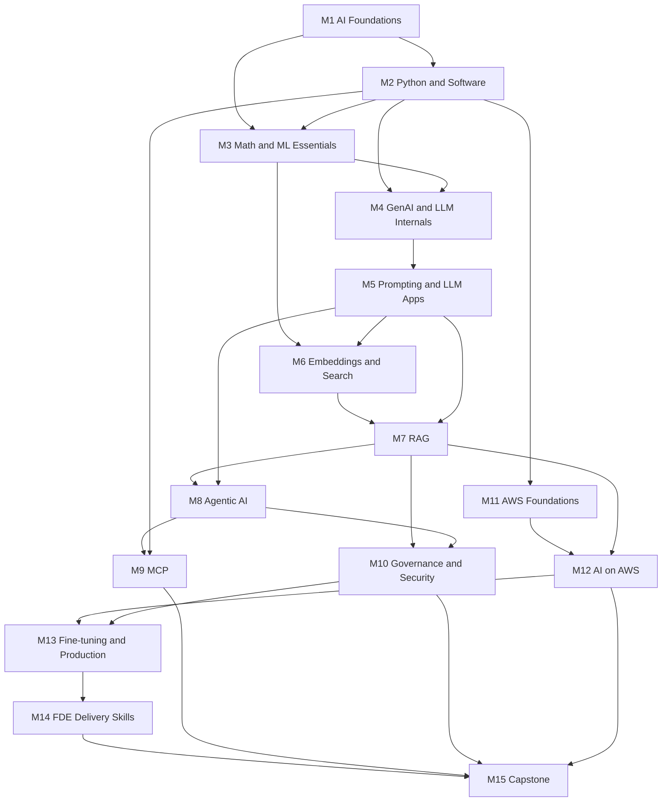

# COURSE_PLAN.md — Complete Lesson Inventory and Prerequisite Order

**Course:** Zero to Professional AI Engineer
**Learner:** Bharath — Technology Lead, frontend/web application background, beginner in AI/ML/math/AWS, not assumed to know Python.
**Design date:** 2026-09-07
**Total planned units:** 214 lessons + 15 module assessments + 14 projects + 1 capstone.

---

## 0. How this plan is organised

Every lesson has a stable ID of the form `M<module>-L<nn>`. IDs never change once assigned, because
later lessons reference them as prerequisites. A lesson lives in one file:

```
modules/module-07-rag/M7-L05-chunking-strategies.md
```

Answer keys are deliberately in a **separate** directory so you can attempt quizzes honestly:

```
answer-keys/module-07-answers.md
```

Runnable code lives in `labs/` (small per-lesson scripts) and `projects/` (multi-file applications),
not pasted only inside Markdown, so you can actually execute it.

---

## 1. Design assumptions (documented decisions)

These are choices I made on your behalf. They are defensible, not the only option, and each one is
revisited in the lesson where it matters.

| # | Decision | Why | Alternative considered |
|---|---|---|---|
| A1 | **Python 3.12** is the course language | Matches your machine (verified 3.12.3); broad library support | 3.11 (also fine); 3.13 (some ML wheels lag) |
| A2 | **Primary vector store = pgvector on PostgreSQL**, with a pure-Python fallback for offline labs | You already understand relational databases; one system for rows *and* vectors; no new vendor account; teaches SQL + vector search together, which the brief explicitly requires | Chroma (easiest), Qdrant/Weaviate (best pure-vector features), OpenSearch/Pinecone (managed). Compared in M6-L08 |
| A3 | **Model provider = Anthropic Claude API** for direct-API lessons, **Amazon Bedrock** for the AWS lessons | Your target skill list names AWS; Bedrock hosts Claude, so the same prompts port across both | OpenAI, Google Gemini, local Ollama. Portability is taught explicitly in M5-L17 |
| A4 | **Every lesson has an offline/mock path** before any paid path | You must be able to learn and practise at zero cost | Cloud-first (rejected: costs money to learn) |
| A5 | **Framework order: mechanics first, framework second** | You asked for this; it is also the difference between an engineer and a library user | Framework-first tutorials (rejected) |
| A6 | **FastAPI + Pydantic v2** for all APIs | Explicit requirement; Pydantic doubles as LLM output validation | Flask, Litestar |
| A7 | **Frontend kept deliberately small** (one HTML file + fetch, or Streamlit) | You are already strong here; course time is better spent on AI/backend | React SPA (unnecessary for learning objectives) |
| A8 | **All data is synthetic or public-domain**, generated by scripts in this repo | No licensing ambiguity, no employer data, reproducible | Real scraped corpora (rejected: rights + reproducibility) |
| A9 | **Math is taught by hand with small numbers first**, then NumPy | You said beginner; notation without arithmetic does not stick | Skip math (rejected: you cannot debug embeddings or evals without it) |
| A10 | **Governance is taught as engineering artefacts** (registers, cards, gates), not as legal advice | I am not able to give you jurisdiction-specific legal advice, and frameworks are not compliance | Legal-first treatment (rejected: out of scope and unsafe) |

---

## 2. Verification policy

Fields like AI and cloud pricing change fast. This course marks every claim with one of:

- **[STABLE]** — a concept unlikely to change (dot products, HTTP status codes, overfitting).
- **[VERIFIED 2026-09-07]** — checked against an official source on that date; source linked.
- **[UNVERIFIED]** — believed correct from training knowledge but **not** re-checked; treat as a
  starting point and confirm against the linked official docs before relying on it in production.
- **[EXECUTED]** — the code was actually run in this environment and the shown output is real.
- **[NOT EXECUTED]** — code that requires paid credentials or cloud resources; logic reviewed but
  output is illustrative.

Prices, model names, quotas, and regional availability are **always** treated as `[UNVERIFIED]` unless
explicitly re-checked, and every such lesson tells you the exact page to confirm on.

---

## 3. Prerequisite map (module level)



**Legal shortcut:** if you only have time for the "AI Engineer core", the critical path is
M1 → M2 → M4 → M5 → M6 → M7 → M8 → M9 → M15. M3 (math) makes you able to *debug* that path;
M10–M13 make you able to *ship and defend* it. Do not skip M10 if you intend to put this in front of
real users.

---

## 4. Full lesson inventory

Legend: **D** = difficulty (1 Intro, 2 Core, 3 Advanced), **hrs** = estimated study time including exercises.

### Module 1 — AI Foundations (11 lessons, ~12 h)

| ID | Title | D | hrs | Prereqs |
|---|---|---|---|---|
| M1-L01 | What AI, Machine Learning, Deep Learning and Generative AI Actually Mean | 1 | 1.0 | — |
| M1-L02 | Rule-Based Systems vs Learned Systems | 1 | 1.0 | M1-L01 |
| M1-L03 | The Four Task Shapes: Classification, Regression, Clustering, Generation | 1 | 1.0 | M1-L01 |
| M1-L04 | Data Vocabulary: Dataset, Feature, Label, Model, Algorithm | 1 | 1.0 | M1-L03 |
| M1-L05 | Parameters vs Hyperparameters | 1 | 0.75 | M1-L04 |
| M1-L06 | Training, Validation, Testing, Inference | 1 | 1.0 | M1-L04 |
| M1-L07 | Supervised, Unsupervised, Self-Supervised and Reinforcement Learning | 1 | 1.25 | M1-L06 |
| M1-L08 | Generalization, Overfitting and Underfitting | 2 | 1.25 | M1-L06 |
| M1-L09 | Data Leakage and Evaluation Contamination | 2 | 1.25 | M1-L08 |
| M1-L10 | Probabilistic Behaviour, Uncertainty and Hallucination | 2 | 1.25 | M1-L07 |
| M1-L11 | AI Capability vs Application Reliability — and When Plain Code Wins | 2 | 1.25 | M1-L10 |
| — | Module 1 assessment (18 questions) + revision guide | — | 1.0 | all |

### Module 2 — Python and Software Foundations (20 lessons, ~34 h)

| ID | Title | D | hrs | Prereqs |
|---|---|---|---|---|
| M2-L01 | Terminal, Python Install, Virtual Environments and pip | 1 | 1.5 | — |
| M2-L02 | Variables, Numbers, Strings and f-strings | 1 | 1.5 | M2-L01 |
| M2-L03 | Collections: list, tuple, dict, set | 1 | 1.75 | M2-L02 |
| M2-L04 | Conditions, Loops and Comprehensions | 1 | 1.75 | M2-L03 |
| M2-L05 | Functions, Arguments, Scope and Return Values | 1 | 1.75 | M2-L04 |
| M2-L06 | Modules, Packages and Project Layout | 1 | 1.25 | M2-L05 |
| M2-L07 | Classes, Dataclasses and Composition over Inheritance | 2 | 2.0 | M2-L06 |
| M2-L08 | Type Hints and Pydantic v2 Validation | 2 | 2.0 | M2-L07 |
| M2-L09 | Files, Paths, CSV, JSON and Environment Variables | 1 | 1.75 | M2-L05 |
| M2-L10 | Exceptions, Tracebacks and Debugging | 2 | 1.75 | M2-L05 |
| M2-L11 | HTTP and REST: Methods, Headers, Status Codes, Auth | 1 | 1.75 | M2-L01 |
| M2-L12 | Calling APIs from Python with httpx (and what an SDK adds) | 2 | 1.75 | M2-L11, M2-L08 |
| M2-L13 | Async and Concurrency: when it helps and when it does not | 3 | 2.25 | M2-L12 |
| M2-L14 | Timeouts, Retries, Exponential Backoff and Rate Limits | 2 | 2.0 | M2-L13 |
| M2-L15 | FastAPI: Routes, Request/Response Schemas, Dependencies | 2 | 2.25 | M2-L08, M2-L12 |
| M2-L16 | SQL Fundamentals and Database Access from Python | 2 | 2.5 | M2-L09 |
| M2-L17 | Git, Branches and Dependency Management | 1 | 1.5 | M2-L06 |
| M2-L18 | Logging and Automated Testing with pytest | 2 | 2.0 | M2-L10 |
| M2-L19 | Secret Handling: .env, secret managers, and what never goes in git | 2 | 1.25 | M2-L09, M2-L17 |
| M2-L20 | Docker Fundamentals for Python Services | 2 | 2.0 | M2-L15 |
| — | **Project 2: Validated Support-Ticket API** | 2 | 5.0 | M2-L20 |
| — | Module 2 assessment (20 questions) + revision guide | — | 1.0 | all |

### Module 3 — Mathematics and Machine Learning Essentials (14 lessons, ~24 h)

| ID | Title | D | hrs | Prereqs |
|---|---|---|---|---|
| M3-L01 | Scalars, Vectors, Matrices, Shapes and Dimensions | 1 | 1.75 | M2-L04 |
| M3-L02 | Dot Products, Norms and Cosine Similarity by Hand | 2 | 2.0 | M3-L01 |
| M3-L03 | Mean, Variance, Standard Deviation and Distributions | 1 | 1.75 | M3-L01 |
| M3-L04 | Probability and Conditional Probability | 2 | 2.0 | M3-L03 |
| M3-L05 | Logarithms, Cross-Entropy and Perplexity Intuition | 2 | 2.0 | M3-L04 |
| M3-L06 | Derivatives, Gradients and the Chain Rule | 2 | 2.0 | M3-L01 |
| M3-L07 | Loss Functions and Gradient Descent | 2 | 2.0 | M3-L06 |
| M3-L08 | Linear Regression from Scratch | 2 | 2.0 | M3-L07 |
| M3-L09 | Logistic Regression and the Sigmoid | 2 | 2.0 | M3-L08, M3-L05 |
| M3-L10 | Neural Networks: Weights, Biases, Activations | 2 | 2.0 | M3-L09 |
| M3-L11 | Backpropagation: a full worked example with 6 numbers | 3 | 2.5 | M3-L10, M3-L06 |
| M3-L12 | Learning Rate, Epochs, Batches and Optimizers | 2 | 1.75 | M3-L11 |
| M3-L13 | Splits, Class Imbalance and Stratification | 2 | 1.75 | M1-L09 |
| M3-L14 | Accuracy, Precision, Recall, F1, Confusion Matrix, Baselines, Reproducibility | 2 | 2.25 | M3-L13 |
| — | **Project 3: Train and Evaluate a Small Classifier** | 2 | 4.0 | M3-L14 |
| — | Module 3 assessment (18 questions) + revision guide | — | 1.0 | all |

### Module 4 — Generative AI and LLM Internals (18 lessons, ~28 h)

| ID | Title | D | hrs | Prereqs |
|---|---|---|---|---|
| M4-L01 | Foundation Models and What "Generative" Really Means | 1 | 1.25 | M1-L07 |
| M4-L02 | Modalities: Text, Image, Audio, Video and Multimodal | 1 | 1.25 | M4-L01 |
| M4-L03 | Tokens, Tokenizers, Vocabularies and Token IDs | 2 | 2.0 | M2-L03 |
| M4-L04 | Embeddings and Contextual Representations | 2 | 2.0 | M3-L02, M4-L03 |
| M4-L05 | Language Modelling: Next-Token Prediction End to End | 2 | 2.0 | M4-L03, M3-L05 |
| M4-L06 | Context Windows, Output Limits and Truncation | 2 | 1.5 | M4-L03 |
| M4-L07 | Attention and Self-Attention: the core idea | 3 | 2.5 | M3-L02, M4-L04 |
| M4-L08 | Queries, Keys, Values and Attention Scores — worked by hand | 3 | 2.5 | M4-L07 |
| M4-L09 | Positional Information | 3 | 1.5 | M4-L08 |
| M4-L10 | Inside a Transformer Block | 3 | 2.0 | M4-L09, M3-L10 |
| M4-L11 | Encoder, Decoder and Encoder-Decoder Architectures | 2 | 1.5 | M4-L10 |
| M4-L12 | Pretraining, Instruction Tuning and the Post-Training Stack | 2 | 1.75 | M4-L05 |
| M4-L13 | Preference Optimization: RLHF, DPO and what alignment buys you | 3 | 1.75 | M4-L12 |
| M4-L14 | Autoregressive Decoding: Temperature, Top-p, Top-k, Sampling | 2 | 2.0 | M4-L05 |
| M4-L15 | Stop Conditions, Truncated Output and Finish Reasons | 2 | 1.25 | M4-L14 |
| M4-L16 | Training Knowledge vs Runtime Context; Model Memory vs Conversation Storage | 2 | 1.5 | M4-L06 |
| M4-L17 | Serving Internals: Quantization, KV Cache, Batching, Memory | 3 | 2.0 | M4-L10 |
| M4-L18 | Hosted vs Local Models: quality, latency, context, licensing, cost | 2 | 2.0 | M4-L17 |
| — | **Project 4: Controlled Model Behaviour Comparison** | 2 | 4.0 | M4-L18 |
| — | Module 4 assessment (20 questions) + revision guide | — | 1.0 | all |

### Module 5 — Prompting and LLM Application Engineering (18 lessons, ~30 h)

| ID | Title | D | hrs | Prereqs |
|---|---|---|---|---|
| M5-L01 | Anatomy of a Prompt: Instruction, Context, Examples, Input | 1 | 1.5 | M4-L14 |
| M5-L02 | Message Roles and Instruction Priority | 2 | 1.5 | M5-L01 |
| M5-L03 | Zero-shot, Few-shot and Example Selection | 2 | 2.0 | M5-L01 |
| M5-L04 | Task Decomposition and Reasoning Prompts | 2 | 2.0 | M5-L03 |
| M5-L05 | Delimiters and Handling Untrusted Content | 2 | 1.5 | M5-L02 |
| M5-L06 | Structured Outputs and JSON Schemas | 2 | 2.25 | M2-L08, M5-L01 |
| M5-L07 | Output Validation and Repair Loops | 2 | 2.0 | M5-L06 |
| M5-L08 | Tool Definitions and Tool-Call Arguments | 2 | 2.25 | M5-L06 |
| M5-L09 | Streaming and User Experience | 2 | 1.75 | M2-L13 |
| M5-L10 | Conversation State: what you store and what you resend | 2 | 1.75 | M4-L16 |
| M5-L11 | Context Engineering: Summarization, Truncation, Budgets | 3 | 2.0 | M5-L10, M4-L06 |
| M5-L12 | Prompt Versioning and Regression Testing | 2 | 2.0 | M2-L18 |
| M5-L13 | Prompt Injection: attack catalogue and real defences | 3 | 2.25 | M5-L05, M5-L08 |
| M5-L14 | Refusals, Errors and Fallback Behaviour | 2 | 1.5 | M5-L07 |
| M5-L15 | Token Accounting and Cost Calculation | 2 | 1.75 | M4-L03 |
| M5-L16 | Caching and Model Routing | 2 | 2.0 | M5-L15 |
| M5-L17 | Provider Differences and Portability | 2 | 1.5 | M5-L08 |
| M5-L18 | Building an Evaluation Dataset You Can Trust | 3 | 2.25 | M5-L12, M3-L14 |
| — | **Project 5: Ticket Classifier and Summarizer with Validated Output** | 2 | 6.0 | M5-L18 |
| — | Module 5 assessment (20 questions) + revision guide | — | 1.0 | all |

### Module 6 — Embeddings and Search (13 lessons, ~22 h)

| ID | Title | D | hrs | Prereqs |
|---|---|---|---|---|
| M6-L01 | Semantic Similarity vs Exact Matching | 1 | 1.25 | M4-L04 |
| M6-L02 | Embedding Dimensions, Model Compatibility and Normalization | 2 | 1.75 | M3-L02, M6-L01 |
| M6-L03 | Keyword Search and BM25 — computed by hand | 2 | 2.25 | M3-L05 |
| M6-L04 | Dense vs Sparse Retrieval | 2 | 1.5 | M6-L03, M6-L02 |
| M6-L05 | Exact Nearest-Neighbour Search and Its Cost | 2 | 1.75 | M6-L02 |
| M6-L06 | Approximate Nearest Neighbours and HNSW Intuition | 3 | 2.0 | M6-L05 |
| M6-L07 | Vector Indexes vs Vector Databases | 2 | 1.5 | M6-L06 |
| M6-L08 | pgvector Hands-On (and how alternatives differ) | 2 | 2.5 | M6-L07, M2-L16 |
| M6-L09 | Metadata, Filtering and Filtered-ANN Pitfalls | 2 | 1.75 | M6-L08 |
| M6-L10 | Indexing, Updates, Deletion and Re-embedding | 2 | 1.75 | M6-L08 |
| M6-L11 | Hybrid Search and Reciprocal Rank Fusion | 2 | 2.0 | M6-L04 |
| M6-L12 | Cross-Encoder Reranking | 3 | 2.0 | M6-L11 |
| M6-L13 | Retrieval Metrics: Precision@k, Recall@k, MRR, nDCG and Relevance Labels | 3 | 2.5 | M6-L11, M3-L14 |
| — | **Project 6: Semantic and Hybrid Search over Course Descriptions** | 2 | 5.0 | M6-L13 |
| — | Module 6 assessment (18 questions) + revision guide | — | 1.0 | all |

### Module 7 — Retrieval-Augmented Generation (20 lessons, ~34 h)

| ID | Title | D | hrs | Prereqs |
|---|---|---|---|---|
| M7-L01 | RAG Architecture End to End | 2 | 1.75 | M6-L13, M5-L07 |
| M7-L02 | RAG vs Fine-Tuning vs Long Context vs Plain Tools | 2 | 1.75 | M7-L01 |
| M7-L03 | Ingestion and Document Parsing | 2 | 2.0 | M2-L09 |
| M7-L04 | Hard Formats: PDFs, HTML, Tables, Scans and OCR | 3 | 2.25 | M7-L03 |
| M7-L05 | Cleaning, Normalisation and Deduplication | 2 | 1.75 | M7-L03 |
| M7-L06 | Chunking I: Size, Overlap and Document Boundaries | 2 | 2.0 | M7-L05 |
| M7-L07 | Chunking II: Fixed, Recursive, Sentence, Semantic, Structure-Aware | 3 | 2.25 | M7-L06 |
| M7-L08 | Metadata, Identifiers, Provenance and Versioning | 2 | 1.75 | M7-L06 |
| M7-L09 | Query Rewriting, Expansion and Decomposition | 3 | 2.0 | M7-L01 |
| M7-L10 | Retrieval and Reranking in the RAG Loop | 2 | 1.75 | M6-L12 |
| M7-L11 | Context Assembly and Token Budgets | 2 | 2.0 | M5-L11 |
| M7-L12 | Citations and Evidence Verification | 3 | 2.25 | M7-L11 |
| M7-L13 | Abstention: teaching the system to say "I don't know" | 3 | 2.0 | M7-L12 |
| M7-L14 | Conflicting, Duplicated and Outdated Sources | 3 | 1.75 | M7-L08 |
| M7-L15 | Permission-Aware Retrieval and Tenant Isolation | 3 | 2.5 | M6-L09, M2-L15 |
| M7-L16 | Incremental Updates and Deletion Propagation | 3 | 1.75 | M6-L10, M7-L08 |
| M7-L17 | Conversational and Multi-Hop Retrieval | 3 | 2.0 | M7-L09, M5-L10 |
| M7-L18 | Agentic Retrieval and Graph RAG | 3 | 2.0 | M7-L17 |
| M7-L19 | Evaluating RAG: Retrieval vs Answer, Groundedness, Correctness, Completeness | 3 | 2.5 | M7-L12, M5-L18 |
| M7-L20 | Debugging RAG, Adversarial Documents, Latency and Cost | 3 | 2.5 | M7-L19, M5-L13 |
| — | **Project 7: Document Assistant with Citations, Authorization and Evals** | 3 | 8.0 | M7-L20 |
| — | Module 7 assessment (22 questions) + revision guide | — | 1.0 | all |

### Module 8 — Agentic AI (18 lessons, ~30 h)

| ID | Title | D | hrs | Prereqs |
|---|---|---|---|---|
| M8-L01 | Chatbots, Workflows and Agents: a precise distinction | 2 | 1.5 | M5-L08 |
| M8-L02 | Deterministic Execution vs Model-Selected Actions | 2 | 1.5 | M8-L01 |
| M8-L03 | The Tool Execution Loop, Written From Scratch | 2 | 2.5 | M8-L02, M5-L08 |
| M8-L04 | Plan, Act, Observe, Stop | 2 | 2.0 | M8-L03 |
| M8-L05 | Tool Schemas and Argument Validation | 2 | 2.0 | M5-L06, M8-L03 |
| M8-L06 | State and Memory in Agents | 3 | 2.0 | M5-L10 |
| M8-L07 | Routing, Chaining and Parallel Execution | 2 | 2.0 | M8-L04 |
| M8-L08 | Orchestrator-Worker and Evaluator-Optimizer Patterns | 3 | 2.0 | M8-L07 |
| M8-L09 | Single-Agent vs Multi-Agent Designs | 3 | 1.75 | M8-L08 |
| M8-L10 | Human Approval and Escalation | 2 | 2.0 | M8-L05 |
| M8-L11 | Read-Only vs State-Changing Actions | 2 | 1.5 | M8-L10 |
| M8-L12 | Idempotency and Duplicate-Action Prevention | 3 | 2.0 | M8-L11 |
| M8-L13 | Retries, Timeouts, Cancellation and Recovery | 3 | 2.0 | M2-L14, M8-L12 |
| M8-L14 | Checkpointing and Durable Execution | 3 | 2.0 | M8-L13 |
| M8-L15 | Step Limits, Cost Budgets and Runaway Prevention | 2 | 1.5 | M5-L15, M8-L04 |
| M8-L16 | Sandboxing and Least Privilege for Tools | 3 | 2.0 | M8-L11 |
| M8-L17 | Tracing and Task-Level Evaluation | 3 | 2.25 | M8-L04, M5-L18 |
| M8-L18 | Tool Failures, Adversarial Inputs, Framework Choice, and When Not to Use an Agent | 3 | 2.0 | M8-L17, M5-L13 |
| — | **Project 8: Support Agent with Investigation and Approval Gate** | 3 | 8.0 | M8-L18 |
| — | Module 8 assessment (20 questions) + revision guide | — | 1.0 | all |

### Module 9 — Model Context Protocol (16 lessons, ~24 h)

| ID | Title | D | hrs | Prereqs |
|---|---|---|---|---|
| M9-L01 | What MCP Standardizes — and Explicitly What It Does Not | 2 | 1.5 | M8-L05 |
| M9-L02 | Hosts, Clients and Servers | 2 | 1.5 | M9-L01 |
| M9-L03 | The Three Primitives: Tools, Resources, Prompts | 2 | 1.75 | M9-L02 |
| M9-L04 | JSON-RPC 2.0 Foundations | 2 | 1.75 | M2-L11 |
| M9-L05 | Initialization and Capability Negotiation | 2 | 1.75 | M9-L04 |
| M9-L06 | Discovery and Invocation | 2 | 1.75 | M9-L05 |
| M9-L07 | Input and Output Schemas | 2 | 1.75 | M9-L06, M5-L06 |
| M9-L08 | Transports: stdio and Streamable HTTP; local vs remote | 2 | 2.0 | M9-L05 |
| M9-L09 | Build Your First MCP Server (stdio, Python) | 2 | 2.5 | M9-L07, M9-L08 |
| M9-L10 | Authentication vs Authorization in MCP | 3 | 2.0 | M2-L11, M9-L08 |
| M9-L11 | OAuth Concepts and MCP's Authorization Requirements | 3 | 2.25 | M9-L10 |
| M9-L12 | Credentials, Token Handling and Trust Boundaries | 3 | 2.0 | M9-L11, M2-L19 |
| M9-L13 | Permission Enforcement Outside the Model | 3 | 2.0 | M9-L12, M7-L15 |
| M9-L14 | Errors, Timeouts, Cancellation, Logging and Debugging | 2 | 2.0 | M9-L09 |
| M9-L15 | Tool Descriptions, Discoverability and Untrusted Tool Results | 3 | 2.0 | M9-L03, M5-L13 |
| M9-L16 | Protocol Versions, Compatibility, Server Testing and Deployment | 3 | 2.25 | M9-L14, M2-L20 |
| — | **Project 9: MCP Server for Course Catalog + Permissioned Progress** | 3 | 7.0 | M9-L16 |
| — | Module 9 assessment (18 questions) + revision guide | — | 1.0 | all |

### Module 10 — AI Governance and Security (16 lessons, ~24 h)

| ID | Title | D | hrs | Prereqs |
|---|---|---|---|---|
| M10-L01 | Governance, Safety, Security and Compliance are Four Different Things | 2 | 1.5 | M1-L11 |
| M10-L02 | Intended Use, Limitations and System Ownership | 2 | 1.5 | M10-L01 |
| M10-L03 | AI Inventories | 2 | 1.25 | M10-L02 |
| M10-L04 | Risk Registers and Risk Assessment | 2 | 2.0 | M10-L03 |
| M10-L05 | Data Provenance, Licensing and Permitted Use | 2 | 1.75 | M7-L08 |
| M10-L06 | Personal and Sensitive Data; Minimization, Retention, Deletion | 2 | 2.0 | M10-L05 |
| M10-L07 | Access Control and Tenant Isolation as Governance Controls | 3 | 1.75 | M7-L15, M9-L13 |
| M10-L08 | Bias and Subgroup Evaluation | 3 | 2.25 | M3-L14 |
| M10-L09 | Transparency, User Communication and Human Oversight | 2 | 1.75 | M10-L02 |
| M10-L10 | Security: Prompt Injection, Exfiltration and Tool Misuse (threat model) | 3 | 2.25 | M5-L13, M8-L16 |
| M10-L11 | Model and Supplier Assessment | 2 | 1.5 | M4-L18 |
| M10-L12 | Release Evaluation Gates | 3 | 2.0 | M5-L18, M7-L19 |
| M10-L13 | Versioning Datasets, Models, Prompts and Configuration; Auditability | 3 | 2.0 | M5-L12, M10-L04 |
| M10-L14 | Incident Response, Rollback and Change Management | 3 | 2.0 | M10-L12 |
| M10-L15 | Model Cards and System Documentation | 2 | 1.75 | M10-L02 |
| M10-L16 | NIST AI RMF, Legal Requirements vs Voluntary Frameworks, Residual Risk | 3 | 2.25 | M10-L14 |
| — | **Project 10: Risk Register, System Card, Release Gate, Incident Drill** | 3 | 6.0 | M10-L16 |
| — | Module 10 assessment (20 questions) + revision guide | — | 1.0 | all |

### Module 11 — AWS Foundations (18 lessons, ~28 h)

| ID | Title | D | hrs | Prereqs |
|---|---|---|---|---|
| M11-L01 | Cloud Computing and the Shared Responsibility Model | 1 | 1.25 | — |
| M11-L02 | Regions, Availability Zones and Placement Decisions | 1 | 1.25 | M11-L01 |
| M11-L03 | Account Setup, Root User Protection and MFA | 1 | 1.5 | M11-L01 |
| M11-L04 | IAM: Identities, Policies, Roles and Least Privilege | 2 | 2.5 | M11-L03 |
| M11-L05 | Temporary Credentials, STS and the CLI | 2 | 2.0 | M11-L04 |
| M11-L06 | Billing, Budgets, Cost Allocation — and why alerts are not caps | 2 | 1.75 | M11-L03 |
| M11-L07 | VPCs, Subnets, Route Tables and Security Groups | 2 | 2.5 | M11-L02 |
| M11-L08 | Public vs Private Access, NAT, Endpoints | 2 | 1.75 | M11-L07 |
| M11-L09 | DNS, TLS and Load Balancing | 2 | 2.0 | M11-L08 |
| M11-L10 | S3: Buckets, Permissions, Encryption, Lifecycle | 2 | 2.25 | M11-L04 |
| M11-L11 | EC2 and the Compute Baseline | 2 | 1.75 | M11-L07 |
| M11-L12 | Containers on AWS: ECR, ECS and Fargate | 3 | 2.5 | M11-L11, M2-L20 |
| M11-L13 | Lambda and API Gateway | 2 | 2.25 | M11-L04 |
| M11-L14 | RDS and DynamoDB | 2 | 2.25 | M2-L16 |
| M11-L15 | SQS, SNS and EventBridge | 2 | 2.0 | M11-L13 |
| M11-L16 | CloudWatch and CloudTrail | 2 | 2.0 | M11-L13 |
| M11-L17 | KMS, Secrets Manager, Backups and Disaster Recovery | 2 | 2.25 | M11-L10 |
| M11-L18 | Infrastructure as Code, CI/CD and Rollback | 3 | 2.5 | M11-L12, M2-L17 |
| — | **Project 11: Authenticated API with Logging, Monitoring, Cost Estimate** | 3 | 7.0 | M11-L18 |
| — | Module 11 assessment (20 questions) + revision guide | — | 1.0 | all |

### Module 12 — AI on AWS (14 lessons, ~22 h)

| ID | Title | D | hrs | Prereqs |
|---|---|---|---|---|
| M12-L01 | Amazon Bedrock: concepts, model access, region reality | 2 | 2.0 | M11-L04 |
| M12-L02 | Invocation, Streaming and the Converse API | 2 | 2.0 | M12-L01, M5-L09 |
| M12-L03 | Embeddings on Bedrock | 2 | 1.5 | M12-L02, M6-L02 |
| M12-L04 | Bedrock Knowledge Bases | 2 | 2.0 | M12-L03, M7-L01 |
| M12-L05 | Bedrock Agents | 3 | 2.0 | M12-L04, M8-L04 |
| M12-L06 | Bedrock Guardrails | 2 | 1.75 | M12-L02, M10-L10 |
| M12-L07 | SageMaker Concepts and Custom Model Hosting | 3 | 2.0 | M12-L01 |
| M12-L08 | IAM Permissions for AI Services | 3 | 2.0 | M11-L04, M12-L01 |
| M12-L09 | S3 Ingestion Pipelines and Event-Driven Processing | 3 | 2.25 | M11-L15, M7-L03 |
| M12-L10 | Vector-Store Choices on AWS | 2 | 2.0 | M6-L08, M11-L14 |
| M12-L11 | Application Hosting, Network Boundaries and Secrets | 3 | 2.0 | M11-L12, M11-L17 |
| M12-L12 | Encryption, Logging, Quotas, Throttling and Retries | 3 | 2.0 | M12-L08, M2-L14 |
| M12-L13 | Evaluation and Monitoring in Production on AWS | 3 | 2.0 | M11-L16, M7-L19 |
| M12-L14 | Cost per Request, Workload Estimates, Deployment, Rollback, Cleanup | 3 | 2.25 | M12-L12, M11-L06 |
| — | **Project 12: Deploy the RAG Application to AWS** | 3 | 8.0 | M12-L14 |
| — | Module 12 assessment (18 questions) + revision guide | — | 1.0 | all |

### Module 13 — Fine-Tuning and Production Optimization (14 lessons, ~22 h)

| ID | Title | D | hrs | Prereqs |
|---|---|---|---|---|
| M13-L01 | Deciding Whether Fine-Tuning Is Justified | 2 | 1.75 | M7-L02 |
| M13-L02 | Dataset Preparation and Quality | 3 | 2.25 | M13-L01, M3-L13 |
| M13-L03 | Training/Evaluation Contamination in Fine-Tuning | 3 | 1.5 | M1-L09, M13-L02 |
| M13-L04 | Supervised Fine-Tuning: what actually happens | 3 | 2.0 | M4-L12, M3-L12 |
| M13-L05 | LoRA and QLoRA | 3 | 2.25 | M13-L04, M4-L17 |
| M13-L06 | Fine-Tuning Evaluation and Rollback | 3 | 1.75 | M13-L04, M10-L12 |
| M13-L07 | Distillation and Quantization in Practice | 3 | 2.0 | M4-L17 |
| M13-L08 | Model Routing and Fallback | 2 | 1.75 | M5-L16 |
| M13-L09 | Caching and Invalidation | 2 | 1.75 | M5-L16, M7-L16 |
| M13-L10 | Batching, Concurrency and Throughput | 3 | 2.0 | M2-L13, M4-L17 |
| M13-L11 | Latency Percentiles and Load Testing | 3 | 2.0 | M13-L10 |
| M13-L12 | Offline Evaluation vs Online Monitoring | 3 | 2.0 | M12-L13 |
| M13-L13 | Human Evaluation and the Limits of LLM-as-a-Judge | 3 | 2.0 | M13-L12, M5-L18 |
| M13-L14 | Canary Releases, Reliability Targets, Incident Analysis and Runbooks | 3 | 2.25 | M13-L11, M10-L14 |
| — | **Project 13: Measure and Fix One Real Weakness** | 3 | 6.0 | M13-L14 |
| — | Module 13 assessment (18 questions) + revision guide | — | 1.0 | all |

### Module 14 — FDE and Professional Delivery Skills (12 lessons, ~18 h)

| ID | Title | D | hrs | Prereqs |
|---|---|---|---|---|
| M14-L01 | Discovering the Actual Customer Problem | 2 | 1.5 | M1-L11 |
| M14-L02 | Mapping Current Workflows | 2 | 1.5 | M14-L01 |
| M14-L03 | Assessing Data Readiness | 2 | 1.75 | M14-L02, M7-L03 |
| M14-L04 | Defining Success Metrics and Selecting a Baseline | 3 | 2.0 | M14-L03, M3-L14 |
| M14-L05 | Build vs Buy Decisions | 2 | 1.5 | M14-L04 |
| M14-L06 | Translating Requirements into Architecture | 3 | 2.0 | M14-L05, M12-L11 |
| M14-L07 | Designing a Bounded Proof of Concept | 2 | 1.75 | M14-L06 |
| M14-L08 | Integrating with Existing APIs and Identity Systems | 3 | 2.0 | M9-L11, M2-L15 |
| M14-L09 | Demonstrating Business Value and Gathering Feedback | 2 | 1.5 | M14-L07 |
| M14-L10 | Communicating Uncertainty and Limitations | 2 | 1.5 | M10-L09 |
| M14-L11 | Production Handover, Documentation and Debugging Unfamiliar Environments | 3 | 2.0 | M13-L14 |
| M14-L12 | Presenting Technical Trade-offs to Nontechnical Stakeholders | 2 | 1.5 | M14-L10 |
| — | **Exercise 14: Ambiguous Request → Scoped, Testable Solution** | 3 | 4.0 | M14-L12 |
| — | Module 14 assessment (16 questions) + revision guide | — | 1.0 | all |

### Module 15 — End-to-End Capstone (8 units, ~50 h)

| ID | Title | hrs |
|---|---|---|
| M15-U01 | Problem Statement, Requirements and Acceptance Criteria | 4 |
| M15-U02 | Architecture, Data-Flow Diagrams and Threat Model | 5 |
| M15-U03 | Synthetic Dataset and Ingestion Pipeline | 6 |
| M15-U04 | Core Application: RAG + Catalog + Progress + Permissions | 12 |
| M15-U05 | MCP Surface and Bounded Agent Workflow with Approval | 8 |
| M15-U06 | Evaluation Suite: quality, retrieval, tool use, authorization | 6 |
| M15-U07 | AWS Deployment, Traces, Cost, Latency, Cleanup | 6 |
| M15-U08 | Documentation Set, Demo Script, Case Study, Assessment Rubric | 3 |

---

## 5. Time budget

At **10–12 hours per week**, total ~382 hours of study ≈ **32–38 weeks**. The detailed week-by-week
schedule is in [`references/STUDY_SCHEDULE.md`](references/STUDY_SCHEDULE.md).

---

## 6. What this course does not claim

- It does not cover every technique in these fields. Fields like agent architectures and model
  serving change on a monthly cadence.
- **Required professional foundations** are Modules 1–12 and 14. **Optional specializations** are
  Module 13 (fine-tuning depth — many AI engineers never fine-tune), Graph RAG (M7-L18), multi-agent
  systems (M8-L09), and SageMaker custom hosting (M12-L07).
- Nothing here is legal advice. Following NIST AI RMF or any framework does **not** by itself make
  you compliant with any law. See M10-L16.
