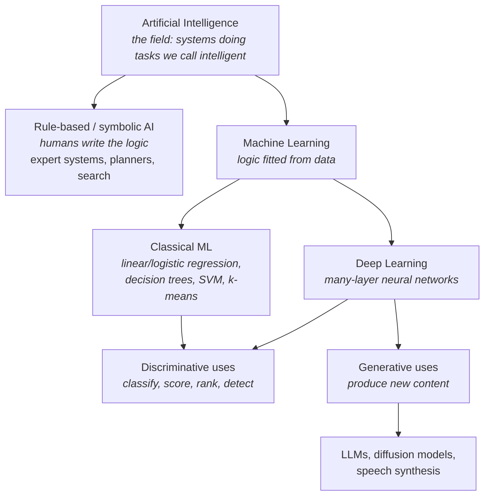

# M1-L01 — What AI, Machine Learning, Deep Learning and Generative AI Actually Mean

| | |
|---|---|
| **Lesson ID** | M1-L01 |
| **Module** | Module 1 — AI Foundations |
| **Difficulty** | 1 (Intro) |
| **Estimated study time** | 1.0 hour (35 min reading, 25 min exercises) |
| **Prerequisites** | None. This is the first lesson of the course. |

---

## 1. Learning objectives

By the end of this lesson you will be able to:

1. **Define** AI, machine learning, deep learning and generative AI in one sentence each, without
   using any of the other three terms in the definition.
2. **Draw** the nesting relationship between the four terms and **state** why it is a nesting rather
   than four separate things.
3. **Classify** at least 8 out of 10 real software systems into the correct category, and **justify**
   each classification by naming the deciding property.
4. **Identify** two systems that are commonly *called* AI but are not learned systems, and explain
   what they actually are.
5. **Explain** why "generative" describes the *output shape*, not the *learning method*.

These are measurable: exercise 3 and the quiz test each one directly.

---

## 2. Vocabulary

Every term used in this lesson, defined before use.

| Term | Definition |
|---|---|
| **Artificial Intelligence (AI)** | The broad engineering field of building systems that perform tasks which, when a human does them, we call intelligent. It is a *field*, not a technique. |
| **Machine Learning (ML)** | A set of techniques where a program improves at a task by processing data, rather than by a human writing the rules explicitly. |
| **Deep Learning (DL)** | Machine learning using neural networks with many stacked layers. "Deep" literally means "many layers". |
| **Neural network** | A mathematical function built from layers of simple numeric operations, whose behaviour is controlled by adjustable numbers called weights. Full treatment in M3-L10. |
| **Generative AI** | AI systems whose output is newly produced content — text, image, audio, video, code — rather than a label, a number, or a group assignment. |
| **Model** | The artefact produced by training: the learned numbers plus the structure that uses them. Formally defined in M1-L04. |
| **Training** | The process of adjusting a model's numbers using data so it performs better at a task. Detailed in M1-L06. |
| **Inference** | Using an already-trained model to produce an output for a new input. Detailed in M1-L06. |
| **Rule-based system** | Software whose behaviour comes entirely from conditions a human wrote. Detailed in M1-L02. |
| **Large Language Model (LLM)** | A deep-learning model trained on very large amounts of text to produce text. The main subject of Module 4. |
| **Foundation model** | A large model trained broadly once, then adapted to many tasks instead of being built per task. Detailed in M4-L01. |

---

## 3. Plain-language explanation

There are four words that get used interchangeably in press releases, and they are not
interchangeable. Sorting them out now will save you months of confusion, because almost every
architecture decision you make later depends on knowing which one you are dealing with.

Here is the honest version:

- **AI** is the *goal*. "Make the computer do something that looks intelligent." It is a field of
  study, like "web development". It says nothing about how.
- **Machine learning** is one *strategy* for reaching that goal: instead of writing the rules
  yourself, you show the computer many examples and let it work out the rules. It is a shift in who
  writes the logic — from you, to a fitting procedure driven by data.
- **Deep learning** is one *family of techniques* within machine learning, using neural networks
  many layers deep. It became dominant because it handles messy, high-dimensional inputs — pixels,
  audio waveforms, raw text — without a human hand-designing what to look at.
- **Generative AI** describes what the system *produces*. If the output is new content rather than a
  label or a number, it is generative. Today's generative systems happen to be built with deep
  learning, but "generative" is a statement about output, not about method.

So three of these words answer different questions:

| Word | Answers the question |
|---|---|
| AI | *What field is this?* |
| Machine learning | *Where did the logic come from?* |
| Deep learning | *What kind of model?* |
| Generative AI | *What shape is the output?* |

That is why a system can be all four at once, or AI without being ML, or ML without being deep, or
deep without being generative.

### Connecting to what you already know

You already have exactly this vocabulary problem in web development, and you already handle it fine:

| Web term | Analogous AI term | Why |
|---|---|---|
| "Web development" | AI | A whole field, tells you nothing about the stack |
| "Client-side rendering" | Machine learning | A strategy — a decision about *where the work happens* |
| "React" | Deep learning | One specific dominant family of implementations of that strategy |
| "Single-page app" | Generative AI | Describes the *user-visible result*, not the technology |

Nobody says "should we use web development or React?" — the question is malformed. In the same way,
"should we use AI or machine learning?" is malformed. But you will hear people ask it, including
customers, and part of your job as a Forward Deployed Engineer will be to gently re-ask the real
question underneath (Module 14 is entirely about this skill).

---

## 4. Analogy

**Think of transport.**

- **AI** = "moving people from A to B". The purpose.
- **Machine learning** = "engine-powered vehicles". A strategy for the purpose. Not the only one —
  a bicycle also moves people.
- **Deep learning** = "internal combustion engines". A dominant family within that strategy.
- **Generative AI** = "vehicles that carry cargo". A description of what comes out the other end.

A cargo truck is all four. A bicycle achieves the purpose without the strategy. An electric train is
engine-powered without internal combustion. A sports car has an engine and carries no cargo.

### Where the analogy breaks — read this part carefully

Analogies in this course always come with their failure points, because a half-understood analogy is
worse than none.

1. **Transport categories are crisp; these are not.** There is no committee that certifies a system
   as "AI". A spam filter written in 1998 with hand-written rules was called AI then and would not
   be called AI now. The boundary moves — this is a real, named phenomenon called the **AI effect**:
   once a technique works reliably and is understood, people stop calling it AI. Optical character
   recognition and chess engines both went through this.

2. **The nesting is a convention, not a law.** Some machine learning is not usually called AI by
   practitioners (a linear regression predicting house prices is "statistics" to a statistician and
   "AI" to a marketing department). Both are defensible. Do not argue about it; ask what the system
   actually does.

3. **The analogy suggests these evolved in sequence. They did not.** Neural networks were invented
   in the 1940s–1950s, decades before they worked at scale. They became dominant in the 2010s not
   because of a new idea but because of data volume and GPU compute. The idea waited ~60 years for
   the hardware. This matters to you practically: it means today's limitations are often *resource*
   limitations, not conceptual ones, and they can lift suddenly.

4. **"Generative" is a leakier category than "carries cargo".** A model that outputs a single word
   from a fixed list of 5 categories, and a model that writes an essay, can be *the same model
   architecture* with a different output constraint. You will see this concretely in M5-L06 when you
   force a generative model to emit only valid JSON. So "generative" is about how the output is
   *produced* — constructed piece by piece — more than about how long it is.

---

## 5. Detailed technical explanation

### 5.1 The nesting, precisely



Read that diagram as "contains", not "came after".

Three things in it are worth pausing on:

- **Rule-based AI is a sibling of ML, not an ancestor.** It is still AI, still used, and often still
  the correct answer. A flight-booking constraint solver is AI and contains zero learning. M1-L02 is
  entirely about this branch, and M1-L11 will argue that you should reach for it more often than
  most teams do.
- **Classical ML and deep learning both feed discriminative uses.** For tabular data — rows and
  columns, like a database table — classical ML frequently *beats* deep learning while being
  cheaper, faster and easier to explain. You will train exactly such a model in Project 3.
- **Generative sits under deep learning in practice today**, but not by definition. Markov chains
  generated text in the 1940s–70s without neural networks. Generation is an output property.

### 5.2 The deciding property for each term

When you are asked "is this ML?", there is one question that settles it:

> **Where did the decision logic come from — a human writing it, or a fitting procedure over data?**

If a person could open the source and read the rule ("if amount > 10000 and country in high_risk:
flag"), it is rule-based. If the behaviour lives in millions of numbers that no one wrote by hand and
no one can read individually, it is learned.

For "is this deep learning?":

> **Does the model stack multiple layers of learned transformations, each feeding the next?**

One layer of learned weights is a linear model. Many layers with non-linear steps between them is
deep learning. The intermediate layers construct their own useful intermediate representations
instead of a human specifying "look at the ratio of vowels to consonants". This property — **learned
feature construction** — is the actual reason deep learning won on images, audio and text. M3-L10
builds this up from arithmetic.

For "is this generative?":

> **Is the output drawn from an open-ended space that the model constructs piece by piece, or
> selected from a fixed, finite set the designer defined?**

Choosing one of `{spam, not_spam}` is discriminative. Producing a sentence, where each next token
is chosen from a vocabulary of ~100,000 options and the sequence can be thousands long, is
generative. The space of possible outputs is astronomically large and was never enumerated.

### 5.3 Why this distinction changes your engineering decisions

This is not vocabulary pedantry. Each category has a different failure mode, and you debug them
differently:

| Category | Typical failure | How you fix it |
|---|---|---|
| Rule-based | A case nobody thought of; rules conflict | Add/repair a rule. Deterministic, testable, auditable. |
| Classical ML | Wrong or missing features; distribution shift | Better features, retrain, monitor input drift |
| Deep learning (discriminative) | Not enough labelled data; spurious correlations | More/better labels, augmentation, re-check for leakage (M1-L09) |
| Generative | Fluent output that is **wrong** | Ground it in retrieved evidence (Module 7), validate output (M5-L07), let it abstain (M7-L13) |

Notice the last row. A rule-based system that fails usually fails *visibly* — it throws, or returns
nothing, or returns an obviously wrong result. A generative system that fails often fails
*invisibly*, producing a confident, well-formatted, grammatical answer that is simply untrue. This
single asymmetry is why Modules 5, 7 and 10 exist and why so much of production AI engineering is
verification machinery rather than model work. M1-L10 covers it properly.

### 5.4 Assumptions and limitations of this framing

- This taxonomy is a **teaching tool**, not a formal ontology. Real systems are hybrids: a fraud
  system may use rules for hard legal thresholds, a gradient-boosted tree for scoring, and an LLM to
  write the analyst's summary. That is three categories in one product, and it is normal and good.
- The categories say nothing about **quality**. "It uses deep learning" is not evidence that
  something works. In Module 14 you will learn to always ask for the baseline (M14-L04).
- The boundary between "classical ML" and "deep learning" is a spectrum, not a wall. A 2-layer
  network sits awkwardly in between and nobody cares.

---

## 6. Worked example

Let us classify five real systems, showing the reasoning step by step rather than just the answer.

### Example 1 — A thermostat that turns on heating below 18 °C

- Step 1. Does it do a task we would call intelligent when a human does it? Barely. Deciding to turn
  on heating is not a notable human skill. → **Not AI** by most definitions.
- Step 2. Where does the logic come from? A human wrote `if temp < 18`. → rule-based.
- **Verdict: not AI. Plain software.** This is the baseline case, and worth stating: most software
  is not AI, and that is fine.

### Example 2 — A learning thermostat that predicts when you will be home

- Step 1. Task: predicting occupancy from past patterns. That is a judgement humans make. → AI.
- Step 2. Logic source: it observes weeks of your behaviour and fits a pattern. No human wrote "this
  person comes home at 18:40 on Tuesdays". → **machine learning**.
- Step 3. Many stacked layers? Almost certainly not — this is a small tabular problem, likely a
  simple statistical model. → **not deep learning**.
- Step 4. Output? A time or a probability. Selected from a numeric range, not constructed content.
  → **not generative**.
- **Verdict: AI, ML, not DL, not generative.**

### Example 3 — A spam filter using hand-written keyword rules

- Step 1. Task: judging intent of a message. Called AI historically. → AI (weakly).
- Step 2. Logic: a human wrote the keyword list. → **rule-based, not ML**.
- **Verdict: AI (by tradition), not ML.** Note this is a *sibling* branch. Add a step where the
  keyword weights are fitted from 100,000 labelled emails and it becomes ML — specifically Naive
  Bayes, the classic example.

### Example 4 — Face detection in your phone camera

- Step 1. Task: perception. Definitely AI.
- Step 2. Logic: trained on labelled images. → **ML**.
- Step 3. Layers: a convolutional neural network, many layers deep. → **DL**.
- Step 4. Output: bounding-box coordinates and "face / not face". A fixed-shape numeric output.
  → **not generative**.
- **Verdict: AI, ML, DL, not generative.** This is the most important row in this table, because it
  breaks the assumption that "deep learning" implies "generative". Most deep learning deployed in
  the world is *not* generative.

### Example 5 — ChatGPT / Claude writing an email

- Step 1. AI: yes.
- Step 2. ML: yes — trained on text, nobody wrote the rules.
- Step 3. DL: yes — a transformer, dozens to hundreds of layers.
- Step 4. Output: a sequence of tokens built one at a time from a huge vocabulary. → **generative**.
- **Verdict: all four.**

### Summary table of the worked example

| System | AI? | ML? | DL? | Generative? | Deciding property |
|---|---|---|---|---|---|
| Fixed thermostat | No | No | No | No | Trivial task, human-written rule |
| Learning thermostat | Yes | Yes | No | No | Fitted from behaviour; simple model; numeric output |
| Keyword spam filter | Yes* | No | No | No | Human-written keyword list |
| Face detection | Yes | Yes | Yes | No | Trained CNN; fixed-shape output |
| LLM writing email | Yes | Yes | Yes | Yes | Trained transformer; open-ended constructed output |

\* "Yes" by historical convention; many practitioners today would say no. Both defensible — say which
definition you are using.

---

## 7. Practical activity

There is no model to train yet. The practical work here is **classification practice with immediate
feedback**, which is the skill this lesson actually teaches.

Run the self-check script. It shows you 10 systems, takes your four answers for each, and tells you
which deciding property you missed.

**File:** [`labs/m1/l01_taxonomy_quiz.py`](../../labs/m1/l01_taxonomy_quiz.py)
**Dependencies:** none — Python standard library only.
**Setup:** none. You do not even need the virtual environment yet.

```bash
python3 labs/m1/l01_taxonomy_quiz.py
```

Answer each of the 4 sub-questions with `y` or `n`. To see the full answer table without playing,
run:

```bash
python3 labs/m1/l01_taxonomy_quiz.py --show-answers
```

### 7.1 Explanation of the important lines

You are not expected to write Python yet — that starts in M2-L01. But read the script; it is short
and it is a fair preview of the language.

| Line / construct | What it does and why it matters |
|---|---|
| `@dataclass` | Declares a small record type with named fields. It is Python's equivalent of a TypeScript `interface` plus constructor. Taught properly in M2-L07. |
| `SYSTEMS: list[System] = [...]` | A list of records — the quiz data. The `list[System]` part is a **type hint**: documentation the tools can check. M2-L08. |
| `input("...").strip().lower()` | Reads a line the user typed, removes surrounding whitespace, lowercases it. Chained method calls, like JavaScript. M2-L02. |
| `answer.startswith("y")` | Accepts `y`, `yes`, `Y` — forgiving input handling. A tiny example of the validation habit that Module 5 turns into a discipline. |
| `zip(labels, got, expected)` | Walks three lists in step. A very common Python idiom. M2-L04. |
| `if __name__ == "__main__":` | "Only run this when the file is executed directly, not when imported." Explained in M2-L06. |

### 7.2 Expected output and how to verify it

`[EXECUTED]` — the script was run in the authoring environment on 2026-09-07 with Python 3.12.3.
Because the run is interactive, here is the deterministic `--show-answers` output, which you can
compare exactly:

```
CLASSIFICATION ANSWER TABLE
================================================================================
System                                   AI    ML    DL    Gen
--------------------------------------------------------------------------------
Fixed-threshold thermostat               no    no    no    no
Learning thermostat (occupancy)          yes   yes   no    no
Keyword spam filter                      yes   no    no    no
Naive Bayes spam filter                  yes   yes   no    no
Face detection in a phone camera         yes   yes   yes   no
Chess engine using search + handcrafted   yes   no    no    no
AlphaZero-style chess engine             yes   yes   yes   no
Customer-churn model on tabular data     yes   yes   no    no
LLM chat assistant                       yes   yes   yes   yes
Image generator from a text prompt       yes   yes   yes   yes
================================================================================
Total systems: 10
```

**Verification:** your interactive run should end with a score out of 40 (10 systems × 4 questions).
If the script errors instead of printing, see troubleshooting below.

---

## 8. Common mistakes and troubleshooting

### Conceptual mistakes

1. **"Deep learning means generative."** No. Face detection, medical image triage, fraud scoring and
   speech-to-text are all deep learning and none are generative. Most deployed deep learning is
   discriminative.
2. **"If it's AI it must be ML."** No. Constraint solvers, planners, and search algorithms (chess
   minimax, route finding) are AI with zero learning.
3. **"More layers is better."** No. On tabular data, gradient-boosted trees usually beat neural
   networks with less compute and more explainability. You will see this in Project 3.
4. **"Generative AI is a kind of model."** It is a description of output. The same transformer can be
   used discriminatively (classify this ticket) or generatively (write this summary) — Project 5
   does both with one model.
5. **Arguing about whether X "is really AI".** Unproductive. Ask instead: where does the logic come
   from, what is the output shape, and how do we know when it is wrong. Those three questions have
   engineering consequences; the label does not.

### Script troubleshooting

| Symptom | Cause | Fix |
|---|---|---|
| `python3: command not found` | Python not installed or not on PATH | Windows: try `python` or `py`. Otherwise complete M2-L01 first. |
| `SyntaxError: invalid syntax` near `list[System]` | Python older than 3.9 | Check `python3 --version`; upgrade, or see M2-L01. |
| `FileNotFoundError` | Wrong working directory | Run from the course root, or use the full path to the file. |
| Script exits immediately | You piped input or are in a non-interactive shell | Use `--show-answers`, or run it in a real terminal. |

---

## 9. Security, privacy, reliability and cost

Mostly not applicable at this stage — there is no model, no data and no network call. Two points do
apply and are worth planting now:

- **Reliability:** the four categories have different failure signatures (§5.3). Knowing which
  category you are debugging tells you where to look first. This is the single most useful practical
  payoff of this lesson.
- **Cost:** the categories differ by orders of magnitude. A rule costs microseconds and effectively
  nothing. A classical ML prediction costs microseconds to milliseconds. An LLM call costs tens of
  milliseconds to tens of seconds and real money per request. In M5-L15 you will calculate this
  exactly. When someone proposes an LLM for a task a regular expression solves, the cost argument is
  usually more persuasive than the correctness argument.

Privacy and security become live concerns from Module 5 onward.

---

## 10. Exercises

Attempt these before opening the answer key.

### Exercise 1 — Beginner (~10 min)

Write a one-sentence definition of each of the four terms **without using any of the other three
terms** in the definition. For example, you may not define generative AI as "AI that generates".

Then, for each definition, name the single question it answers (field / logic source / model type /
output shape).

### Exercise 2 — Intermediate (~15 min)

For each of these five systems, decide AI / ML / DL / Generative, and **write the deciding property
that settled it**. A verdict without a reason scores zero.

1. A credit-card fraud system that blocks any transaction over £5,000 from a new device.
2. Google Translate today.
3. A recommendation engine that suggests "customers also bought" from co-purchase counts.
4. A tool that turns a photo of a receipt into structured expense fields.
5. A code-completion assistant in your IDE.

Then flag any that are **genuinely ambiguous**, and explain what extra information you would need.
(Two of the five are ambiguous as written. Identifying ambiguity is part of the exercise.)

### Exercise 3 — Challenge (~20 min)

You are in a meeting. A product manager says:

> "Our competitor has AI. We need AI. Let's add ChatGPT to the checkout page."

Write a response of at most 150 words that:

1. Does not embarrass or dismiss them.
2. Re-asks the real question underneath.
3. Names at least two categories from this lesson and what each would be appropriate for.
4. Proposes a concrete next step that costs less than a day.

This is a real Forward Deployed Engineer skill and it is graded against a rubric, not an exact
answer. Module 14 develops it fully.

---

## 11. Quiz

Ten questions. Answers and reasoning are in
[`answer-keys/module-01-answers.md`](../../answer-keys/module-01-answers.md) — attempt all ten first.

**Q1.** Which statement most accurately describes the relationship between the four terms?

- A. They are four separate techniques you choose between.
- B. AI contains ML, ML contains DL, and "generative" describes an output property that mostly
  appears within DL today.
- C. Generative AI contains deep learning, which contains machine learning.
- D. ML and AI are synonyms; DL and generative AI are synonyms.

**Q2.** A hospital uses a many-layer neural network trained on labelled X-rays to output one of
`{normal, abnormal}`. Which is correct?

- A. AI, ML, DL, generative
- B. AI, ML, DL, not generative
- C. AI, not ML, DL, not generative
- D. Not AI, ML, DL, not generative

**Q3.** What is the single deciding property that separates a rule-based system from a machine
learning system?

- A. Whether it uses a neural network.
- B. Whether it runs in the cloud.
- C. Whether the decision logic was written by a human or fitted from data.
- D. Whether the output is text.

**Q4.** Which of these is a *generative* system?

- A. A model scoring loan applications from 0 to 1.
- B. A model grouping 50,000 customers into 8 segments.
- C. A model producing a spoken sentence in a synthetic voice.
- D. A model detecting pedestrians in a video frame.

**Q5.** The "AI effect" refers to:

- A. The performance improvement from adding more layers.
- B. The tendency to stop calling a technique "AI" once it works reliably and is understood.
- C. The effect of AI on employment.
- D. The tendency of models to become confident when wrong.

**Q6.** Your team must predict monthly churn from a 40-column customer table with 20,000 rows. A
colleague insists on a deep neural network because "deep learning is state of the art". What is the
strongest *technical* counter-argument from this lesson?

- A. Deep learning cannot handle tabular data at all.
- B. Neural networks are always slower at inference than any alternative.
- C. On tabular data of this size, classical methods frequently match or beat deep learning at lower
  cost and with better explainability, so deep learning should have to earn its place against a
  baseline.
- D. Deep learning requires generative output, which does not fit churn prediction.

**Q7.** Which pair of systems are both AI but differ on whether they are ML?

- A. A chess engine using handcrafted evaluation + search, and AlphaZero.
- B. Face detection, and image generation.
- C. A linear regression, and a logistic regression.
- D. An LLM, and a diffusion image model.

**Q8.** Why does the lesson insist that "generative" is a statement about output rather than method?

- A. Because generative models never use neural networks.
- B. Because the same underlying model can be constrained to emit a fixed label or allowed to emit
  open-ended content, and generation predates neural networks.
- C. Because generation is always done with rule-based systems.
- D. Because generative models cannot be trained.

**Q9.** A colleague says: "We are using AI, so we do not need to define what correct output looks
like — the model will figure it out." Identify the most serious flaw in this reasoning.

- A. Models cannot produce output without a specification file.
- B. AI systems, and especially generative ones, can fail invisibly by producing fluent but wrong
  output, so a definition of correct is required precisely *because* the model will not signal
  failure.
- C. AI always requires labelled data, so a specification is automatic.
- D. There is no flaw; this is standard practice.

**Q10.** *(Short written answer — rubric-graded, not multiple choice.)*
In no more than 60 words, explain to a non-technical stakeholder why "we use deep learning" is not
by itself evidence that a system works well. Name at least one thing you would ask for instead.

---

## 12. Revision notes

- **AI** = the field. **ML** = logic fitted from data instead of hand-written. **DL** = ML with many
  neural network layers. **Generative** = output is constructed content, not a label or number.
- Nesting: AI ⊃ ML ⊃ DL. Generative is an *output property* that today mostly lives inside DL.
- Rule-based AI is a **sibling** of ML under AI, not an ancestor. It is still often the right answer.
- Deciding questions: *Where did the logic come from?* (ML or not) · *Many stacked learned layers?*
  (DL or not) · *Open-ended constructed output?* (generative or not).
- Most deployed deep learning is **not** generative.
- Each category has a distinct failure mode. Generative's failure mode — confident and wrong — is
  the one that requires the most engineering (Modules 5, 7, 10).
- The label does not matter; the three engineering questions do.

---

## 13. Completion checklist

- [ ] I can define all four terms without circular references.
- [ ] I can draw the nesting diagram from memory.
- [ ] I scored 8/10 or better on the taxonomy script.
- [ ] I completed Exercises 1 and 2 and checked them against the key.
- [ ] I attempted Exercise 3 and compared it to the rubric.
- [ ] I scored at least 7/10 on the quiz.
- [ ] I can name the different failure mode of each category.
- [ ] I can explain why "deep learning" is not evidence of quality.

---

## 14. References

Concepts in this lesson are `[STABLE]` — they have been settled for years and are not version
sensitive. Sources are for depth, not required reading.

- Russell & Norvig, *Artificial Intelligence: A Modern Approach* — the standard reference for the
  field's scope, including the non-learning branches.
- Goodfellow, Bengio & Courville, *Deep Learning* (free online at
  <https://www.deeplearningbook.org/>) — Chapter 1 covers exactly this taxonomy. `[UNVERIFIED]` link
  target not re-checked on 2026-09-07.
- Grinsztajn et al., "Why do tree-based models still outperform deep learning on tabular data?"
  (NeurIPS 2022) — the evidence behind the Q6 answer. `[UNVERIFIED]`

---

## 15. Next lesson

→ [M1-L02 — Rule-Based Systems vs Learned Systems](M1-L02-rule-based-vs-learned.md)

You have just seen that rule-based AI is a sibling of machine learning, not a predecessor. The next
lesson takes that branch seriously: you will write both versions of the same system and measure
exactly where each one wins.
