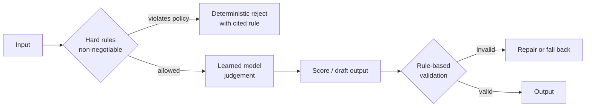

# M1-L02 — Rule-Based Systems vs Learned Systems

| | |
|---|---|
| **Lesson ID** | M1-L02 |
| **Module** | Module 1 — AI Foundations |
| **Difficulty** | 1 (Intro) |
| **Estimated study time** | 1.0 hour (30 min reading, 30 min lab and exercises) |
| **Prerequisites** | [M1-L01](M1-L01-what-ai-ml-dl-genai-mean.md) |

---

## 1. Learning objectives

By the end of this lesson you will be able to:

1. **State** the four properties on which rule-based and learned systems differ, and **predict**
   which approach wins for a given problem description.
2. **Run and read** a side-by-side comparison where the same task is solved both ways, and
   **interpret** why each one fails on the cases it fails on.
3. **Explain** what "brittleness" means precisely, with an example, rather than as a vague criticism.
4. **Describe** the maintenance cost curve of each approach and why it crosses over.
5. **Recommend** a hybrid design for a problem where neither pure approach is correct, and justify
   which part goes where.

---

## 2. Vocabulary

| Term | Definition |
|---|---|
| **Rule-based system** | Software whose decision logic is a set of conditions a human wrote and can read. Also called *symbolic* or *expert* systems. |
| **Learned system** | Software whose decision logic is a set of numbers fitted from data by an algorithm. |
| **Expert system** | A historical name for a large rule-based system encoding a specialist's knowledge, typically as `if/then` rules. |
| **Brittleness** | The property of failing completely, rather than degrading gracefully, on inputs slightly outside what was anticipated. |
| **Graceful degradation** | Producing a somewhat-worse answer on unfamiliar input rather than no answer or a wildly wrong one. |
| **Coverage** | The proportion of real-world inputs your rules actually handle. |
| **Naive Bayes** | A simple learned classifier that estimates the probability of a class from the independent contribution of each feature. Used as the learned example here; the maths comes in M3-L04. |
| **Feature** | A measurable input property the system uses to decide. Formalised in M1-L04. |
| **Ground truth** | The correct answer for an example, as decided by a trustworthy process (usually a human). |
| **Determinism** | The property that the same input always produces the same output. |
| **Auditability** | The ability to explain, after the fact, exactly why a specific decision was made. |

---

## 3. Plain-language explanation

There are only two ways to get decision logic into a computer.

**Option 1: you write it.** You think about the problem, work out the conditions, and type them in.
`if amount > 10000 and country in HIGH_RISK: flag()`. The computer does exactly what you said.

**Option 2: you show it examples and let a procedure fit the logic.** You collect 50,000 past
transactions labelled fraud/not-fraud, run a fitting algorithm, and get back a pile of numbers that
score new transactions. Nobody wrote the rule. Nobody can point at line 47 and say "that's the rule
about Belgium".

That is the entire distinction. Everything else follows from it.

What follows is important:

- If you wrote the logic, you can **read** it, **test** it exactly, **explain** any decision, and
  **change** one behaviour without touching others. But you can only handle situations you thought
  of, and complex domains have more situations than you can think of.
- If the logic was fitted from data, it can capture patterns too subtle or too numerous for you to
  articulate. But you cannot read it, you can only test it statistically, explaining a single
  decision is hard, and changing one behaviour risks changing others.

There is a common mistake in both directions. Junior engineers over-use rules ("I'll just add
another `if`") until the system becomes an unmaintainable thicket. Enthusiastic teams over-use
learning ("let's train a model") for problems where three conditions would have been correct,
auditable and free.

### Connecting to what you already know

You have met this exact trade-off before, under different names:

| Web development situation | Same trade-off |
|---|---|
| Hand-written CSS vs a utility framework's generated classes | Explicit and readable vs derived and hard to trace |
| A hand-rolled validator vs a schema-driven one | You control every message, vs consistency you did not have to write |
| `if`-chains in a router vs a config-driven route table | Readable per case vs scalable across cases |
| Manual query tuning vs the query planner | You know exactly what runs, vs a system that adapts to data it measured |

That last row is the closest fit. A database query planner is a *learned-ish* system: it uses
statistics gathered from your actual data to choose a plan. It usually beats your hand-written hint,
and when it goes wrong it is annoying to debug for exactly the reasons learned systems are annoying
to debug.

---

## 4. Analogy

**A recipe versus a trained cook.**

- The **recipe** is rule-based. Written down, repeatable, anyone can follow it, you can point at the
  step that went wrong. But if you hand it a bag of ingredients it does not mention, it is useless.
- The **trained cook** is a learned system. They have made ten thousand dishes. Give them
  unfamiliar ingredients and they will produce something reasonable. But ask them to write down
  exactly why they added the lemon and you will get "it needed brightness" — an explanation that is
  true and unhelpful.

### Where the analogy breaks

1. **The cook can explain themselves partially; a model often cannot at all.** Human intuition is
   compressible into advice. A neural network's weights are not. Techniques exist to approximate
   explanations, but they are approximations of the model, not the reasons.
2. **The cook knows when they are out of their depth.** Models typically do not. A cook handed a
   molecular gastronomy brief will say "I don't do that". A model will confidently produce
   something. This is the single most important disanalogy, and M1-L10 is about it.
3. **Recipes do not have a *coverage* problem in the same way.** A recipe is meant to make one dish.
   A rule-based system is meant to handle *all* inputs, which is why the number of rules explodes.
4. **The cook learns continuously; a deployed model is frozen.** Unless you explicitly retrain, a
   model's knowledge stops at its training data. In M4-L16 you will see why this matters enormously
   for LLMs.

---

## 5. Detailed technical explanation

### 5.1 The four differing properties

| Property | Rule-based | Learned |
|---|---|---|
| **Origin of logic** | Human authorship | Fitting procedure over data |
| **Inspectability** | Full — read the source | Weak — millions of numbers; explanations are approximations |
| **Behaviour on unseen input** | Brittle: falls off a cliff, or silently no-ops | Degrades: gives a plausible-ish answer, sometimes confidently wrong |
| **Cost of change** | Linear in rules, but rules interact combinatorially | Retrain: cheap per change but hard to make one *targeted* change |

Two secondary properties matter in production:

| Property | Rule-based | Learned |
|---|---|---|
| **Determinism** | Total. Same input → same output, forever | Deterministic at inference for a fixed model, but the model changes when retrained; generative models add sampling randomness (M4-L14) |
| **Auditability** | Trivial: cite the rule | Requires deliberate engineering: log inputs, model version, and score |

### 5.2 What "brittleness" actually means

Brittleness is not "makes mistakes". Both approaches make mistakes. Brittleness is a specific
*shape* of failure: **performance does not decline smoothly as inputs drift from what you
anticipated — it collapses.**

Concretely. Suppose your spam rule is:

```python
if "free money" in subject.lower():
    return SPAM
```

- Input `"FREE MONEY"` → caught (you lowercased).
- Input `"free  money"` (two spaces) → **missed**. Complete miss, not a near miss.
- Input `"f r e e  m o n e y"` → missed.
- Input `"Free Мoney"` (Cyrillic М) → missed.

Each of these is a tiny perturbation and each one produces total failure. Meanwhile a learned model
that saw thousands of spam messages picks up on dozens of correlated signals — sender reputation,
link density, unusual capitalisation — so defeating one signal only moves the score a little.

The mirror-image weakness: the learned model will confidently score a legitimate email from your
finance director about a genuine free-money promotion as spam, and you will not be able to say
exactly why.

### 5.3 The maintenance cost curve

This is the argument that actually decides real projects.

```
cost of
maintaining
correctness
    ^
    |                                   ,--  rule-based
    |                               ,--'     (superlinear: rules interact)
    |                          ,---'
    |                     ,---'
    |               ,----'
    |          ,---'
    |      ,--'                   ______________  learned
    |   ,-'              ________/
    | ,'      __________/
    |,_______/  (high fixed start-up: data, labels, eval, serving)
    +------------------------------------------------> problem complexity
              ^ crossover
```

- **Rule-based has near-zero start-up cost.** Ten rules, one afternoon, done. But rules *interact*:
  rule 40 contradicts rule 7 under a condition neither author considered. The cost of adding rule
  *n* grows with *n*, so total cost is superlinear.
- **Learned has a high fixed cost.** You need labelled data, an evaluation set, a training pipeline,
  a serving path, monitoring. That is weeks before the first prediction. But after that, handling
  more complexity is often "get more data" rather than "write more logic".

**The engineering judgement is: where is the crossover, and which side of it is my problem on?**
Teams get this wrong in both directions. M1-L11 turns this into a decision checklist.

Note what the curve implies for LLMs specifically: foundation models have **moved the crossover
dramatically to the left**, because someone else already paid the fixed cost of training. You get a
capable learned system with an API key and no labelled data. That is genuinely new, and it is why
this course exists. But it does not eliminate the fixed cost — it *relocates* it, from training to
evaluation, guardrails and verification. You will pay it in Modules 5, 7 and 10.

### 5.4 When each is correct

**Choose rules when:**

- The logic is a **published specification**: tax bands, VAT rates, legal thresholds, business
  policy. There is a right answer and it is written down. Never learn what you can look up.
- **Auditability is mandatory**. If you must explain a decision to a regulator or a customer,
  citing a rule is a complete answer.
- **Failure is expensive and cases are enumerable.** Payment routing, access control.
- **You have no labelled data**, and cannot get any.
- **The rule count is small and stable.**

**Choose learning when:**

- The logic is **known but not articulable**. Humans can label "is this photo blurry?" instantly and
  cannot write the rule.
- The input is **high-dimensional and messy**: pixels, audio, free text.
- The pattern **changes over time** and you can retrain on recent data (spam, fraud).
- You have **enough labelled examples**, or a foundation model removes that need.
- **Graceful degradation beats total failure** for your use case.

**Choose a hybrid when — and this is most real systems:**

- Hard constraints must be *guaranteed*, but the judgement inside them is fuzzy.

The hybrid pattern that recurs throughout this course:



Rules on the **outside**, learning on the **inside**. The rules bound what the model is permitted to
do; the model handles the judgement the rules cannot express. You will build precisely this shape in
M5-L07 (output validation), M7-L15 (permission-aware retrieval) and M8-L10 (approval gates). If you
remember one diagram from Module 1, make it this one.

### 5.5 Assumptions and limitations

- The comparison assumes you *can* get labelled data. If you cannot, the choice is made for you.
- "Rules are auditable" assumes the rule set is small enough to read. A 4,000-rule legacy expert
  system is not meaningfully auditable either.
- "Learned systems degrade gracefully" is a tendency, not a guarantee. Under **distribution shift** —
  when live inputs stop resembling training data — learned systems can fail as hard as rules, and
  more quietly.

---

## 6. Worked example — the same task, both ways, by hand

Task: classify a short message as `SPAM` or `HAM` (not spam).

**Training data (4 messages).** Deliberately tiny so you can do the arithmetic yourself.

| # | Message | Label |
|---|---|---|
| 1 | `win free money now` | SPAM |
| 2 | `free entry win prize` | SPAM |
| 3 | `meeting at noon today` | HAM |
| 4 | `lunch meeting today` | HAM |

### 6.1 The rule-based solution

A human reads these and writes:

```python
SPAM_WORDS = {"free", "win", "prize", "money"}
if any(word in SPAM_WORDS for word in message.split()):
    return "SPAM"
return "HAM"
```

Test on the training data: messages 1, 2 contain spam words → SPAM ✓. Messages 3, 4 do not → HAM ✓.
**4/4. Perfect.**

Now test on new messages:

| Test message | Rule verdict | Truth | Correct? |
|---|---|---|---|
| `win a prize today` | SPAM (has "win") | SPAM | ✓ |
| `free meeting room booking` | SPAM (has "free") | HAM | ✗ **false positive** |
| `claim your cash bonus` | HAM (no listed word) | SPAM | ✗ **false negative** |

Both failures are instructive. The rule cannot express "free is suspicious *unless* surrounded by
office words". And it has zero opinion about `cash bonus` because the author did not think of it.

### 6.2 The learned solution (Naive Bayes, by hand)

We estimate, for each word, how much more often it appears in spam than ham. Full probability
theory is M3-L04; here is the arithmetic.

**Step 1 — count words per class.**

SPAM messages: `win free money now` + `free entry win prize` = 8 word slots
`{win:2, free:2, money:1, now:1, entry:1, prize:1}`

HAM messages: `meeting at noon today` + `lunch meeting today` = 7 word slots
`{meeting:2, at:1, noon:1, today:2, lunch:1}`

**Step 2 — vocabulary size.** All distinct words across both classes:
`win, free, money, now, entry, prize, meeting, at, noon, today, lunch` → **V = 11**.

**Step 3 — smoothed probability of each word given a class.** We add 1 to every count so that an
unseen word does not produce a probability of zero (which would zero out the entire product). This
is **Laplace smoothing**.

$$P(\text{word} \mid \text{class}) = \frac{\text{count in class} + 1}{\text{total words in class} + V}$$

Every symbol: `count in class` = how many times that word appeared in that class's messages.
`total words in class` = 8 for spam, 7 for ham. `V` = 11, the vocabulary size. The `+1` and `+V`
are the smoothing.

For spam, the denominator is 8 + 11 = 19. For ham, 7 + 11 = 18.

| Word | count(spam) | P(word\|SPAM) | count(ham) | P(word\|HAM) |
|---|---|---|---|---|
| free | 2 | (2+1)/19 = 3/19 ≈ 0.158 | 0 | (0+1)/18 = 1/18 ≈ 0.056 |
| win | 2 | 3/19 ≈ 0.158 | 0 | 1/18 ≈ 0.056 |
| meeting | 0 | 1/19 ≈ 0.053 | 2 | 3/18 ≈ 0.167 |
| today | 0 | 1/19 ≈ 0.053 | 2 | 3/18 ≈ 0.167 |
| room | 0 (unseen) | 1/19 ≈ 0.053 | 0 (unseen) | 1/18 ≈ 0.056 |

**Step 4 — classify `free meeting room booking`.**

Prior: 2 spam and 2 ham messages, so P(SPAM) = P(HAM) = 0.5. They are equal, so they cancel and we
can ignore them here. (`booking` is unseen, same as `room`.)

Score for SPAM = P(free|S) × P(meeting|S) × P(room|S) × P(booking|S)
= 0.158 × 0.053 × 0.053 × 0.053 ≈ **2.35 × 10⁻⁵**

Score for HAM = P(free|H) × P(meeting|H) × P(room|H) × P(booking|H)
= 0.056 × 0.167 × 0.056 × 0.056 ≈ **2.93 × 10⁻⁵**

HAM score is higher → classified **HAM** ✓.

**This is the whole point.** The rule said SPAM because "free" appeared. The learned model said HAM
because although "free" pushes toward spam, "meeting" pushes harder toward ham, and the model
*weighs and combines* evidence instead of triggering on any single term. The rule cannot do that
without a human writing the interaction explicitly — and there are thousands of such interactions.

**Step 5 — where the learned model fails.** Classify `claim your cash bonus`. Every word is unseen,
so every probability is the smoothing floor: spam = (1/19)⁴, ham = (1/18)⁴. Ham is slightly larger,
so it predicts HAM — wrong, and for a bad reason. With four training messages the model knows
nothing. **Learned systems need data; with too little, they are worse than a rule.** That is the
honest counterweight to §6.2.

---

## 7. Practical activity — run the comparison

**File:** [`labs/m1/l02_rules_vs_learned.py`](../../labs/m1/l02_rules_vs_learned.py)
**Dependencies:** none — standard library only. You do not need the virtual environment yet.

```bash
python3 labs/m1/l02_rules_vs_learned.py
```

The script implements both classifiers from scratch (no libraries, so nothing is hidden), trains the
Naive Bayes on a synthetic 60-message dataset generated inside the file, and evaluates both on a
held-out test set — including four deliberately adversarial messages.

### 7.1 Explanation of the important lines

| Construct | What it does and why |
|---|---|
| `SPAM_WORDS = {...}` | A `set` — fast membership testing. The entire rule-based "model". |
| `Counter()` | Counts occurrences. This is the training step for Naive Bayes: counting is fitting. |
| `math.log(p)` | We add **logs** of probabilities instead of multiplying probabilities. Multiplying 30 small numbers underflows to 0.0 in floating point. Logs turn multiplication into addition and keep the numbers in a safe range. This is a real production technique, not a trick — see M3-L05. |
| `(count + 1) / (total + vocab_size)` | Laplace smoothing, exactly as in the worked example. |
| `train_test_split` (hand-written here) | Separates data used for fitting from data used for judging. The reason why is M1-L06 and M1-L09. |
| `random.Random(seed).shuffle(...)` | Fixes the shuffle so **your output matches mine exactly**. Reproducibility — M3-L14. |
| The `Why ... is a trap` block | Prints the prior, the per-class training word count and `P(unknown\|class)` so you can see *why* the model decided, not just *what* it decided. Building this habit early is the point. |

### 7.2 Expected output

`[EXECUTED]` — run in the authoring environment on 2026-09-07, Python 3.12.3. The seed is fixed, so
your output should be **byte-identical**:

```
======================================================================
RULE-BASED vs LEARNED  -  the same spam task, two approaches
======================================================================

Training messages: 44   Test messages: 11

--- Accuracy on the held-out test set ---
Rule-based  :  7/11  = 63.6%
Naive Bayes : 11/11  = 100.0%

--- The adversarial cases (never seen in training) ---
Message                                  Truth  Rule   Bayes
----------------------------------------------------------------------
free meeting room for the team           HAM    SPAM   HAM
claim your cash bonus reward today       SPAM   HAM    SPAM
f r e e   m o n e y                      SPAM   HAM    SPAM
urgent winner selected claim prize       SPAM   SPAM   SPAM

--- Why the 'f r e e   m o n e y' result is a trap ---
Tokens the model sees : ['f', 'r', 'e', 'e', 'm', 'o', 'n', 'e', 'y']
Of those, known words : []   <- none of them

  HAM   prior=0.591  train words=149  P(unknown|HAM)=1/304=0.003289  log score=-51.98
  SPAM  prior=0.409  train words=97   P(unknown|SPAM)=1/252=0.003968  log score=-50.66

Every token is unknown, so BOTH classes fall back to the smoothing
floor. SPAM wins only because spam training messages are SHORTER, so
its denominator is smaller and each unknown word scores slightly
higher. The model did not detect the attack. It got the right answer
from an artefact of message length. This is a spurious correlation
(M1-L09), and it would flip the moment your spam samples got longer.

--- What this lab shows ---
1. The rule fires on 'free'/'win' regardless of context, so it calls
   'we win the contract if the demo works' SPAM. False positive.
2. The rule has no opinion on words its author never listed, so
   'verify your account or it will be closed' passes. False negative.
3. Naive Bayes scored 11/11 here - but 11 examples is weak evidence.
   Do not trust a percentage without a sample size (M3-L14).
4. A right answer is not the same as correct reasoning. Always ask
   WHY a model was right, not just whether it was.
======================================================================
```

**Verification:** confirm `7/11 = 63.6%` and `11/11 = 100.0%`, and that the diagnostic block prints
`P(unknown|SPAM)=1/252` against `P(unknown|HAM)=1/304`. If your numbers differ you have edited the
seed, the dataset, or the word list.

### 7.3 Read the three results carefully — they are the lesson

**Result 1: the rule failed in both directions.** Look at which four test messages it got wrong:

| Test message | Truth | Rule said | Failure type |
|---|---|---|---|
| `we win the contract if the demo works` | HAM | SPAM | **False positive** — `win` fired with no regard for context |
| `verify your account or it will be closed` | SPAM | HAM | **False negative** — phishing, but no listed keyword |
| `double your income working from home` | SPAM | HAM | False negative |
| `your package could not be delivered click link` | SPAM | HAM | False negative |

You cannot fix all four by adding words. Fixing the first requires *removing* `win`, which would
break the messages the rule currently catches. **The rule set has no setting that gets all four
right**, because a flat keyword list cannot express context. That is the structural limit, not a
tuning problem.

**Result 2: 100% is not as good as it looks.** Naive Bayes got 11/11. On 11 examples, the 95%
confidence interval around that estimate stretches down to roughly 72% — a coin-flip's worth of
uncertainty. A percentage without a sample size is not evidence. You will quantify this properly in
M3-L14. Treat any headline accuracy on a small test set with suspicion, including your own.

**Result 3 — the most important one: right answer, wrong reason.** The model labelled
`f r e e   m o n e y` as SPAM, which is the correct label. If you only looked at the verdict column
you would conclude the model is robust to character-spacing attacks. It is not. The diagnostic block
shows what actually happened:

- All 9 tokens (`f`, `r`, `e`, ...) are absent from the vocabulary.
- With no known words, both classes collapse to the smoothing floor: `1 / (train_words + V)`.
- Spam training messages are shorter — 97 words versus 149 — so the spam denominator is smaller
  (252 vs 304) and each unknown token scores *slightly* higher under SPAM.
- Nine unknown tokens compound that tiny edge until it overturns HAM's prior advantage (0.591 vs
  0.409). Final scores: −50.66 SPAM, −51.98 HAM. A margin of 1.3 log units, produced entirely by
  average message length.

The model has learned "unfamiliar input is probably spam", which is an artefact of how this dataset
was written, not a fact about spam. Pad the spam training messages with filler and the verdict flips.
This is a **spurious correlation**, and it is the single most common way evaluation misleads people.
M1-L09 is devoted to it.

The habit to build now: **when a model is right, ask why before you celebrate.** Exercise 2 makes you
prove this one to yourself by breaking it.

## 8. Common mistakes and troubleshooting

### Conceptual

1. **"Learned systems are just better."** Case 3 above disproves it. And where a published spec
   exists, learning it from data is strictly worse than reading it.
2. **"Rules don't scale."** Too broad. Rules do not scale to *fuzzy perceptual judgement*. They
   scale perfectly to enumerable policy. Your access-control layer should be rules, forever.
3. **"We'll start with rules and swap in ML later."** Reasonable — but only if you keep the
   labelled outcomes from the rule-based era. Teams routinely throw away exactly the data they will
   need. **Log decisions and outcomes from day one.** This is the most valuable practical takeaway
   in this lesson.
4. **Judging on training data.** The rule scored 4/4 on the training messages in §6.1 and 1/3 on new
   ones. Evaluating on data you designed against is meaningless. M1-L06 and M1-L09.
5. **Assuming graceful degradation is automatic.** Under distribution shift a learned model can fail
   hard and silently. Monitoring (M13-L12) is not optional.

### Troubleshooting

| Symptom | Cause | Fix |
|---|---|---|
| Accuracy differs from above | Seed or dataset edited | `git diff` the lab file, or re-copy it |
| `ZeroDivisionError` | Smoothing removed | Restore `+ 1` / `+ vocab_size` |
| `ValueError: math domain error` | `math.log(0)` — a zero probability | This is exactly what smoothing prevents |
| Both classifiers score 100% | Test set overlaps training set | Check the split; see M1-L09 |

---

## 9. Security, privacy, reliability and cost

- **Security.** Rule-based logic is **enumerable by an attacker**. Anyone can probe which words
  trigger your filter and route around it in minutes. Learned systems raise that cost but do not
  eliminate it — adversarial evasion is an active field. For *security decisions* (authentication,
  authorization) always use deterministic rules: you must be able to prove the property holds, and a
  statistical system cannot give you a proof. This principle is load-bearing in M7-L15, M8-L16 and
  M9-L13: **never let a model be your access-control mechanism.**
- **Privacy.** Rules need no training data, so they carry no data-retention obligation. Training a
  model on customer messages creates one — provenance, consent and deletion all become your problem
  (M10-L05, M10-L06).
- **Reliability.** Rules are deterministic and unit-testable case by case. Learned systems need
  *statistical* testing over a dataset, and the test set itself becomes an asset you must maintain.
- **Cost.** The rule-based classifier here costs nanoseconds and zero currency. Naive Bayes costs
  microseconds. An LLM doing the same job costs 10–1000 ms and real money per call. The accuracy
  gain must justify a five-to-nine order-of-magnitude cost increase — sometimes it does, often
  nobody checks. M5-L15 makes you check.

---

## 10. Exercises

### Exercise 1 — Beginner (~10 min)

For each system, state rule-based, learned, or hybrid — and give the one-sentence reason:

1. UK income tax calculation.
2. Detecting whether a photo contains a cat.
3. Deciding whether a user may delete a document.
4. Estimating a taxi fare before the ride.
5. Rejecting a password shorter than 12 characters.
6. Ranking search results.

### Exercise 2 — Intermediate (~20 min)

Open `labs/m1/l02_rules_vs_learned.py`.

1. Add `cash`, `bonus` and `claim` to `SPAM_WORDS`. Re-run. Record the rule-based accuracy and
   state whether the Naive Bayes number moved — and explain why it did or did not.
2. The rule currently calls `we win the contract if the demo works` SPAM. Try to fix that *without*
   breaking the four spam messages it currently catches, changing only `SPAM_WORDS`. Report what you
   tried and what happened.
3. **Break the spurious correlation.** In `DATA`, append the filler
   ` regards from the operations team here` to the end of the **first 15 SPAM messages** — this only
   makes spam messages longer; it adds no ham signal and no new spam signal. Re-run and look at the
   `f r e e   m o n e y` row and the diagnostic block.
   - Record the verdict, and the `train words` figure for each class.
   - Then try it with only 5 padded messages, and again with 10. Record the margin each time.
   - State the exact condition under which the verdict flips, in terms of the two `train words`
     numbers. (There is a clean answer; the key confirms it.)
4. Write two sentences on what exercise 3 proves about trusting a model that gave you the right
   answer.

### Exercise 3 — Challenge (~25 min)

Design a hybrid content-moderation system for a community forum. Requirements:

- Posts containing a fixed list of banned illegal terms must **always** be blocked, with an
  auditable reason. No exceptions, no probability.
- Borderline harassment must be detected — it cannot be captured by a word list.
- Users must be told why their post was blocked.
- A human moderator must review anything the system is unsure about.

Produce:

1. A diagram (Mermaid or ASCII) showing what is rule-based and what is learned.
2. A statement of which decisions are **never** delegated to the model, and why.
3. Your handling of the case where the rule says allow and the model says block.
4. One failure mode of your own design that you have not mitigated, stated honestly.

Rubric in the answer key. There is no single correct architecture; there are defensible and
indefensible ones.

---

## 11. Quiz

Answers: [`answer-keys/module-01-answers.md`](../../answer-keys/module-01-answers.md).

**Q1.** What single property most fundamentally distinguishes a rule-based system from a learned one?

- A. Whether it runs on a GPU.
- B. Whether the decision logic was authored by a human or fitted from data.
- C. Whether it produces text output.
- D. Whether it is deployed in the cloud.

**Q2.** "Brittleness" in a rule-based system means:

- A. It runs slowly on large inputs.
- B. It requires frequent redeployment.
- C. Its performance collapses rather than declining smoothly when inputs drift outside anticipated
  cases.
- D. It uses too much memory.

**Q3.** In the worked example, the rule classified `free meeting room booking` as SPAM but Naive
Bayes classified it as HAM. Why?

- A. Naive Bayes had access to more test data.
- B. The rule triggers on any single listed keyword, while Naive Bayes weighs evidence from all
  words, and `meeting` pushes toward HAM more strongly than `free` pushes toward SPAM.
- C. Naive Bayes ignores the word `free` entirely.
- D. The rule was implemented incorrectly.

**Q4.** Why does the Naive Bayes implementation add 1 to every word count?

- A. To make the numbers larger and easier to read.
- B. To correct for class imbalance.
- C. So that a word never seen in a class does not produce probability zero, which would zero out the
  entire product and discard all other evidence.
- D. To speed up training.

**Q5.** A tax-calculation feature must apply published statutory bands. Which approach and why?

- A. Learned, because tax rules are complex.
- B. Learned, because it will generalize to future tax years.
- C. Rule-based, because the correct logic is a published specification and each decision must be
  auditable and exactly correct.
- D. Hybrid, with a model deciding the band and rules checking it.

**Q6.** Which statement about the maintenance cost curve is correct?

- A. Rule-based cost grows superlinearly because rules interact; learned systems carry a high fixed
  start-up cost but scale better with complexity.
- B. Learned systems are always cheaper.
- C. Rule-based cost is constant regardless of rule count.
- D. Both grow linearly at the same rate.

**Q7.** In the lab, Naive Bayes labelled `f r e e   m o n e y` as SPAM — the correct label. The
diagnostic showed every token was unknown and that SPAM won only because spam training messages
averaged 97 words against HAM's 149, making the smoothing denominator smaller. What is the most
accurate conclusion?

- A. The model is robust to character-spacing attacks and needs no further work.
- B. The model was correct by coincidence: it learned "unfamiliar input is probably spam" from an
  artefact of message length, so the verdict would flip if spam samples got longer. Correct output
  is not evidence of correct reasoning.
- C. Laplace smoothing is a bug and should be removed.
- D. Naive Bayes cannot classify text containing spaces.

**Q8.** Why should access-control decisions be rule-based even in an AI-heavy system?

- A. Models are too slow for authorization.
- B. You must be able to *prove* the security property holds and explain any denial; a statistical
  system provides evidence, not proof, and can be manipulated by crafted input.
- C. Authorization data cannot be represented numerically.
- D. Regulations forbid using models for anything.

**Q9.** A team plans to replace their rule-based system with ML "next year". What is the most
important thing they should do *now*?

- A. Choose a model architecture.
- B. Buy GPUs.
- C. Start logging inputs, decisions and eventual outcomes, because that log becomes the labelled
  training and evaluation data they will otherwise not have.
- D. Rewrite the rules in Python.

**Q10.** How have foundation models changed the cost curve described in §5.3?

- A. They eliminated the fixed cost of learned systems entirely.
- B. They moved the crossover point left, because the training cost was paid by someone else — but
  the fixed cost is relocated into evaluation, guardrails and verification rather than removed.
- C. They made rule-based systems obsolete.
- D. They made the curves identical.

---

## 12. Revision notes

- Two ways to get logic in: **you write it** (rule-based) or **fit it from data** (learned).
- Differing properties: origin of logic · inspectability · behaviour on unseen input · cost of change.
- **Brittleness** = collapse rather than graceful decline on slightly-off inputs.
- Rules: near-zero start-up, superlinear growth (rules interact). Learned: high fixed cost, better
  scaling with complexity. Foundation models moved the crossover left but relocated the fixed cost
  into evaluation and guardrails.
- **Never learn what is published.** Tax bands, policy, legal thresholds → rules.
- **Never let a model be your access-control mechanism.** Security needs proof, not evidence.
- Canonical hybrid: **rules on the outside, model on the inside.** Hard rules bound what the model
  may do; the model handles judgement rules cannot express.
- Log decisions + outcomes from day one, or you will have no training data later.
- Neither approach is automatically robust to adversarial input.

---

## 13. Completion checklist

- [ ] I can name the four differing properties without looking.
- [ ] I can define brittleness with a concrete example.
- [ ] I reproduced the Naive Bayes arithmetic in §6.2 by hand.
- [ ] I ran the lab and got 63.6% / 100.0%.
- [ ] I completed Exercise 2 and broke the spurious correlation myself.
- [ ] I can explain why 11/11 is weak evidence.
- [ ] I attempted Exercise 3 and compared against the rubric.
- [ ] I can draw the "rules outside, model inside" hybrid diagram.
- [ ] I scored 7/10 or better on the quiz.

---

## 14. References

`[STABLE]` concepts. Sources for depth only.

- Russell & Norvig, *AIMA* — Part III covers knowledge-based/symbolic systems properly.
- Manning, Raghavan & Schütze, *Introduction to Information Retrieval*, Ch. 13 — Naive Bayes text
  classification, including Laplace smoothing. Free at <https://nlp.stanford.edu/IR-book/>
  `[UNVERIFIED]` link not re-checked 2026-09-07.
- Sculley et al., "Hidden Technical Debt in Machine Learning Systems" (NeurIPS 2015) — the
  maintenance-cost argument, from Google. `[UNVERIFIED]`

---

## 15. Next lesson

→ [M1-L03 — The Four Task Shapes](M1-L03-task-shapes.md)

You have seen one task (spam) solved two ways. Next you will learn the four *shapes* that
machine-learning tasks come in, so you can recognise which one a customer problem actually is —
a skill you will use in every scoping conversation in Module 14.
