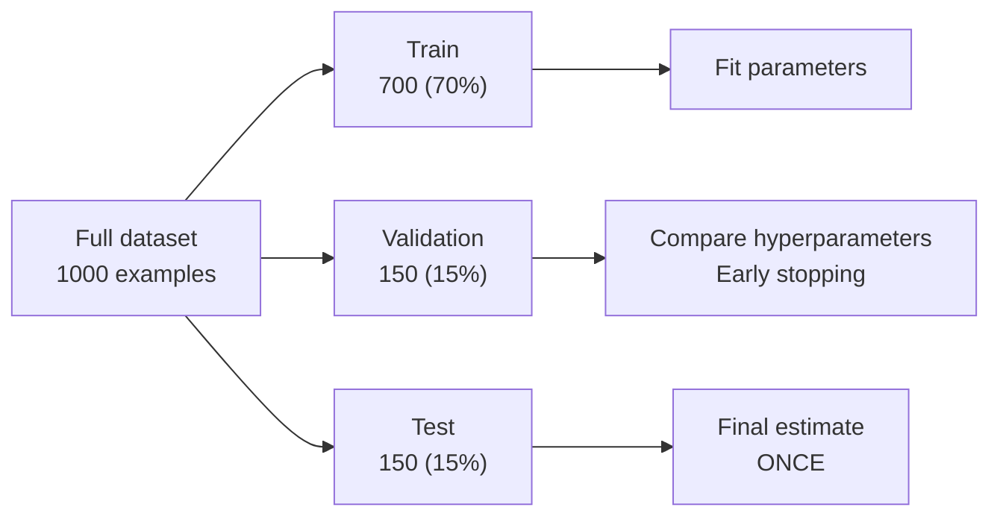

# M1-L06 — Training, Validation, Testing and Inference

| | |
|---|---|
| **Lesson ID** | M1-L06 |
| **Difficulty** | 1 (Intro) |
| **Estimated study time** | 1.0 hour |
| **Prerequisites** | [M1-L04](M1-L04-data-vocabulary.md), [M1-L05](M1-L05-parameters-vs-hyperparameters.md) |

---

## 1. Learning objectives

1. **Describe** the four phases of a model's life and **state** what changes in each.
2. **Split** a dataset into train/validation/test correctly, and **justify** the proportions.
3. **Explain** the "test set is touched once" rule and what to do when you have already broken it.
4. **Choose** between a simple split, k-fold cross-validation, and a time-based split for a given
   scenario, with reasons.
5. **Apply** the same discipline to an LLM application that has no training phase at all.

---

## 2. Vocabulary

| Term | Definition |
|---|---|
| **Training** | The phase where the algorithm adjusts parameters using the training set. |
| **Training set** | Data used to fit parameters. Typically the largest split. |
| **Validation set** (dev set) | Held-out data used to compare hyperparameter choices and decide when to stop. |
| **Test set** (holdout) | Held-out data used **once** to estimate real-world performance. |
| **Inference** | Using a trained model on new input in production. Also called *serving* or *prediction*. |
| **Split** | Dividing a dataset into disjoint parts. |
| **Stratified split** | A split that preserves the class proportions in each part. |
| **Cross-validation** | Rotating which part is held out, so every example is tested on exactly once. |
| **k-fold** | Cross-validation with `k` equal parts. |
| **Early stopping** | Halting training when validation performance stops improving. |
| **Epoch** | One complete pass through the training set. |
| **Generalization** | Performing well on data not seen during training. Full treatment in M1-L08. |
| **Distribution shift** | Live data no longer resembling the training data. |

---

## 3. Plain-language explanation

A model has four phases, and confusing them causes most beginner errors.

1. **Training** — the model looks at examples *and their answers*, and adjusts its parameters. This
   is the only phase where parameters change.
2. **Validation** — you check how it does on data it did not train on, so you can compare settings
   and decide when to stop. Parameters do not change here; *your choices* do.
3. **Testing** — one final exam on data that has never influenced anything. This gives your honest
   estimate.
4. **Inference** — the model is deployed and answers real requests. It sees no labels and learns
   nothing.

The organising principle is a single sentence:

> **A model must be judged on data it has never seen, and every time you use a dataset to make a
> decision, that dataset stops being a fair judge.**

The exam analogy is standard and genuinely correct here:

- **Training set** = the textbook and worked problems you study from.
- **Validation set** = the practice exams you take repeatedly while revising, adjusting technique.
- **Test set** = the real exam, sat once.
- **Inference** = doing the job afterwards.

If someone studies the real exam paper in advance, their score no longer tells you anything about
their ability. That is exactly what tuning on the test set does.

### Connecting to what you already know

| Software concept | Phase |
|---|---|
| Compiling / building | Training |
| Running the test suite while developing | Validation |
| A release-candidate acceptance test run once before shipping | Testing |
| Production traffic | Inference |

There is a useful further parallel: you would never *write* code to satisfy one specific assertion
and then claim the suite passes. Yet tuning on the test set is precisely that.

---

## 4. Analogy

**Learning to drive.**

- **Training** = lessons with an instructor who corrects you (labels).
- **Validation** = mock tests, which you take several times, adjusting what you practise.
- **Testing** = the official driving test, once.
- **Inference** = driving alone afterwards.

### Where the analogy breaks

1. **A driver keeps learning after the test; a deployed model does not.** Its parameters are frozen.
   Improvement requires an explicit retraining cycle.
2. **The road changes.** Roadworks, new signs, new rules. For a model this is **distribution shift**,
   and unlike a human the model will not notice. It will keep applying old patterns confidently.
   Detecting this is monitoring (M13-L12), and it is why "we tested it" is not a permanent claim.
3. **You can re-sit a driving test with no consequence. You cannot un-see a test set.** Once it has
   informed a decision it is permanently contaminated for that purpose.
4. **A driving test measures a person who is present. A model's test measures a specific artefact.**
   Change one hyperparameter and, strictly, you have a new model whose test result you do not have.

---

## 5. Detailed technical explanation

### 5.1 The four phases in detail

| Phase | Input | Labels visible? | Parameters change? | Who decides things | Frequency |
|---|---|---|---|---|---|
| Training | Training set | Yes | **Yes** | The algorithm | Many epochs |
| Validation | Validation set | Yes (for scoring) | No | **You** (hyperparameters, early stopping) | Many times |
| Testing | Test set | Yes (for scoring) | No | Nobody — you only observe | **Once** |
| Inference | Live request | **No** | No | Nobody | Continuously |

The key column is "who decides things". In training, the algorithm uses the labels to change
parameters. In validation, *you* use the labels to change hyperparameters. Both are forms of fitting;
the second is just slower and done by a human. That is why both sets are "used up" and a third is
required.

### 5.2 The mechanics of splitting



**Typical proportions** — these are conventions, not laws:

| Dataset size | Train | Validation | Test | Note |
|---|---|---|---|---|
| Small (< 1,000) | 60% | 20% | 20% | Prefer cross-validation instead |
| Medium (1k–100k) | 70% | 15% | 15% | The common default |
| Large (> 1M) | 98% | 1% | 1% | 1% of 10M is 100,000 — plenty |

The insight in the last row: **what matters is the absolute size of the held-out sets, not the
percentage.** You need enough held-out examples for the measurement to be precise. A test set of 50
items gives you a margin of error of roughly ±14 percentage points, which is useless for comparing
two systems that differ by 5 points.

**Rules for splitting:**

1. **Split before you do anything else.** Not after cleaning, not after computing statistics. If you
   normalise using the mean of the whole dataset, test information has leaked into training
   (M1-L09).
2. **Shuffle `X` and `y` together** (M1-L04).
3. **Stratify for classification.** If 5% of examples are fraud, each split should contain ~5% fraud.
   Random splitting on imbalanced data can produce a test set with almost no positives.
4. **Group by entity when examples are related.** If one customer has 40 tickets, all 40 must land in
   the same split. Otherwise the model memorises that customer and you measure memorisation.
5. **Split by time for time-dependent data.** See §5.4.
6. **Fix the seed** and record it.

### 5.3 Cross-validation

With little data, a single 20% test set is both too small to be reliable and too large to spare.
**k-fold cross-validation** solves this: split into `k` parts, train `k` times, each time holding out
a different part, and average the results.

```
5-fold cross-validation
fold 1:  [TEST][    train    ][    train    ][    train    ][    train    ]
fold 2:  [train][    TEST     ][    train    ][    train    ][    train    ]
fold 3:  [train][    train    ][    TEST     ][    train    ][    train    ]
fold 4:  [train][    train    ][    train    ][    TEST     ][    train    ]
fold 5:  [train][    train    ][    train    ][    train    ][    TEST     ]
                        -> average the 5 scores
```

**Advantages:** every example is tested exactly once; you get a mean *and a spread*, which tells you
how stable the result is. A model scoring 82% ± 2% is very different from 82% ± 12%.

**Costs:** `k` times the training compute. Rarely used for large neural networks or LLM evaluation
because of cost.

**Important:** cross-validation replaces the *validation* split for tuning. You should still keep a
final test set outside the whole procedure if you plan to report a number.

### 5.4 Time-based splitting

If your data has a time dimension and you will predict the future, **random splitting is wrong**.

Random splitting lets the model train on March and test on February. In production it will never
have that luxury. The result is an optimistic score that does not survive deployment.

```
WRONG (random):   [Jan][Feb][Mar][Apr][May]  -> shuffled, split randomly
RIGHT (temporal): [Jan][Feb][Mar] train | [Apr] validation | [May] test
```

Use a temporal split whenever the answer to *"will this model predict the future?"* is yes: demand
forecasting, churn, fraud, anything with trends or seasonality. This alone catches a large fraction
of "great offline, terrible in production" failures.

### 5.5 What if you already contaminated the test set?

You will do this. Everyone does. The honest options, in order of preference:

1. **Collect fresh test data.** Best, if possible.
2. **Split off a new test set from data you have never used** — for example, the most recent month
   you had held back.
3. **Declare it.** Report the number as "validation performance, potentially optimistic; N
   configurations were compared". A stated caveat is professional. A silent one is not.
4. **Never:** carry on reporting it as an unbiased test result.

### 5.6 The same discipline for LLM applications

You are building applications on pretrained models, so you have **no training phase**. It is
tempting to conclude none of this applies. That is wrong, and the mistake is common enough to be
worth stating plainly:

| Classic ML | Your LLM application |
|---|---|
| Training set | The examples in your few-shot prompt, and any documents you index |
| Validation set | The eval set you iterate against while writing prompts |
| Test set | A held-out eval set you run **once** before shipping |
| Training | Prompt engineering — you are fitting, by hand |
| Hyperparameter tuning | Trying temperatures, `k`, chunk sizes, prompt variants |
| Inference | Production traffic |

**Prompt engineering is fitting.** You are adjusting a system to perform better on examples you can
see. Everything in this lesson applies, including the optimistic bias you measured in M1-L05.

Two LLM-specific traps:

- **Few-shot examples belong to the training set.** Never use an example in your prompt *and* in your
  eval set. It is a guaranteed pass and tells you nothing.
- **The model may have seen your test data during pretraining.** If you evaluate on a public
  benchmark or well-known public documents, the model may have memorised them. This is
  **benchmark contamination** and it is why your own private, synthetic eval set is more trustworthy
  than a public leaderboard. M1-L09 and M5-L18.

### 5.7 Assumptions and limitations

- Splitting assumes examples are independent. They frequently are not (same customer, same document,
  near-duplicate tickets). Grouping is required, and detecting near-duplicates is real work (M7-L05).
- All splitting assumes the future resembles the past. Under distribution shift, even a perfect test
  score expires.
- Small datasets make every estimate noisy. Report intervals, not just point estimates.

---

## 6. Worked example

1,000 labelled support tickets. 8% breached SLA (`y=1`). Tickets span 12 months. Some customers
appear many times.

**Step 1 — is time relevant?** Yes: ticket volume and staffing change over the year, and we predict
the future. **Use a temporal split.**

**Step 2 — are examples independent?** No: customer C7 has 40 tickets. If C7 appears in both train
and test, the model can memorise "C7 always breaches". **Group by customer** — but this conflicts
with the temporal split, since C7's tickets span months.

**Resolution:** time takes priority, because it reflects how the model will actually be used. Accept
the customer overlap but *measure* it: report what fraction of test customers also appear in
training, so the optimism is visible rather than hidden. Being explicit about an unresolved
compromise is what a professional does; pretending it does not exist is not.

**Step 3 — split by time.**

| Split | Months | Examples |
|---|---|---|
| Train | 1–9 | 750 |
| Validation | 10–11 | 150 |
| Test | 12 | 100 |

**Step 4 — sanity-check the class balance.**

- Train: 8% of 750 = **60** positives.
- Validation: 8% of 150 = **12** positives.
- Test: 8% of 100 = **8** positives.

Eight positives in the test set is a problem. Getting one extra wrong swings recall by 12.5
percentage points. **The test set is too small for the minority class**, even though 100 examples
sounds reasonable. This is exactly the kind of arithmetic people skip.

**Step 5 — fix it.** Options: use the last two months for test (200 examples, ~16 positives); or
report a confidence interval alongside the estimate; or collect more data. We take the last two
months for test, and months 8–9 for validation:

| Split | Months | Examples | Positives |
|---|---|---|---|
| Train | 1–7 | 580 | ~46 |
| Validation | 8–9 | 220 | ~18 |
| Test | 10–12 | 200 | ~16 |

**Step 6 — the workflow.**

1. Fit on train.
2. Try 12 hyperparameter combinations, scoring each on validation. Record all 12.
3. Pick the best.
4. Run **once** on test. Report that number.
5. If the test number disappoints, **do not** go back and try more combinations against the test set.
   Return to validation, or obtain a fresh test set.

Step 5 is the hard one, and it is the one that separates a trustworthy evaluation from theatre.

---

## 7. Practical activity

**File:** [`labs/m1/l06_splitting.py`](../../labs/m1/l06_splitting.py)

```bash
python3 labs/m1/l06_splitting.py
```

It generates 1,000 synthetic tickets with a real time trend and repeated customers, then compares
four splitting strategies — naive random, stratified random, grouped, and temporal — reporting for
each: class balance per split, customer overlap between train and test, and the measured optimism
from the time trend. It shows numerically why random splitting flatters a time-dependent model.

### 7.1 Important lines

| Construct | Why |
|---|---|
| `rng.gauss(...)` / `rng.random()` | Generates the synthetic data. Fixed seed so results reproduce. |
| `breach_rate = 0.04 + 0.008 * month` | Builds a deliberate upward trend, so a model that sees late months has an unfair advantage on early ones. |
| `sorted(rows, key=lambda r: r.month)` | Temporal split: sort by time, then cut. Never shuffle first. |
| `set(train_customers) & set(test_customers)` | Set intersection — measures leakage of entities across splits. |
| `by_class.setdefault(label, []).append(row)` | Builds per-class buckets, needed for a stratified split. |

### 7.2 Expected output

`[EXECUTED]` 2026-09-07, Python 3.12.3. Deterministic:

```
======================================================================
SPLITTING STRATEGIES COMPARED
======================================================================
Synthetic dataset: 3000 tickets, 60 customers, 12 months.
Overall breach rate: 0.149
Breach probability RISES sharply through the year (0.04 Jan -> 0.26 Dec).

1. RANDOM (naive)
  train n=2400 breach rate=0.149
  test  n=600  breach rate=0.152  positives=91
  rate gap (test - train)        = +0.003
  test customers also in train   = 60/60 (100%)
  train months=[1, 2, 3, 4, 5, 6, 7, 8, 9, 10, 11, 12]
  test  months=[1, 2, 3, 4, 5, 6, 7, 8, 9, 10, 11, 12]

2. STRATIFIED (preserves class ratio)
  train n=2399 breach rate=0.149
  test  n=601  breach rate=0.150  positives=90
  rate gap (test - train)        = +0.001
  test customers also in train   = 60/60 (100%)
  train months=[1, 2, 3, 4, 5, 6, 7, 8, 9, 10, 11, 12]
  test  months=[1, 2, 3, 4, 5, 6, 7, 8, 9, 10, 11, 12]

3. GROUPED by customer
  train n=2421 breach rate=0.153
  test  n=579  breach rate=0.135  positives=78
  rate gap (test - train)        = -0.018
  test customers also in train   = 0/12 (0%)
  train months=[1, 2, 3, 4, 5, 6, 7, 8, 9, 10, 11, 12]
  test  months=[1, 2, 3, 4, 5, 6, 7, 8, 9, 10, 11, 12]

4. TEMPORAL (past -> future)
  train n=2183 breach rate=0.125
  test  n=817  breach rate=0.215  positives=176
  rate gap (test - train)        = +0.091
  test customers also in train   = 60/60 (100%)
  train months=[1, 2, 3, 4, 5, 6, 7, 8, 9]
  test  months=[10, 11, 12]

----------------------------------------------------------------------
WHAT A TRIVIAL MODEL WOULD PREDICT
----------------------------------------------------------------------
Model: 'predict the training-set breach rate'. Compare to the truth.

strategy                  predicts    actual     error
random                       0.149     0.152    +0.003
stratified                   0.149     0.150    +0.001
grouped                      0.153     0.135    -0.018
temporal                     0.125     0.215    +0.091

----------------------------------------------------------------------
HOW TO READ THIS
----------------------------------------------------------------------
* Random and stratified splits mix months, so the test set looks
  like the training set. Their error is small and everything seems
  fine - but the model was allowed to learn from December while
  being tested on January. Production never works that way.

* The TEMPORAL split is the only one that reproduces the real
  problem. Breaches rise through the year, so a model fitted on
  months 1-9 systematically UNDER-predicts months 10-12. The error
  is several times larger than the random split suggested. That is
  the honest, uncomfortable number, and it is the one to trust.

* Note the temporal split is also UNBALANCED in size: months 1-9
  hold far more rows than 10-12. A time split gives you whatever
  proportion the calendar gives you, not a tidy 80/20.

* Customer overlap is ~100% for random/stratified/temporal: nearly
  every test customer was also seen in training, so those scores
  partly measure memorisation. Only the GROUPED split reports 0%
  overlap, and it is the only one answering 'how well will this
  work for a customer we have never seen?'

* Note also how FEW test customers the grouped split leaves (12).
  Grouping buys honesty and pays for it in statistical power.

* No single split is correct. The split must match the question
  you are actually asking. State which question you answered.
======================================================================
```

### 7.3 The number that matters

Look only at this table:

| strategy | predicts | actual | error |
|---|---|---|---|
| random | 0.149 | 0.152 | **+0.003** |
| stratified | 0.149 | 0.150 | **+0.001** |
| grouped | 0.153 | 0.135 | −0.018 |
| temporal | 0.125 | 0.215 | **+0.091** |

The "model" here is as simple as it gets: *predict the breach rate you saw in training*. Yet the
choice of split changes its apparent error by a factor of **thirty**.

- Under a **random** split the model looks nearly perfect — off by 0.3 of a percentage point. You
  would ship this.
- Under a **temporal** split the same model is off by **9.1 percentage points**, under-predicting
  breaches by more than 40% in relative terms.

Nothing about the model changed. The only thing that changed was whether the evaluation was allowed
to peek at the future. The random split trained on December and tested on January; production never
gets that. **The 0.003 is an artefact of the measurement. The 0.091 is the truth.**

This is the concrete mechanism behind "it worked great in testing and failed in production", and it
costs teams entire quarters. If your data has a time dimension and you are predicting forward, a
random split does not merely overstate your model — it can hide a systematic bias completely.

Three further details in the output are worth noticing:

1. **The temporal split is not 80/20.** It came out 2183/817, because the calendar decides, not you.
   Time splits give you whatever proportion the data has. Accept it, or choose a different cutoff
   month deliberately.
2. **Customer overlap is 100% everywhere except the grouped split.** For random, stratified and
   temporal, every single test customer also appears in training. Those scores partly measure
   memorisation of specific customers. Only the grouped split answers *"how well does this work for
   a customer we have never seen?"*
3. **The grouped split leaves only 12 test customers.** Honesty cost you statistical power. With 12
   customers, one unusual customer moves the result noticeably. This is a genuine trade-off, not a
   flaw — and it is why the grouped split's −0.018 error should itself be read with caution.

The professional habit: **state which question your split answered.** "94% accuracy" is meaningless.
"94% accuracy on future months, for customers already in our training data" is a claim someone can
act on.

**Verification:** confirm the temporal row reads `0.125  0.215  +0.091` and that grouped is the only
strategy showing `0%` customer overlap.

---

## 8. Common mistakes and troubleshooting

1. **Tuning on the test set.** Covered in M1-L05. The most common serious error.
2. **Splitting after preprocessing.** Scaling with the full dataset's mean leaks the test set's
   distribution. Fit the scaler on train only, then apply it to validation and test.
3. **Random split on time-series data.** Optimistic and misleading.
4. **Ignoring entity grouping.** Measures memorisation, not generalisation.
5. **Test set too small for the minority class.** Check the *count* of positives, not the percentage.
6. **Not stratifying imbalanced data.** A test split can end up with almost no positives.
7. **Re-splitting until the numbers look good.** This is the same sin, one level up.
8. **Using few-shot prompt examples in your eval set.**

| Symptom | Cause | Fix |
|---|---|---|
| Test score much higher than production | Leakage, or random split on temporal data | Re-split temporally; audit features (M1-L09) |
| Validation score fluctuates wildly | Validation set too small | Enlarge it, or use k-fold |
| Perfect score on some class | That class leaked, or is trivially separable | Inspect examples by hand |
| Score changes each run | Seed not fixed | Fix and record seeds |
| Model great on known customers, poor on new ones | No grouped split | Group by customer and re-measure |

---

## 9. Security, privacy, reliability and cost

- **Privacy.** Splits are copies of personal data. A deletion request must remove the record from
  *every* split and from any model trained on it — which may mean retraining. Design for this
  (M10-L06) before you have 40 copies of a dataset in S3.
- **Reliability.** A test result is a claim about a moment. Distribution shift expires it. Pair every
  offline evaluation with online monitoring (M13-L12).
- **Cost.** k-fold multiplies training cost by `k`. For LLM evaluation, every eval run costs money:
  200 questions × 12 configurations × £0.004 = £9.60 per sweep. Cheap individually, expensive
  when repeated daily in CI. Budget it (M5-L15).
- **Governance.** Which data went into which split, and the seed used, are part of your audit trail.
  "We tested it" is not evidence; a recorded split manifest is (M10-L13).

---

## 10. Exercises

### Exercise 1 — Beginner (~10 min)

For each scenario, name the split strategy (random, stratified, grouped, temporal — or a combination)
and justify in one sentence:

1. Classifying 50,000 product images into 20 balanced categories.
2. Predicting next month's electricity demand.
3. Detecting fraud, where 0.3% of transactions are fraudulent.
4. Classifying sentences from 200 documents, ~50 sentences each.
5. Predicting whether a patient will be readmitted, with multiple visits per patient.

### Exercise 2 — Intermediate (~20 min)

Run the lab and use its output to answer:

1. The trivial model's error is +0.003 under a random split and +0.091 under a temporal split. The
   model is identical in both cases. Explain, in your own words, what the extra 0.088 consists of.
2. What customer overlap did the random split produce, and what did the grouped split produce? State
   what each of those two evaluations is actually measuring.
3. Your system must serve customers who have never contacted support before. Which of the four
   numbers is the honest estimate for that use case, and why are the other three misleading?
4. The temporal split reports the *worst* error of the four. Explain why the worst number is the
   most trustworthy one here.
5. Change `cutoff_month` from 10 to 7 and re-run. Report the new temporal error and explain the
   direction of the change. (Think about how much of the trend is now inside the test period.)

### Exercise 3 — Challenge (~25 min)

You inherit a project with this note:

> "Model achieves 94% accuracy. Trained on all available data, evaluated with an 80/20 random split.
> Ready for production."

1. List every concern you have, ordered by severity.
2. State the three questions you would ask first.
3. Design the evaluation you would run before agreeing to deploy. Be specific about splits, sizes and
   what you would report.
4. The team says re-evaluating will take two weeks and the launch is Friday. Write the 120-word note
   you would send to the decision-maker.

Rubric in the answer key; part 4 is graded on honesty and clarity, not on whether you block the
launch.

---

## 11. Quiz

**Q1.** In which phase do a model's parameters change?

- A. Training only.  B. Training and validation.  C. Validation and testing.  D. All four.

**Q2.** Why does a separate validation set exist, given that you already have a test set?

- A. To make training faster.
- B. Because comparing hyperparameters uses up a dataset's ability to judge fairly, so the test set
  must be reserved for a single, uninfluenced measurement.
- C. Because test sets are too small.
- D. Because validation data is cheaper to label.

**Q3.** You have 10 million labelled examples. Which split is most reasonable?

- A. 60/20/20  B. 70/15/15  C. 98/1/1, since 1% is still 100,000 examples — plenty for a precise
  estimate  D. 50/25/25

**Q4.** You are predicting next quarter's demand from three years of history. What is wrong with a
random 80/20 split?

- A. Nothing.
- B. It lets the model train on later periods and test on earlier ones, which it can never do in
  production, producing an optimistic estimate.
- C. Random splits cannot handle numeric targets.
- D. It creates class imbalance.

**Q5.** 1,000 examples, 8% positive, 100-example test set. What is the problem?

- A. The test set is too large.
- B. Only ~8 positives, so a single misclassification moves recall by over 12 points, making the
  estimate far too noisy to compare systems.
- C. 8% is too high a positive rate.
- D. There is no problem.

**Q6.** You normalise features using the mean and standard deviation of the entire dataset, then
split. What have you done?

- A. Nothing wrong; normalisation is preprocessing.
- B. Leaked information about the test set into training, because the scaling values encode the test
  data's distribution.
- C. Made the model train faster.
- D. Created class imbalance.

**Q7.** In a 5-fold cross-validation, how many times is each example used for testing?

- A. Zero  B. Once  C. Five times  D. It varies

**Q8.** Which statement about LLM applications is correct?

- A. Splitting does not apply because there is no training.
- B. Prompt engineering is a form of fitting, so a held-out eval set touched once is still required,
  and few-shot examples must never appear in it.
- C. Public benchmarks are the most reliable evaluation.
- D. Only temperature needs tuning.

**Q9.** You discover you have compared 30 prompt variants against your final test set. The most
professional response is:

- A. Report the best score without comment.
- B. Obtain or carve out a fresh, never-used test set and re-measure; if that is impossible, report
  the figure explicitly as potentially optimistic and state that 30 configurations were compared.
- C. Delete the low scores.
- D. Increase the test set size and re-run the same 30.

**Q10.** *(Written, rubric-graded.)* Your teammate says "we don't need a validation set, we'll just
be careful not to overfit the test set." In under 80 words, explain why care is not a substitute,
referring to what you measured in M1-L05.

---

## 12. Revision notes

- Four phases: **training** (parameters change), **validation** (your choices change), **testing**
  (nothing changes, observe once), **inference** (production, no labels).
- Core rule: *judge on unseen data; any dataset used to make a decision stops being a fair judge.*
- Splits: 60/20/20 small · 70/15/15 typical · 98/1/1 huge. **Absolute held-out size matters more
  than percentage.**
- Split **first**, before preprocessing. Fit scalers on train only.
- **Stratify** for imbalance · **group** for repeated entities · **temporal** for time-dependent
  prediction. Check the *count* of minority examples, not just the rate.
- k-fold: every example tested once; gives a mean **and a spread**; costs k× compute.
- Contaminated the test set? Get fresh data, or declare the caveat. Never report it silently.
- LLM apps: prompt engineering **is** fitting. Few-shot examples belong to "training". Beware
  benchmark contamination — your own private eval set beats a public leaderboard.

---

## 13. Completion checklist

- [ ] I can name the four phases and what changes in each.
- [ ] I can explain why validation and test must be separate.
- [ ] I ran the lab and can interpret all four strategies' numbers.
- [ ] I know when to use temporal, grouped and stratified splits.
- [ ] I checked minority-class counts, not just percentages, in Exercise 2.
- [ ] I completed Exercise 3 including the note to the decision-maker.
- [ ] I scored 7/10 on the quiz.

---

## 14. References

`[STABLE]`.

- scikit-learn, "Cross-validation: evaluating estimator performance".
  <https://scikit-learn.org/stable/modules/cross_validation.html> `[UNVERIFIED]`
- Google, *Rules of Machine Learning*, Rules #29–#33 on training/serving consistency and temporal
  validation. `[UNVERIFIED]`

---

## 15. Next lesson

→ [M1-L07 — Supervised, Unsupervised, Self-Supervised and Reinforcement Learning](M1-L07-learning-paradigms.md)

You now know how a model is trained and judged. Next: the four ways a model can learn — including
the self-supervised trick that made LLMs possible without anyone labelling the internet.
