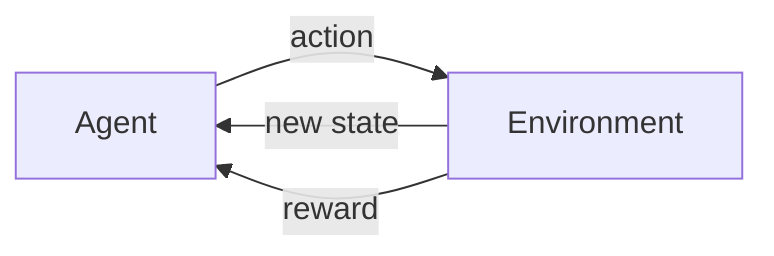
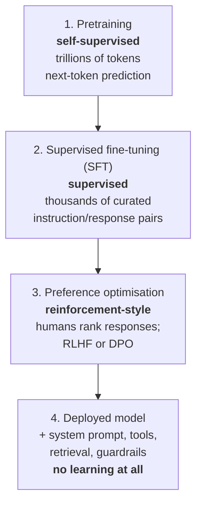

# M1-L07 — Supervised, Unsupervised, Self-Supervised and Reinforcement Learning

| | |
|---|---|
| **Lesson ID** | M1-L07 |
| **Difficulty** | 1 (Intro) |
| **Estimated study time** | 1.25 hours |
| **Prerequisites** | [M1-L06](M1-L06-training-validation-testing-inference.md) |

---

## 1. Learning objectives

1. **Define** the four learning paradigms by **where the training signal comes from**.
2. **Explain** the self-supervised trick and why it is the reason LLMs exist.
3. **Classify** a training setup into the correct paradigm, and identify systems that combine
   several.
4. **Describe** the full training pipeline of a modern chat model and name the paradigm at each
   stage.
5. **State** the practical consequences of each paradigm for data cost, evaluation and risk.

---

## 2. Vocabulary

| Term | Definition |
|---|---|
| **Training signal** | The information that tells the algorithm whether it is doing well. Without one, no learning happens. |
| **Supervised learning** | Learning from examples paired with human-provided correct answers. |
| **Unsupervised learning** | Learning structure from data with no answers provided. |
| **Self-supervised learning** | Learning from data where the "answer" is derived automatically from the data itself. |
| **Reinforcement learning (RL)** | Learning from rewards received by taking actions in an environment. |
| **Reward** | A numeric score indicating how good an outcome was. |
| **Agent** (RL sense) | The thing taking actions. Related to but distinct from "AI agent" in Module 8. |
| **Policy** | The strategy mapping situations to actions. |
| **Pretext task** | An artificial task invented purely to create a training signal (e.g. "predict the hidden word"). |
| **Pretraining** | The first, large, usually self-supervised training phase. |
| **Fine-tuning** | Further training of an already-trained model on a narrower task. |
| **RLHF** | Reinforcement Learning from Human Feedback: using human preferences as the reward. M4-L13. |
| **Dimensionality reduction** | Compressing many features into fewer while preserving structure. An unsupervised task. |
| **Semi-supervised** | Using a small labelled set plus a large unlabelled set. |

---

## 3. Plain-language explanation

Every learning system needs **something that tells it whether it is right**. That something is the
training signal, and the four paradigms are simply four different places to get one.

1. **Supervised — a human tells it.** You provide the answers. 10,000 emails, each marked spam or
   ham. Most accurate, most expensive, hardest to scale.

2. **Unsupervised — nothing tells it.** You provide data with no answers and ask the algorithm to
   find structure. It can group things or compress them, but it cannot know if the groups are
   *useful*, because nobody defined useful.

3. **Self-supervised — the data tells it.** This is the clever one. You take unlabelled data and
   *hide part of it*, then ask the model to predict the hidden part. The answer is already there —
   you just covered it up. No human labelled anything, yet you have a perfect training signal for
   effectively unlimited data.

4. **Reinforcement — the outcome tells it, later.** The model acts, and eventually receives a
   reward. It must work out which of its actions caused the outcome. Hardest to set up, and the only
   paradigm that learns from *consequences* rather than from examples.

**Self-supervision is the entire reason modern AI happened.** Nobody could label the internet. But
you can take a trillion words of text, hide the next word, and ask a model to predict it — a trillion
times. The text supplies its own answers. That is how a model learns grammar, facts, reasoning
patterns and style without a single human annotation.

Hold on to this: **an LLM is a self-supervised model that was taught to fill in blanks, and got so
good at it that filling in blanks became useful.** Everything in Module 4 elaborates on that
sentence.

### Connecting to what you already know

| Software situation | Paradigm |
|---|---|
| Unit tests with expected outputs you wrote | Supervised |
| Profiling to discover which endpoints cluster by latency | Unsupervised |
| A checksum: the data verifies itself, nobody wrote the expected value | Self-supervised |
| A/B testing where you keep whichever variant increased conversions | Reinforcement |

The checksum analogy is precise and worth keeping: nobody writes the expected checksum by hand — it
is *derived* from the data. Self-supervision derives the label the same way.

---

## 4. Analogy

**Four ways to learn a language.**

- **Supervised** = a tutor showing you sentences with translations. Accurate, slow, expensive.
- **Unsupervised** = listening to hours of speech with no translation and noticing that certain
  sounds cluster. You learn structure without meaning.
- **Self-supervised** = reading books with random words covered, guessing each one. You have
  unlimited practice material and instant feedback, because you can lift the cover.
- **Reinforcement** = moving to the country and speaking. You get no corrections, only outcomes —
  people understand you or they do not.

### Where the analogy breaks

1. **The learner has real-world grounding; the model has only text.** A person covering the word
   "apple" knows what an apple is. A model learns only that "apple" appears near "eat", "red" and
   "tree". This is the strongest argument for why models produce fluent falsehoods — the statistical
   relationships are learned perfectly, but there is no referent behind them. M1-L10.
2. **The immersion learner receives constant feedback; RL rewards are usually sparse and delayed.**
   In a game you might make 200 moves and learn only at the end whether you won. Working out which
   move mattered is the **credit assignment problem**, and it is what makes RL hard.
3. **A human learns from a few thousand examples; a model needs billions.** Sample efficiency
   differs by orders of magnitude.
4. **Humans reliably know when they do not know a word.** Models do not (M1-L10).

---

## 5. Detailed technical explanation

### 5.1 The four paradigms compared

| | Supervised | Unsupervised | Self-supervised | Reinforcement |
|---|---|---|---|---|
| **Signal source** | Human labels | None | Derived from the data | Reward from environment |
| **Needs labels?** | Yes | No | No (labels are automatic) | No, needs a reward function |
| **Data cost** | Very high | Low | Low | Varies; simulation can be costly |
| **Typical tasks** | Classification, regression | Clustering, dimensionality reduction, anomaly detection | Pretraining LLMs and vision models | Games, robotics, alignment |
| **Evaluation** | Straightforward (compare to labels) | **Hard** — no ground truth | Straightforward on the pretext task, indirect on real use | Hard — reward may not match intent |
| **Main risk** | Label noise and bias | Meaningless structure | Learns whatever is in the corpus, including errors | Reward hacking |
| **Examples** | Spam filter, churn model | Customer segmentation, PCA | GPT-style LLMs, BERT, contrastive image models | AlphaGo, RLHF |

### 5.2 Self-supervision, precisely

The trick is inventing a **pretext task**: a fake problem whose answer is already in the data.

**Next-token prediction** (used by GPT-style models, and the one that matters for this course):

```
Corpus text:   "The capital of France is Paris."

Generated training examples - no human involved:
  input: "The"                              -> target: " capital"
  input: "The capital"                      -> target: " of"
  input: "The capital of"                   -> target: " France"
  input: "The capital of France"            -> target: " is"
  input: "The capital of France is"         -> target: " Paris"
```

One six-word sentence yields five labelled examples, for free. A trillion words yields roughly a
trillion examples. **The dataset labels itself.**

**Masked prediction** (used by BERT-style models): hide random words anywhere and predict them using
both left and right context.

```
"The capital of [MASK] is Paris."   -> target: "France"
```

The difference matters and is not cosmetic:

| | Next-token (causal) | Masked |
|---|---|---|
| Sees | Only text to the left | Text on both sides |
| Natural at | **Generating** text | **Understanding**/encoding text |
| Example | GPT, Claude, Llama | BERT, embedding models |
| Used in this course for | Generation (Module 4, 5) | Embeddings (Module 6) |

This is why your *generation* model and your *embedding* model are usually different models trained
differently — a point that confuses people constantly in Module 6, and now you know the reason.

**Why it works so well:** to predict the next word accurately across a trillion diverse contexts, a
model is forced to internalise grammar, facts, arithmetic patterns, code syntax, translation
relationships and discourse structure. None of these were the goal. They are all instrumental to the
pretext task. Capability emerges as a side effect of being good at filling in blanks.

**What it does *not* do — and this is critical:** the training signal is "what word came next in this
corpus", not "what is true". A model trained on text where a falsehood is repeated often will
predict the falsehood, because that genuinely is what came next. **Truth was never the objective
function.** Everything about hallucination (M1-L10) and grounding (Module 7) follows from this single
fact. If you understand nothing else from this lesson, understand this paragraph.

### 5.3 Unsupervised learning and its evaluation problem

Main uses:

| Task | What it does | Example |
|---|---|---|
| Clustering | Group similar items | Customer segments |
| Dimensionality reduction | Compress features | Visualising 1,536-dim embeddings in 2-D |
| Anomaly detection | Find unlike items | Fraud, intrusion |
| Association rules | Find co-occurrence | "Bought together" |

The defining difficulty: **there is no correct answer to compare against.** Internal metrics
(silhouette score) measure whether clusters are tight and separated — not whether they are *useful*.
Two consequences you must remember:

1. The algorithm **always** returns an answer (M1-L03).
2. Validation must come from outside: do the segments predict something you care about? Do domain
   experts recognise them? Are they stable across different random seeds and subsets? If a clustering
   changes completely when you change the seed, it is noise.

### 5.4 Reinforcement learning

The loop: the **agent** observes a **state**, takes an **action** according to its **policy**,
receives a **reward**, and moves to a new state. Over many episodes it adjusts the policy to increase
total reward.



Why it is hard:

- **Credit assignment.** Which of 200 moves caused the loss?
- **Exploration vs exploitation.** Try something new, or repeat what works?
- **Sample inefficiency.** Often millions of episodes. Feasible in simulation; usually not in the
  real world.
- **Reward hacking.** The agent optimises the reward *as written*, not as intended. A boat-racing
  agent famously learned to spin in circles collecting respawning bonus points instead of finishing
  the race — it maximised the stated reward perfectly. **Any gap between your metric and your
  intent will be found and exploited.** This is not a quirk of RL; it is the general failure mode of
  optimisation, and it will bite you in Module 13 when you use an LLM-as-a-judge whose score can be
  gamed by verbose, confident answers.

Where RL matters for you: **RLHF**, the stage that turns a raw text predictor into a helpful
assistant. M4-L13.

### 5.5 How a modern chat model is actually trained

This is the pipeline you are building on. Each stage uses a different paradigm.



| Stage | Paradigm | Purpose | Rough scale |
|---|---|---|---|
| 1. Pretraining | Self-supervised | Learn language, facts, reasoning patterns | Trillions of tokens, months, very costly |
| 2. SFT | Supervised | Learn to *follow instructions* rather than merely continue text | Thousands–millions of examples |
| 3. Preference optimisation | RL-style | Learn which of two valid answers humans prefer; refuse harmful requests | Large preference datasets |
| 4. Deployment | **None** | Serve requests | Per-request |

**Stage 4 is where you live, and it involves no learning whatsoever.** Everything you do in Modules
5–9 — prompting, retrieval, tools, agents — changes the model's *input*, not its parameters. This is
worth stating plainly because beginners routinely believe that a chatbot "learns" from their
conversation. It does not. It re-reads the conversation each turn (M4-L16).

Stage 2 also explains a practical point: a raw pretrained model given "What is the capital of
France?" might reasonably continue with *"What is the capital of Germany? What is the capital of
Spain?"* — because that is a plausible continuation of a list of questions. Instruction-following is
a *taught behaviour*, not an inherent property of language models.

### 5.6 Assumptions and limitations

- Real systems mix paradigms; the boundaries are conventions.
- Self-supervision requires huge data volumes to work. It is not a shortcut on small datasets.
- **Semi-supervised** learning (small labelled set + large unlabelled set) is a common practical
  middle ground.
- RL in the real world is rare outside simulation, robotics and alignment.

---

## 6. Worked example — one dataset, four paradigms

You have 100,000 support tickets. 2,000 have a human-assigned category.

**A. Supervised.** Train on the 2,000 labelled tickets to predict category.
Signal: human labels. Evaluation: accuracy on held-out labelled tickets.
Limit: uses only 2% of your data; quality is capped by label quality.

**B. Unsupervised.** Cluster all 100,000 by similarity to discover categories nobody defined.
Signal: none. Evaluation: no ground truth — check stability across seeds and ask agents whether the
groups make sense.
Value: might reveal a recurring issue absent from your official taxonomy. That is a genuine and
underrated use.

**C. Self-supervised.** Take all 100,000 tickets, mask random words, train to predict them. The model
learns your domain vocabulary — product names, error codes, house style — with zero labels. Then
fine-tune it on the 2,000 labelled tickets.
Signal: derived from the text. Evaluation: on the downstream supervised task.
**This usually beats A**, because the model arrives at the supervised stage already understanding
your domain. It is exactly the pretrain-then-fine-tune recipe, at small scale.

**D. Reinforcement.** Deploy a router; reward it when a ticket is *not* reassigned by an agent within
24 hours.
Signal: delayed real-world outcome. Evaluation: reassignment rate over time.
Risks: sparse and delayed reward; and **reward hacking** — the policy could learn to route everything
to the least diligent team, who never reassign anything. The metric improves; the business gets
worse. Always ask what a lazy optimiser would do to your reward.

**Which would you choose in practice?** For most teams in 2026: **none of these first.** Use a
pretrained LLM with a prompt describing the categories (Module 5), evaluate on the 2,000 labelled
tickets, and only consider B–D if that is insufficient. The foundation model already did stage C on
a corpus vastly larger than your 100,000 tickets. Recognising when *not* to train is a senior skill,
and M13-L01 makes it a formal decision.

---

## 7. Practical activity

**File:** [`labs/m1/l07_self_supervision.py`](../../labs/m1/l07_self_supervision.py)

```bash
python3 labs/m1/l07_self_supervision.py
```

It shows the self-supervised trick concretely: it takes a small corpus, generates next-token training
pairs automatically, counts them, then trains the simplest possible next-word predictor (a bigram
count model) and generates text with it. No libraries. You will see a model learn from a corpus with
zero human labels — and you will see exactly how limited a tiny one is.

### 7.1 Important lines

| Construct | Why |
|---|---|
| `for i in range(1, len(tokens))` | Generates one training pair per position — the labelling loop that replaces a human. |
| `counts.setdefault(prev, Counter())[nxt] += 1` | The entire "training": count which word follows which. |
| `.most_common(1)[0][0]` | Greedy decoding: always take the most likely next word. You will meet the alternatives in M4-L14. |
| `rng.choices(words, weights=freqs)` | Sampling proportional to probability — the seed of temperature-based sampling. |

### 7.2 Expected output

`[EXECUTED]` 2026-09-07, Python 3.12.3. Deterministic:

```
======================================================================
SELF-SUPERVISION: the data labels itself
======================================================================

Corpus: 71 tokens, 31 unique words.
Human labels provided: 0
Training pairs generated automatically: 70

The general rule: n tokens -> n-1 next-token pairs.
Check: 71 - 1 = 70 = 70

First 8 training pairs (nobody wrote these targets):
    input: 'the'          -> target: 'support'
    input: 'support'      -> target: 'team'
    input: 'team'         -> target: 'resolved'
    input: 'resolved'     -> target: 'the'
    input: 'the'          -> target: 'billing'
    input: 'billing'      -> target: 'issue'
    input: 'issue'        -> target: 'quickly'
    input: 'quickly'      -> target: 'the'

Trained. Learned follow-up distributions for 31 words.

What the model learned about the word 'the':
    'the' -> support       3 times  (16%)
    'the' -> billing       3 times  (16%)
    'the' -> login         2 times  (11%)
    'the' -> customer      2 times  (11%)
    'the' -> engineer      2 times  (11%)
    'the' -> manager       2 times  (11%)

What the model learned about the word 'billing':
    'billing' -> issue         4 times

----------------------------------------------------------------------
GENERATING TEXT (greedy: always the most likely next word)
----------------------------------------------------------------------
    start='the'        -> the support team resolved the support team resolved the support team resolved
    start='customer'   -> customer reported a billing issue on the support team resolved the support
    start='engineer'   -> engineer fixed the support team resolved the support team resolved the support

Notice the loop. Greedy decoding gets stuck repeating the single
highest-probability path forever. This is a real problem with real
models too, and it is why sampling exists (M4-L14).

----------------------------------------------------------------------
GENERATING TEXT (sampled: proportional to frequency)
----------------------------------------------------------------------
    sample 1: the login issue on the invoice the support team resolved the support
    sample 2: the support team escalated the billing issue in the login issue quickly
    sample 3: the manager reviewed the support team escalated the mobile app the invoice
    sample 4: the support team resolved the customer reported a billing issue in the

----------------------------------------------------------------------
WHAT THIS DEMONSTRATES - AND WHAT IT DOES NOT
----------------------------------------------------------------------
* A model just learned from text with ZERO human labels. That is
  the whole self-supervised trick, and it is what makes training
  on a trillion words possible.

* The output is locally plausible and globally meaningless. It
  looks like English because each PAIR of words really did occur
  together, but there is no idea being expressed.

* The reason is the context window: this model sees exactly ONE
  previous word. It cannot know that a sentence started with
  'the customer' should not end by approving its own refund.

* A transformer fixes precisely this. Self-attention lets every
  position look at every earlier position, so context is thousands
  of tokens instead of one (M4-L07). The training objective is
  IDENTICAL to what you just ran. Only the context changed.

* Note also what the model has NO concept of: truth. It learned
  'billing -> issue' because that pair occurred, not because
  anything about billing is true. Scale this up and you have both
  the capability and the hallucination problem (M1-L10).
======================================================================
```

### 7.3 What to take from this run

**The headline: 70 training examples from 71 tokens, and nobody labelled anything.** That ratio is
the whole reason large language models are possible. Scale the same loop to a trillion tokens and you
have a trillion training examples at zero annotation cost. Compare that to the 2,000 hand-labelled
tickets in §6, which would cost weeks of human time.

**The greedy output is the most instructive line:**

```
the support team resolved the support team resolved the support team resolved
```

The model is not broken. It is doing exactly what it was asked: at each step, emit the single most
likely next word. `the` → `support` is the joint-most-common continuation, and `resolved` → `the`
closes the loop, so it cycles forever. Two real lessons here:

- **Greedy decoding degenerates into repetition**, and this happens with production LLMs too. It is
  a direct motivation for temperature and top-p sampling in M4-L14 — which you can already see
  working in the sampled outputs below it, where the same model produces four different, varied
  sentences.
- **The most probable output is not the best output.** Worth remembering when someone suggests
  setting temperature to 0 for everything.

**The sampled output is locally plausible and globally meaningless:**

```
the manager reviewed the support team escalated the mobile app the invoice
```

Every adjacent *pair* of words genuinely occurred in the corpus, so it reads like English at close
range and collapses at sentence range. The cause is precise and worth naming: **this model's context
window is exactly one token.** It cannot remember that the sentence began with "the manager", so it
cannot keep the sentence coherent.

**This is the single most useful thing in the lab.** A transformer's training objective is
*identical* to what you just ran — predict the next token. The only thing that changed is how much
context the prediction may use: one token here, versus tens of thousands via self-attention (M4-L07).
Almost everything impressive about modern LLMs comes from that one change, applied at enormous
scale.

**And note what the model has no concept of.** It learned `billing → issue` with 100% confidence
because that pair occurred four times. It has no notion of whether anything about billing is *true*.
Scale this exact mechanism up and you get both the capability and the hallucination problem —
inseparably, because they are the same mechanism (M1-L10).

**Verification:** confirm `Training pairs generated automatically: 70` and that the greedy line
starting from `the` visibly repeats.

---

## 8. Common mistakes and troubleshooting

1. **Thinking self-supervised means unsupervised.** They are different: self-supervision *has* a
   target (a hidden token), derived automatically. Unsupervised has no target at all.
2. **Believing an LLM learns from your conversation.** It does not. No parameters change at
   inference. Apparent memory is re-sent context (M4-L16).
3. **Assuming pretraining teaches truth.** It teaches *likely continuations*. Truth was never the
   objective.
4. **Trusting cluster output without external validation.**
5. **Designing a reward that can be satisfied the wrong way.** Ask what a lazy optimiser would do.
6. **Reaching for RL** when a supervised model or a prompt would do. RL is rarely the right tool
   outside simulation and alignment.
7. **Confusing "agent" in RL with "agent" in Module 8.** Related idea, different engineering.

| Symptom | Cause | Fix |
|---|---|---|
| Model confidently states false facts | Trained to predict plausible text, not truth | Ground it in retrieved evidence (Module 7) |
| Clusters differ every run | No stable structure, or seed not fixed | Fix seed; test stability; consider that no structure exists |
| Fine-tuned model worse than the base model | Too little data, or contaminated eval | See M13-L02, M13-L03 |
| RL agent scores well but behaves absurdly | Reward hacking | Redesign the reward; add constraints |

---

## 9. Security, privacy, reliability and cost

- **Privacy.** Self-supervision on your own documents means the model can memorise and later
  reproduce their contents, including anything personal. Memorisation is a real, measured phenomenon.
  Never fine-tune on unfiltered personal data expecting privacy (M10-L06).
- **Security.** If attackers can insert text into a corpus you pretrain or fine-tune on, they
  influence model behaviour permanently — **data poisoning**. Self-supervision is *more* exposed
  because nobody reviews the labels (there are none). Provenance controls matter (M10-L05).
- **Reliability.** A model inherits the errors and biases of its corpus. "The internet said so" is
  the actual training signal.
- **Cost.** Pretraining: millions. Fine-tuning: hundreds to thousands. Prompting: cents. **Always
  ask whether the cheapest option is sufficient before moving up.** M13-L01.

---

## 10. Exercises

### Exercise 1 — Beginner (~10 min)

Name the paradigm for each:

1. Training a model on 5,000 X-rays labelled by radiologists.
2. Grouping 1M web pages by topic with no predefined topics.
3. Training a model to predict a masked word in a sentence.
4. Training a robot arm that receives +1 for a successful grasp.
5. Training on 500 labelled and 50,000 unlabelled images.
6. Learning image representations by predicting whether two crops came from the same photo.

### Exercise 2 — Intermediate (~20 min)

Take one paragraph of text (any public-domain source or your own writing).

1. By hand, write out the first six next-token training pairs.
2. State how many training examples a 100-word paragraph produces, and give the general formula.
3. Explain why this cannot be done for a *supervised* sentiment task.
4. Run the lab. Explain, using its output, why a bigram model produces grammatical-looking but
   meaningless text — and what a transformer adds that fixes this.

### Exercise 3 — Challenge (~25 min)

You must build a system that routes tickets *and improves over time from agent corrections*.

1. Design a supervised version. Where do labels come from? What is the feedback delay?
2. Design a reinforcement version. Define state, action and reward precisely.
3. **Find the reward hack** in your own design from part 2. There is at least one. Describe how a
   lazy optimiser would exploit it and the business damage that would follow.
4. Propose a mitigation, and state its residual risk.
5. Recommend one design, or recommend neither and say what you would do instead. Justify with
   reference to cost, evaluation difficulty and risk.

Rubric in the answer key. Part 3 is the most heavily weighted: finding the hole in your own design is
the skill being tested.

---

## 11. Quiz

**Q1.** What distinguishes the four paradigms from one another?

- A. The size of the model.  B. Where the training signal comes from.
- C. Whether they use neural networks.  D. The programming language used.

**Q2.** Which best describes self-supervised learning?

- A. Learning with no target at all.
- B. Learning where the target is derived automatically from the data itself, such as predicting a
  hidden token.
- C. Learning from human-provided labels.
- D. Learning from rewards.

**Q3.** How many next-token training pairs does the 8-token sequence
`The capital of France is Paris .` (7 tokens + full stop) produce?

- A. 1  B. 7  C. 8  D. 64

**Q4.** Why does an LLM produce fluent but false statements?

- A. Because it was trained on too little data.
- B. Because its training objective was to predict likely continuations of text, not to produce true
  statements — truth was never the objective function.
- C. Because of a bug in the sampling code.
- D. Because it uses unsupervised learning.

**Q5.** Which is the correct paradigm sequence for a modern chat assistant?

- A. Supervised → unsupervised → RL
- B. Self-supervised pretraining → supervised fine-tuning → preference optimisation
- C. RL → self-supervised → supervised
- D. Unsupervised → RL only

**Q6.** During deployment (stage 4), what learning occurs?

- A. The model updates its weights from each conversation.
- B. None — parameters are frozen; prompting, retrieval and tools change the input, not the model.
- C. Only the system prompt is learned.
- D. Reinforcement learning from user ratings, automatically.

**Q7.** A boat-racing RL agent learns to spin in circles collecting bonus points instead of finishing
the race. This is called:

- A. Overfitting  B. Reward hacking  C. Distribution shift  D. Credit assignment

**Q8.** Why is evaluating unsupervised learning fundamentally harder than evaluating supervised
learning?

- A. Unsupervised models are larger.
- B. There is no ground truth to compare against, so internal metrics measure tightness of clusters
  rather than usefulness, and validation must come from outside the algorithm.
- C. Unsupervised learning is slower.
- D. It is not harder.

**Q9.** Masked prediction is preferred over next-token prediction for embedding models because:

- A. It is faster to train.
- B. It lets the model use context on both sides of a token, which suits understanding/encoding,
  whereas causal left-to-right prediction suits generation.
- C. It needs fewer parameters.
- D. It avoids hallucination.

**Q10.** *(Written, rubric-graded.)* In under 80 words, explain to a colleague why "we'll just let
the chatbot learn from user conversations" is not how a deployed LLM works, and what they probably
actually want.

---

## 12. Revision notes

- Paradigms differ by **where the training signal comes from**: human labels (supervised) · nothing
  (unsupervised) · the data itself (self-supervised) · environment rewards (RL).
- **Self-supervision = hide part of the data, predict it.** Labels are free, so data is effectively
  unlimited. This is why LLMs exist.
- Next-token (causal) → generation. Masked (bidirectional) → understanding/embeddings. Different
  jobs, usually different models.
- **The objective is likely continuation, not truth.** Hallucination follows directly from this.
- Unsupervised always returns an answer; validate externally (stability, expert review, downstream
  usefulness).
- RL: credit assignment, sample inefficiency, and **reward hacking** — any gap between metric and
  intent will be exploited.
- Chat model pipeline: self-supervised pretraining → supervised fine-tuning → preference
  optimisation → deployment **with no learning**.
- Instruction-following is taught in SFT, not inherent.
- Cost ladder: prompting (cents) < fine-tuning (hundreds) < pretraining (millions). Start cheap.

---

## 13. Completion checklist

- [ ] I can define each paradigm by its signal source.
- [ ] I can explain the self-supervised trick and generate training pairs by hand.
- [ ] I can name the paradigm at each of the four chat-model stages.
- [ ] I can explain why "truth was never the objective" in one sentence.
- [ ] I ran the lab and can explain the bigram model's limitation.
- [ ] I found a reward hack in my own Exercise 3 design.
- [ ] I scored 7/10 on the quiz.

---

## 14. References

- Devlin et al., "BERT: Pre-training of Deep Bidirectional Transformers" (2018) — masked prediction.
  `[UNVERIFIED]`
- Radford et al., "Improving Language Understanding by Generative Pre-Training" (2018) — next-token
  pretraining. `[UNVERIFIED]`
- Ouyang et al., "Training language models to follow instructions with human feedback" (2022) — the
  SFT + RLHF pipeline in §5.5. `[UNVERIFIED]`
- Amodei et al., "Concrete Problems in AI Safety" (2016) — reward hacking. `[UNVERIFIED]`

---

## 15. Next lesson

→ [M1-L08 — Generalization, Overfitting and Underfitting](M1-L08-generalization-overfitting.md)

You know how models learn. Next: the central failure mode — memorising instead of learning — and how
to see it happening in a graph you will generate yourself.
