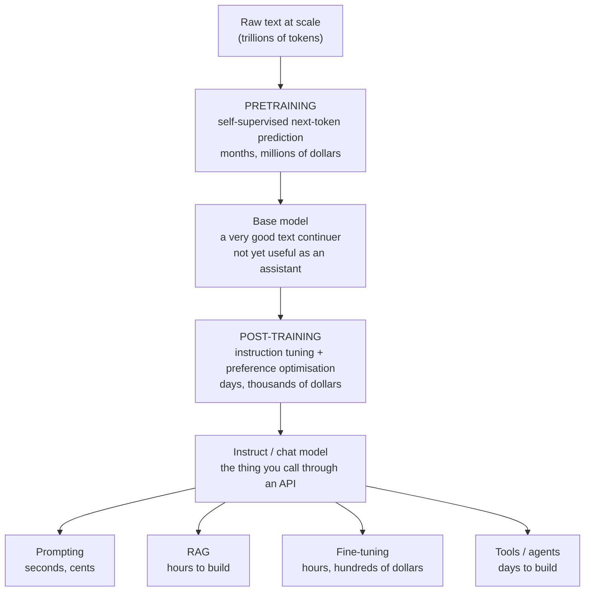

# M4-L01 — Foundation Models and What "Generative" Really Means

| | |
|---|---|
| **Lesson ID** | M4-L01 |
| **Difficulty** | 1 (Beginner) |
| **Estimated study time** | 1.25 hours |
| **Prerequisites** | [M1-L07](../module-01-ai-foundations/M1-L07-learning-paradigms.md), [M3-L05](../module-03-math-ml-essentials/M3-L05-logs-entropy.md) |

---

> **Module 4 starts here, and it is the module that changes how you read everything else.**
> By its end you will be able to open a model card, read every line of it, and say what the model
> will and will not do. Right now that document is mostly opaque. That is the gap this module closes.

---

## 1. Learning objectives

1. **Define** a foundation model precisely, and say what distinguishes it from a task-specific model.
2. **Explain** what "generative" means mechanically — not as a marketing term.
3. **Describe** the pretrain-then-adapt pattern and why it reorganised the whole field.
4. **Distinguish** the four ways to adapt a foundation model, and pick between them.
5. **State** what a foundation model is *not*, and which capabilities are commonly over-claimed.

---

## 2. Vocabulary

| Term | Definition |
|---|---|
| **Foundation model** | A large model trained on broad data at scale, adaptable to many downstream tasks. |
| **Generative model** | A model that produces new samples from a learned distribution, rather than only labelling inputs. |
| **Discriminative model** | A model that maps an input to a label — it draws boundaries, it does not generate. |
| **Pretraining** | The initial, expensive, self-supervised training on broad data. |
| **Adaptation** | Getting a pretrained model to do your specific task. |
| **Emergent capability** | A behaviour absent at smaller scale that appears at larger scale. Contested. |
| **Model card** | The document describing a model's training, intended use and limitations. |
| **Frontier model** | Informal term for the largest, most capable current models. |
| **Open weights** | Model parameters are downloadable. **Not the same as open source.** |
| **Zero-shot / few-shot** | Performing a task with no examples / a handful of examples in the prompt. |

---

## 3. Plain-language explanation

### 3.1 What changed

For most of machine learning's history, the pattern was **one model, one task**:

```
Spam detection    → collect labelled spam    → train a spam model
Sentiment         → collect labelled reviews → train a sentiment model
Translation       → collect aligned pairs    → train a translation model
```

Each needed its own labelled dataset — the expensive part (M1-L04). A new task meant starting over.

**Foundation models inverted this.** Train one very large model once, on an enormous amount of
unlabelled text, using a self-supervised objective that needs no human labels at all (M1-L07): *predict
the next token*. Then adapt that one model to many tasks, often with no additional training whatsoever.

```
Everything on the internet → ONE pretrained model → spam? sentiment? translation? summarisation?
                                                    (often by just asking)
```

**The economics are what matter.** Pretraining costs millions of dollars and months of compute.
Adaptation can cost a few cents and take a second. Because the expensive part is done once by someone
else and amortised across everyone, **a task that would have needed a labelled dataset and a training
run is now a paragraph of instructions.** That is the entire reason your job exists in its current
form.

### 3.2 What "generative" actually means

Not "creative". Not "intelligent". Something much more specific.

A **discriminative** model answers *which class is this?* It learns the boundary between categories.
Your M3-L09 logistic regression is discriminative: it takes an email and returns `P(spam)`. It cannot
write you an email, and no amount of scaling would let it, because it only ever learned where the
line is.

A **generative** model learns the *distribution itself* — what data of this kind looks like — and can
therefore produce new samples from it.

For a language model that means it has learned:

```
P(next token | all tokens so far)
```

Give it a prefix, it gives you a probability distribution over what comes next. Sample from it,
append, repeat. **That loop is the whole of text generation.** Everything else — chat, tool use,
reasoning traces, agents — is built on top of that one operation.

**A useful reframing:** a generative model is not answering your question. It is continuing your text
in a way consistent with the patterns it learned. When the most probable continuation of a question
is its correct answer, you get a correct answer. **That coincidence holds remarkably often, and it is
still a coincidence in the mechanical sense** — nothing in the objective asked for truth. This one
sentence explains hallucination (M1-L10), prompt sensitivity (M5), and why retrieval helps (M7)
better than any other framing.

---

## 4. Analogy

**A foundation model is like a graduate hire with an unusually broad education.** They have read
enormously widely, can be pointed at almost any task with a briefing rather than a training course,
and are useful on day one. Specialising them for your domain is a conversation, not a degree.

### Where the analogy breaks — and these breaks matter

1. **A graduate knows what they do not know.** A foundation model produces its most probable
   continuation with no reliable internal signal for "I have no idea" (M1-L10). Confidence and
   correctness are only loosely related.
2. **A graduate learns from today.** A model's knowledge is frozen at its training cut-off. It does
   not learn from your conversation — that context vanishes when the conversation ends (M4-L16).
3. **A graduate's mistakes are usually explicable.** Model failures can be arbitrary: a rephrasing
   that changes nothing semantically can change the answer (M5-L03).
4. **A graduate is one person with one memory.** A model handles thousands of independent
   conversations with no memory of any of them, and no consistency between them.
5. **A graduate can say "let me check."** A model must be *given* that ability, explicitly, through
   tools (M8).

The analogy is genuinely useful for *scoping* work — "could a well-read generalist do this from a
written brief?" is a good first filter. It is dangerous for *reliability* — everything a competent
colleague does automatically to catch their own errors, you must build.

---

## 5. Detailed technical explanation

### 5.1 What makes a model a foundation model

The term was coined at Stanford in 2021. Three properties `[STABLE]`:

| Property | Meaning |
|---|---|
| **Scale** | Trained on broad data, at a size where the training run is a major undertaking |
| **Self-supervision** | The training signal comes from the data itself, so no labelling is needed |
| **Adaptability** | One model serves many downstream tasks it was never explicitly trained on |

The third is the one that matters. A very large model trained to do exactly one thing is a large
model, not a foundation model.

**Self-supervision is what unlocked the scale.** Labelled data is expensive and finite; raw text is
effectively free and vast. By making the label *the next token in the text itself*, the entire
internet becomes a training set with no annotation cost. M1-L07 introduced this; here is where it pays
off.

### 5.2 Generative vs discriminative, precisely

| | Discriminative | Generative |
|---|---|---|
| **Learns** | `P(y \| x)` — label given input | `P(x)` or `P(x_next \| x_prev)` — the data itself |
| **Can it classify?** | Yes, natively | Yes, by generating a label |
| **Can it generate?** | **No** | Yes |
| **Data needed** | Labelled | Unlabelled |
| **Example** | Logistic regression (M3-L09), BERT classifier | GPT, Claude, Llama, Stable Diffusion |

**A generative model can do a discriminative model's job, but usually less efficiently.** Asking an
LLM to classify a ticket works; a fine-tuned classifier is typically cheaper, faster, and — with
enough labels — more accurate. M1-L11's point applies directly: **use the LLM when you lack labels or
need flexibility, not by default.** The lab measures this trade-off in Module 5.

### 5.3 The pretrain-adapt pattern



**The base model is not the product.** A raw pretrained model asked "What is the capital of France?"
may well continue with "What is the capital of Germany? What is the capital of Spain?" — because in
its training data, questions are frequently followed by more questions. It is doing its job
correctly. Making it answer instead of continue is what post-training accomplishes (M4-L12), and it
is a genuinely separate step, not a polish.

### 5.4 The four ways to adapt — in the order you should try them

| # | Method | Cost | Time | Changes weights? | Use when |
|---|---|---|---|---|---|
| 1 | **Prompting** | Cents | Seconds | No | Almost always start here |
| 2 | **RAG** | Low | Hours–days | No | The model needs facts it was not trained on |
| 3 | **Tools / agents** | Medium | Days | No | The model needs to *act*, or to compute reliably |
| 4 | **Fine-tuning** | Hundreds+ | Hours–days | Yes | You need a consistent format, tone or narrow behaviour, and have examples |

**Work down this list, not up.** The most common expensive mistake in applied LLM work is reaching
for fine-tuning to fix a problem that a clearer prompt or a retrieval step would have solved — and
fine-tuning has the longest feedback loop of the four, so the mistake is discovered late.

**Fine-tuning teaches *behaviour*, not *facts*.** It is excellent at "always respond in this JSON
shape with this tone" and poor at "know our current pricing" — for facts, use retrieval. M13-L02
returns to this at length, and it is the single most common misconception about fine-tuning.

### 5.5 Emergent capabilities — treat with care

The claim: certain abilities are absent at smaller scale and appear suddenly beyond a threshold.

**The claim is contested.** Schaeffer et al. (2023) argued that many apparent emergences are artefacts
of the *metric*: a strict metric like exact-match produces a sharp jump, while a continuous metric on
the same runs shows smooth improvement. `[UNVERIFIED — an active research debate, not settled]`

**The practical consequence stands either way, and it is the part to remember:** you cannot reliably
predict from a smaller model's behaviour what a larger one will do. **Test on the model you will
deploy.** Benchmarks from a different size, a different version, or a different provider tell you
less than one afternoon of evaluation on your own task (M5-L18).

### 5.6 What a foundation model is not

| It is **not** | Because |
|---|---|
| A database | It stores statistical patterns, not retrievable records. It cannot cite what it does not have. |
| A calculator | Arithmetic is emergent, approximate and unreliable. Give it a tool (M8-L04). |
| Deterministic | Same prompt, different output — by default, and even at temperature 0 (M4-L14). |
| Current | Frozen at the training cut-off. |
| Consistent | It may answer the same question differently across runs or phrasings. |
| Self-aware of limits | It cannot reliably report what it does not know. |
| Reasoning like a person | Whatever it does produces useful outputs; it is not human reasoning, and assuming it is leads to bad debugging. |

**The "not a database" row causes the most production incidents.** A model asked for a citation will
often produce a plausibly-formatted, entirely fictional one — correct author style, correct journal
name, correct format, no such paper. It is generating what a citation *looks like*, which is exactly
what it was trained to do. This is not a bug to be fixed by a better prompt; it is the mechanism.
The fix is retrieval (M7).

### 5.7 Open weights is not open source `[STABLE]`

| Term | What it means |
|---|---|
| **Open source** (OSI sense) | Source, data and weights available under a licence permitting use, study, modification and redistribution |
| **Open weights** | Weights downloadable, often under a **custom licence with restrictions** |
| **Closed / API-only** | Access through an API only |

Most "open" LLMs are **open weights, not open source**: the training data is undisclosed and the
licence may restrict commercial use, competitive use, or use above a user threshold. **Read the actual
licence before building on one** — this is a legal question, not a technical one, and M10-L14 covers
it properly. Note that nothing in this course constitutes legal advice.

### 5.8 Assumptions and limitations of this lesson

- The specific model names, sizes and capabilities in this field change monthly. The *structure* —
  pretrain, post-train, adapt — has been stable since roughly 2020 and is what this lesson teaches.
- "Foundation model" has no crisp technical boundary; it is a useful category, not a definition you
  can test.
- Anything in this module about a specific vendor's current model is marked `[UNVERIFIED]` and should
  be checked against that vendor's documentation before you rely on it.

---

## 6. Worked example — one model, five tasks, no retraining

A single pretrained instruct model, given five different briefs. **No weights change between these.**

**Task 1 — classification**

```
Classify this support ticket as one of: billing, technical, account, other.
Reply with only the label.

Ticket: "My card was charged twice for the same order."
→ billing
```

**Task 2 — extraction**

```
Extract the order ID and the amount as JSON with keys order_id and amount_gbp.

Text: "Order GB-4471 was charged £29.99 twice."
→ {"order_id": "GB-4471", "amount_gbp": 29.99}
```

**Task 3 — generation**

```
Write a two-sentence apology to the customer. Do not promise a refund date.
→ "I'm sorry — I can see your card was charged twice for order GB-4471.
   I've escalated this to our billing team, who will confirm the correction."
```

**Task 4 — translation**

```
Translate to French, keeping the order ID unchanged.
→ "Je suis désolé — je vois que votre carte a été débitée deux fois pour la
   commande GB-4471."
```

**Task 5 — summarisation**

```
Summarise this 40-message thread in three bullet points for a manager.
→ • Duplicate charge on order GB-4471 (£29.99)
  • Customer contacted support three times over six days
  • Refund not yet issued; escalated to billing on the 14th
```

**Five tasks that would previously have needed five models and five labelled datasets.**

**Now the important part.** Each of these has a different failure profile, and knowing them is the
actual skill:

| Task | How it fails | Mitigation |
|---|---|---|
| Classification | Invents a sixth category, or returns a sentence instead of a label | Constrain the output; validate against the allowed set (M2-L08) |
| Extraction | Malformed JSON; hallucinated field values; wrong type | Schema validation, and **never** trust unvalidated model output (M5-L07) |
| Generation | Promises something you did not authorise | Explicit negative constraints; review before sending |
| Translation | Silently "corrects" the ID, e.g. `GB-4471` → `FR-4471` | Verify identifiers post-hoc |
| Summarisation | Omits the most important message; adds a detail that was never said | Ground against the source; check for unsupported claims (M7-L18) |

**Notice that four of the five failures produce output that looks completely fine.** That is the
defining characteristic of working with generative models, and it is why Modules 5, 7 and 10 spend so
much time on validation. A crash is a gift; a plausible wrong answer is the problem.

---

## 7. Practical activity

**File:** [`labs/m4/l01_generative_vs_discriminative.py`](../../labs/m4/l01_generative_vs_discriminative.py)

**No API key and no network required.** Everything runs locally on a tiny model trained in-script.

```bash
source .venv/bin/activate
python labs/m4/l01_generative_vs_discriminative.py
```

Trains a discriminative classifier and a generative character-level model on the *same* small corpus,
shows what each can and cannot do, then generates text from the generative one at several
temperatures to make the "sampling from a distribution" claim concrete.

### 7.2 Expected output

`[EXECUTED]` on Python 3.12.3, NumPy 2.5.3, 2026-09-08.

```text

==========================================================================
1. A DISCRIMINATIVE MODEL  (logistic regression over word presence)
==========================================================================
  vocabulary   : 101 words
  parameters   : 102
  training acc : 1.0000   (20 examples -- this is memorisation,
                 not evidence of anything; see M3-L13)

  strongest learned weights:
    was               +1.617   -> billing
    page              -1.484   -> technical
    payment           +1.385   -> billing
    refund            +1.363   -> billing
    my                +1.351   -> billing
    charged           +1.130   -> billing
    when              -1.033   -> technical
    not               +0.981   -> billing

  classifying two unseen messages:
    'i want a refund for the double charge'
      P(billing) = 0.7848 -> billing   (correct)
    'the export button throws an error'
      P(billing) = 0.0552 -> technical   (correct)

  Now ask it to WRITE a support message:
    ... there is no operation that does this.
    The model maps text -> one number. It has no notion of what text
    looks like, only of where the boundary between two classes lies.
    No amount of scaling changes that: it never modelled P(text).

==========================================================================
2. A GENERATIVE MODEL  (character-level, next-character distribution)
==========================================================================
  distinct characters : 28
  contexts modelled   : 27
  transitions counted : 875

  What the model actually stores -- P(next | 'c'):
      'e'   0.312  ############
      'a'   0.250  ##########
      'h'   0.188  #######
      'r'   0.062  ##
      'o'   0.062  ##
      'u'   0.031  #

  and P(next | 'r'):
      'e'   0.172  ######
      ' '   0.138  #####
      'd'   0.103  ####
      '$'   0.086  ###
      'i'   0.086  ###
      'r'   0.086  ###

  THIS is the whole model: a probability distribution over what comes
  next. Generation is: sample from it, append, repeat.

==========================================================================
3. SAMPLING AT DIFFERENT TEMPERATURES  (the same model, every time)
==========================================================================

  greedy
    'the are are are are are are are are are are are are are are are are are are are are are ar'
    'the are are are are are are are are are are are are are are are are are are are are are ar'
    'the are are are are are are are are are are are are are are are are are are are are are ar'

  T=0.3
    'thed pan parice my s ce ashe an ce ther'
    't ce s s ce the ce the ron the ce athe ce are an my whe my ord an winorere cerere are my t'
    'the an can ce s n forere pan can my angere an ar ce pase as wan ce s as ag a the t my ce c'

  T=0.7
    'tharoanonnd d plon s wher'
    'ts e s'
    'i iceled my ong er'

  T=1.0
    'tharadentoartwr re org me grrrre ptheks ase owan nd rd why chede pls wowhing gren'
    'ty herag cre d bin fi aph as lariprn afones nven nogecartshe cene t darepan poa pay n n s '
    'i n mord ptheft lotherv sinorgeksheresheprafilas cerne jure the cung memonony pthex cha wa'

  T=1.5
    'pardsiay lorvogevered ipptttip orong eteftchexpploasichafi ce weroise pony box alaneloporo'
    'tuny brefoang'
    'ilorroich my inox oiladsadecar eev bscsex ripancaronsheg n'

  T=2.5
    'wica jus'
    'phapt ean rr'
    'iloroas strg dophothenshetcy wistoptrrntymprag forafexphy'

  Greedy picks the single most likely character every time, so it is
  deterministic -- and it loops, because the most likely continuation of
  a common pattern is that same pattern again. Raising the temperature
  flattens the distribution (M3-L09 section 5.6) and buys variety at the
  cost of coherence. At T=2.5 it is close to uniform over characters.

==========================================================================
4. THE GENERATIVE MODEL CAN CLASSIFY -- THE DISCRIMINATIVE ONE CANNOT GENERATE
==========================================================================
  Scoring each unseen message under BOTH class models, then picking the
  higher. This is generative classification -- it works because the model
  knows what each class's text LOOKS like.

  message                                   log P(billing)   log P(tech)     verdict
  i want a refund for the double charge              -89.9        -109.1     billing  correct
  the export button throws an error                  -97.6         -84.5   technical  correct

  The generative model did the discriminative model's job.
  The reverse is impossible: P(class | text) contains no information
  about what text looks like, so there is nothing to sample from.
  That asymmetry IS the difference between the two kinds of model.

==========================================================================
5. WHAT NEITHER MODEL HAS
==========================================================================
  Both models were built from 20 sentences and know nothing else.
  Ask either about a fact and there is no mechanism to answer:

    'What is our refund window?'   -> no stored records to consult
    'What is 847 * 23?'            -> no arithmetic, only character
                                      or word statistics
    'What happened yesterday?'     -> the corpus is frozen

  Scaling these to a trillion tokens changes the QUALITY of the
  continuation enormously. It does not change the KIND of thing being
  computed: still P(next | previous), still no records, still frozen.
  That is why M4-L01 section 5.6 lists what a foundation model is not,
  and why Modules 7 and 8 exist.

Done.
```

### 7.3 Reading the result

**Section 1 shows a discriminative model working, and then hitting its ceiling.** The classifier
learns sensible weights — `refund`, `charged`, `payment` push toward billing; `page`, `when` toward
technical — and correctly classifies two unseen messages at 0.78 and 0.06.

Then the lab asks it to write a message, and **there is no operation that does this.** Not a missing
feature: the model is a map from text to one number. It never represented what text *looks like*,
only where the boundary sits. Scaling it to a trillion parameters would produce a very good boundary
and still no ability to generate a single word.

(Note the training accuracy of 1.0000 on 20 examples. By M3-L13's standards that is memorisation and
evidence of nothing — the lab says so in its own output rather than letting the number stand.)

**Section 2 shows the entire generative model.** It is a table of next-character probabilities. After
`'c'`: `e` 0.312, `a` 0.250, `h` 0.188. After `'r'`: `e` 0.172, space 0.138, `d` 0.103. **That is the
whole thing.** 875 counted transitions across 27 contexts.

A frontier language model is this, with three differences: tokens instead of characters (M4-L03), a
context of thousands of tokens instead of one, and a neural network computing the distribution
instead of a lookup table. **The object being computed is identical:** a probability distribution
over what comes next. Keeping that in view is the single most useful thing in this module.

**Section 3 produces a result worth pausing on: greedy decoding loops.**

```
the are are are are are are are are are are are ...
```

Identical on all three runs, because greedy is deterministic. And it repeats forever because **the
most likely continuation of a common pattern is that same pattern again** — having produced ` are`,
the most likely next characters are ` are`. This is not an artefact of a toy model; degenerate
repetition is a real failure mode of greedy and low-temperature decoding in production models, and it
is exactly why top-p sampling exists (M4-L14).

The temperature sweep behaves as M3-L09 §5.6 predicts:

| Temperature | Character |
|---|---|
| 0.0 (greedy) | Deterministic, and **loops** |
| 0.3 | Word-like fragments, repetitive: `'thed pan parice my s ce ashe an ce ther'` |
| 0.7–1.0 | Most varied while still English-shaped |
| 1.5–2.5 | Approaching uniform: `'wica jus'`, `'phapt ean rr'` |

**There is no "correct" temperature** — there is a trade-off between repetition and incoherence, and
where you sit on it is a product decision, the same shape of decision as the threshold in M3-L14.

**Section 4 is the asymmetry, demonstrated rather than asserted.** Scoring each unseen message under a
billing character model and a technical one, then taking the higher:

| Message | log P(billing) | log P(technical) | Verdict |
|---|---|---|---|
| "i want a refund for the double charge" | **−89.9** | −109.1 | billing ✓ |
| "the export button throws an error" | −97.6 | **−84.5** | technical ✓ |

**The generative model did the discriminative model's job.** The reverse is impossible: `P(class |
text)` contains no information about what text looks like, so there is nothing to sample from.

That asymmetry is the definition. It is also why a single foundation model can do §6's five tasks —
having modelled the distribution of text, classification is just one of the things you can ask it
for. And it is why §5.2's caution matters: *can* do the classifier's job is not *should*, since a
dedicated classifier is usually cheaper and faster when you have labels.

**Section 5 states what neither model has**, and the point generalises without modification to a
frontier model: no stored records to consult, no arithmetic unit, a frozen corpus. Scale changes the
quality of the continuation enormously and changes none of those three things. **Modules 7 and 8
exist to supply them.**

---

## 8. Common mistakes and troubleshooting

1. **Treating the model as a knowledge base.** It has no records to retrieve. Use RAG (M7).
2. **Reaching for fine-tuning first.** Work down §5.4's list, not up.
3. **Expecting fine-tuning to teach facts.** It teaches behaviour. Facts come from retrieval.
4. **Assuming determinism.** Even at temperature 0, output can vary (M4-L14 §5.7).
5. **Trusting benchmark numbers for your task.** Evaluate on your own data (M5-L18).
6. **Confusing open weights with open source.** Read the licence.
7. **Assuming a bigger model fixes a reliability problem.** Often it improves the average case and
   leaves the tail (M1-L11).
8. **Using a generative model where a classifier would be better.** If you have labels and a fixed
   label set, benchmark both.

| Symptom | Likely cause | Fix |
|---|---|---|
| Model invents citations | It generates what citations look like | Retrieval with real sources (M7) |
| Answers about recent events are wrong | Training cut-off | Retrieval, or a tool |
| Same prompt, different answers | Sampling | Lower temperature; but do not expect determinism |
| Model continues instead of answering | You are using a **base** model, not an instruct model | Use the instruct variant |
| Arithmetic is wrong | It is pattern-matching, not calculating | Give it a calculator tool (M8-L04) |
| Fine-tuning did not add knowledge | Fine-tuning changes behaviour, not facts | Use RAG |
| Great in testing, poor in production | Tested on easy cases | Evaluate on a realistic distribution (M3-L13) |

---

## 9. Security, privacy, reliability, cost

- **Privacy.** Anything you put in a prompt is sent to the provider. Check their data-retention and
  training-use terms before sending personal or confidential data. **Never** put credentials,
  customer records or employer-confidential material into a third-party model without an approved
  agreement covering it. This course never asks you to.
- **Cost.** Pretraining is not your cost; inference is, and it scales with tokens (M4-L03). A
  prototype that seems free can become expensive at production volume — model the cost per request
  before launch, not after.
- **Cost.** Billing alerts are **notifications, not hard spending caps**. Setting one does not stop
  spend. Where a hard limit is available, configure it explicitly.
- **Reliability.** Foundation models are a dependency you do not control: versions are deprecated,
  behaviour shifts between versions, and availability is not yours to guarantee. Pin versions where
  the provider allows it, and have a documented fallback.
- **Licensing.** Open weights ≠ open source. Read the licence, and get legal review for commercial
  use. Nothing here is legal advice.
- **Governance.** Using a foundation model does not by itself satisfy any regulatory requirement, and
  no framework, certification or vendor claim automatically establishes legal compliance (M10).

---

## 10. Exercises

### Exercise 1 — Beginner (~20 min)

1. In your own words, in two sentences, what makes a model "generative" rather than "discriminative"?
2. For each, say whether a foundation model is a good fit and why: (a) detecting fraudulent
   transactions from 2M labelled examples; (b) summarising customer calls; (c) answering questions
   about your company's internal policies; (d) computing monthly revenue from a database.
3. A colleague says "we should fine-tune so it knows our product catalogue." What do you say?
4. Name three things a foundation model is not, and give a failure each one causes.
5. A model produces a citation to a paper that does not exist. Explain, mechanically, why.

### Exercise 2 — Intermediate (~35 min)

1. Run the lab. Confirm the discriminative model cannot generate and state exactly why.
2. Modify the generative model's training corpus to be a single repeated sentence. Generate from it
   and explain what changed.
3. Sweep the sampling temperature from 0.1 to 2.0. Report where output becomes incoherent, and relate
   it to M3-L09 §5.6.
4. Use the discriminative model to classify a sentence, then the generative model to classify the
   same sentence by generating a label. Compare and comment.
5. Find a real model card (any provider). List: training cut-off, context window, licence, and three
   stated limitations. Note anything you could not find.

### Exercise 3 — Challenge (~40 min)

1. Extend the generative model to bigram context and measure the perplexity change (M3-L05).
2. Implement greedy decoding and sampling. Compare 20 outputs each, and quantify the diversity
   difference.
3. Write a one-page decision memo for a real task in your work: which of §5.4's four methods you
   would use, why, what you would measure, and what would make you change approach.
4. Take one of §6's five tasks and write out its full failure mode table with mitigations, in the
   style of that section.
5. Find two models with published licences — one genuinely open source, one open weights. Tabulate
   the differences in what you may actually do with each.

---

## 11. Quiz

*(Answers: [`answer-keys/module-04-answers.md`](../../answer-keys/module-04-answers.md#m4-l01).)*

**Q1.** What distinguishes a foundation model from a large task-specific model?

- A. It has substantially more parameters than the task-specific one.
- B. Its weights and training data are always publicly available.
- C. It adapts to many downstream tasks it was never explicitly trained for.
- D. It produces its output faster at inference time.

**Q2.** "Generative", stated mechanically, means the model:

- A. Produces outputs a person would describe as creative or original.
- B. Uses more layers than a comparable classification model does.
- C. Was trained on a substantially larger corpus of data.
- D. Learns a distribution and draws new samples from it.

**Q3.** Why did self-supervision enable the scale-up in model size?

- A. The training signal comes from the data, so unlabelled text is usable.
- B. It converges in fewer optimisation steps than supervised training.
- C. It reaches the same quality with far fewer parameters.
- D. It removes the requirement for specialised accelerator hardware.

**Q4.** You ask a raw **base** model "What is the capital of France?" and it replies with three more
questions. What has happened?

- A. The sampling temperature has been set too high for this prompt.
- B. It is continuing the text plausibly, which is what it was trained to do.
- C. The model file is corrupted or the weights failed to load.
- D. The prompt has exceeded the model's context window.

**Q5.** In what order should you try the four adaptation methods?

- A. Fine-tuning, then tools, then RAG, then prompting.
- B. RAG, then prompting, then fine-tuning, then tools.
- C. The order makes no practical difference to cost or outcome.
- D. Prompting, then RAG, then tools, then fine-tuning.

**Q6.** Fine-tuning is best at teaching a model:

- A. New facts about your business that it was not pretrained on.
- B. Consistent behaviour, output format and tone of voice.
- C. To produce its responses with lower latency.
- D. To decide when to call an external tool.

**Q7.** A model produces a well-formatted citation to a paper that does not exist. Why?

- A. Its retrieval index returned a stale or corrupted record.
- B. That incorrect citation appeared verbatim in its training data.
- C. It generates text matching the pattern of a citation, having no store of records.
- D. The sampling temperature was set above the recommended range.

**Q8.** "Open weights" means:

- A. The weights download, often under a restrictive custom licence.
- B. Precisely the same thing as open source, under a different name.
- C. The model may be used freely for any purpose including commercial.
- D. The full training dataset has been published alongside the model.

**Q9.** What should you conclude from a benchmark score published for a model?

- A. That it will perform at approximately that level on your own task.
- B. That it outperforms any model scoring lower on the same benchmark.
- C. That the model has been validated as ready for production use.
- D. Very little about your task; evaluate on your own data instead.

**Q10.** Of the five task failures in §6, four share one property. Which?

- A. They raise an exception that halts the calling program.
- B. They occur only when the sampling temperature is above 1.0.
- C. They produce plausible-looking output, so nothing flags the error.
- D. They are resolved by switching to a larger model.

**Q11.** *(Written, rubric-graded.)* In under 100 words, explain to a non-technical manager what a
foundation model is and one thing it should not be used for, without using the words "AI",
"intelligent" or "learn".

---

## 12. Revision notes

- **Foundation model** = broad self-supervised pretraining at scale + **adaptability to many tasks**.
  The third property is the defining one.
- **Self-supervision removed the labelling bottleneck.** The label is the next token, so raw text at
  internet scale becomes training data.
- **Generative = learns the distribution and samples from it.** Discriminative = learns a boundary.
  A generative model can classify; a discriminative one can never generate.
- **A language model continues text.** It is not answering your question; the correct answer is often
  the most probable continuation. That framing explains hallucination, prompt sensitivity and why
  retrieval helps.
- **Base model ≠ instruct model.** Post-training is what makes it answer rather than continue.
- **Adaptation order: prompting → RAG → tools → fine-tuning.** Work down, not up.
- **Fine-tuning teaches behaviour, not facts.** For facts, retrieve.
- **Emergence is contested**; the practical rule is not: **test on the model you will deploy.**
- **Not a database, not a calculator, not deterministic, not current, not self-aware of its limits.**
- **Open weights ≠ open source.** Read the licence.
- **Most failures look plausible.** A crash is a gift; a confident wrong answer is the problem.

---

## 13. Completion checklist

- [ ] I can define a foundation model without using the word "big".
- [ ] I can explain generative vs discriminative to a colleague.
- [ ] I can state the four adaptation methods in order and justify the order.
- [ ] I can explain why fine-tuning does not teach facts.
- [ ] I ran the lab and saw both model types on the same data.
- [ ] I read a real model card and found its cut-off, context window and licence.
- [ ] I scored 8/11 on the quiz.

---

## 14. References

- Bommasani et al. (2021), *On the Opportunities and Risks of Foundation Models*.
  <https://arxiv.org/abs/2108.07258> `[UNVERIFIED]`
- Schaeffer et al. (2023), *Are Emergent Abilities of Large Language Models a Mirage?*
  <https://arxiv.org/abs/2304.15004> `[UNVERIFIED]`
- Mitchell et al. (2019), *Model Cards for Model Reporting*.
  <https://arxiv.org/abs/1810.03993> `[UNVERIFIED]`
- Open Source Initiative, *The Open Source AI Definition*. <https://opensource.org/ai> `[UNVERIFIED]`

---

## 15. Next lesson

→ [M4-L02 — Modalities: Text, Image, Audio, Video and Multimodal](M4-L02-modalities.md)

You know what a foundation model is. Next: what kinds of data they work with, and why text remains
the interface to all of them.
