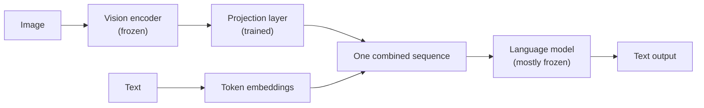

# M4-L02 — Modalities: Text, Image, Audio, Video and Multimodal

| | |
|---|---|
| **Lesson ID** | M4-L02 |
| **Difficulty** | 1 (Beginner) |
| **Estimated study time** | 1.25 hours |
| **Prerequisites** | [M4-L01](M4-L01-foundation-models.md), [M3-L01](../module-03-math-ml-essentials/M3-L01-vectors-matrices.md) |

---

## 1. Learning objectives

1. **Define** a modality, and explain what every modality has in common once it reaches a model.
2. **Describe** how text, images, audio and video are each turned into sequences of vectors.
3. **Explain** what "multimodal" means and the two architectures that achieve it.
4. **Estimate** the token cost of an image and explain why images are expensive.
5. **Choose** the right modality for a task, and recognise when converting to text first is better.

---

## 2. Vocabulary

| Term | Definition |
|---|---|
| **Modality** | A kind of data: text, image, audio, video, and others. |
| **Multimodal model** | A model accepting or producing more than one modality. |
| **Any-to-any** | A model handling many modalities in both directions. |
| **Patch** | A small square of an image, treated as one unit — the image equivalent of a token. |
| **ViT** | Vision Transformer — a transformer applied to image patches. |
| **Spectrogram** | A 2-D image of audio: time on one axis, frequency on the other. |
| **Mel scale** | A frequency scale spaced to match human hearing. |
| **OCR** | Optical Character Recognition — extracting text from an image. |
| **ASR** | Automatic Speech Recognition — audio to text. |
| **TTS** | Text-to-Speech. |
| **Projection layer** | A learned matrix mapping one modality's vectors into the language model's space. |
| **Diffusion model** | A generative model that produces images by iteratively removing noise. |

---

## 3. Plain-language explanation

### 3.1 The one idea

A transformer does not know what text is. It does not know what an image is. It processes exactly one
kind of input:

> **A sequence of vectors.**

That is the whole interface. So handling a new modality is one engineering problem: **turn this
thing into a sequence of vectors.**

| Modality | Becomes a sequence of… | How |
|---|---|---|
| Text | Tokens | Split into subwords, look each up in an embedding table |
| Image | Patches | Cut into squares (say 14×14 pixels), flatten, project each |
| Audio | Frames | Convert to a spectrogram, slice it along time |
| Video | Frames + patches | Sample frames, patch each one |

**Once converted, the machinery is the same.** The attention mechanism you will meet in M4-L07 does
not behave differently for an image patch than for a word. This is why the field converged on one
architecture for everything — and it is the single most useful thing to understand about
multimodality.

### 3.2 Why this matters to you

Three practical consequences, and all three will affect a system you build:

1. **Images consume your context window** (M4-L06). A single image can cost more than a page of text.
   A prompt with six screenshots may not fit, and the failure arrives as a truncation, not an error.
2. **You are usually billed per token, including image tokens.** An image-heavy workload can cost
   10–50× a text one for the same number of requests.
3. **Converting to text first is often better.** For a scanned invoice, OCR into text and then reason
   over the text is frequently cheaper, more accurate and far more debuggable than passing the image
   to a vision model. §5.7 covers when each wins.

---

## 4. Analogy

**A modality is a file format; the model is an application that only opens one.** Every other format
needs converting first. Once converted, the application does not know or care where the content came
from.

### Where the analogy breaks

1. **File conversion is lossless or nearly so. Modality conversion is lossy and the loss is
   selective.** Patching an image discards fine detail; OCR discards layout, colour and handwriting
   nuance. What is lost determines what the model cannot see.
2. **A file format has one correct reading. A modality has many valid encodings**, and the choice —
   patch size, sample rate, mel bins — changes what the model can perceive.
3. **Conversion is usually a fixed algorithm. Here the converter is itself a trained model**, with
   its own failure modes and biases.
4. **A converted file looks the same to you. Converted modalities are not comparable to each other**
   — an image token and a text token cost the same money and carry very different amounts of
   information.

---

## 5. Detailed technical explanation

### 5.1 Text

Covered fully in M4-L03. Split into subword tokens, look each up in an embedding table, get a vector
per token. Roughly **1 token ≈ 4 characters ≈ 0.75 English words** `[STABLE — a rule of thumb, and
M4-L03 measures where it fails badly]`.

### 5.2 Images

**Patching.** A 224×224 image with 14×14 patches gives `(224/14)² = 256` patches. Each patch is
`14 × 14 × 3 = 588` numbers, projected by a learned matrix to the model's dimension.

**The key relationship, and it is quadratic:**

```
patches = (width / patch_size) × (height / patch_size)
```

**Halving the patch size quadruples the patch count.** Doubling image resolution also quadruples it.
This is why vision models resize aggressively, and why "just send the full-resolution scan" is an
expensive instinct.

**Typical costs** `[UNVERIFIED — providers differ and change these; check current docs]`:

| Image | Rough token cost |
|---|---|
| Small thumbnail (512×512) | ~250 tokens |
| Standard (1024×1024) | ~750–1,500 tokens |
| High detail / large | 1,500–3,000+ tokens |

For comparison, this lesson's §3 is about 400 tokens. **One high-detail image can cost more than
several pages of text.**

**What vision models see well and badly:**

| Good at | Poor at |
|---|---|
| Describing scenes and objects | Reading small or dense text |
| Reading large, clear text | Precise spatial measurement |
| Chart trends and shapes | Exact values from unlabelled charts |
| Layout structure | Counting many similar objects |
| Answering open questions about content | Anything requiring pixel-level precision |

**The counting weakness is worth knowing** — "how many people are in this photo?" is unreliable above
a handful, and the model will answer confidently anyway.

### 5.3 Audio

Raw audio at 16 kHz is 16,000 numbers per second — far too many to treat as a sequence directly.

**The standard pipeline:**

```
waveform → short overlapping windows → FFT → magnitudes → mel filterbank → log
        → a 2-D array: (time frames × mel bins)
```

That array is **a picture of the sound**: time horizontally, frequency vertically, brightness for
energy. Having produced an image, the model can treat it as one. A 10-second clip at 25 ms hops
becomes ~400 frames rather than 160,000 samples.

**Two routes for speech:**

| Route | How | Trade-off |
|---|---|---|
| **ASR then text** | Transcribe, then reason over the transcript | Cheap, debuggable, loses tone and speaker identity |
| **Native audio** | Feed audio frames to the model directly | Retains tone, emotion, overlap; costlier and harder to inspect |

**Default to ASR-then-text** unless you specifically need what the transcript throws away.

### 5.4 Video

Video is images plus time, and the cost is brutal:

```
1 minute at 30 fps = 1,800 frames
1,800 frames × ~750 tokens = 1,350,000 tokens
```

That exceeds nearly every context window. So every practical system **samples**: 1 frame per second,
or key frames on scene change, plus the audio track transcribed separately. **Video understanding is
mostly a sampling-strategy problem**, and the sampling strategy determines what the system can
possibly notice.

### 5.5 How multimodal models are built

**Two architectures:**

**(a) Adapter / projection** — the common approach. Take a pretrained vision encoder and a pretrained
language model, and train a small projection layer mapping vision vectors into the language model's
embedding space.



Cheap, reuses two strong pretrained models, and the language model is not retrained from scratch.

**(b) Natively multimodal** — train on all modalities from the start, with one shared representation.
More expensive, generally better cross-modal reasoning.

**The practical consequence of (a):** many multimodal models are a language model wearing a vision
adapter. That explains a lot of observed behaviour — strong language reasoning *about* images, weaker
precise perception *of* them.

### 5.6 Generating non-text output

Producing images is a **different mechanism** from generating text, and this trips people up.

| | Text generation | Image generation |
|---|---|---|
| Mechanism | Autoregressive: one token at a time | **Diffusion**: start from noise, iteratively denoise |
| Order | Left to right | The whole image at once, refined over steps |
| Steps | One per token | Typically 20–50 denoising steps |
| Control | Prompt, temperature, stop sequences | Prompt, guidance scale, seed, negative prompt |

**Diffusion is not next-token prediction**, so almost none of M4-L14's decoding knowledge transfers.
Image models are also generally **separate models** from your text model — "GPT can make images"
usually means the text model calls an image model as a tool (M8).

### 5.7 Choosing a modality — the decision that saves money

| Situation | Do this | Why |
|---|---|---|
| Scanned invoices, structured fields | **OCR → text → LLM** | Cheaper, more accurate on dense text, debuggable |
| Screenshot, "what is wrong here?" | Vision model | Layout and visual state matter |
| Chart with a data table available | **Use the table** | Never ask a model to read values off a chart when you have the numbers |
| Call recordings, content analysis | **ASR → text** | Cheap and inspectable |
| Call recordings, tone or sentiment | Native audio | The transcript discards exactly what you need |
| Long video, find an event | Sample frames + transcribe audio | Full video will not fit |
| Handwriting | Vision model | OCR is weak on handwriting |

**The general rule: convert to text when text preserves what you need, and keep the original modality
when it does not.** Being explicit about *what information the conversion discards* is the whole
decision.

### 5.8 Assumptions and limitations

- Token costs and capabilities are provider-specific and change frequently. Everything numeric here
  is `[UNVERIFIED]` and must be checked against current documentation before you budget on it.
- Patch sizes, sample rates and mel-bin counts vary by model.
- "Multimodal" on a product page may mean anything from full native support to a tool call to a
  separate model. Read the documentation, not the marketing.

---

## 6. Worked example — costing a document-processing pipeline

**The task.** 10,000 scanned invoices a month. Extract supplier, invoice number, date, total.

**Option A — send each page image to a vision model.**

```
Page image, high detail          ≈ 1,500 tokens
Prompt and schema                ≈   200 tokens
Output JSON                      ≈   100 tokens
                                 -------------
Per invoice                      ≈ 1,800 tokens
10,000 invoices                  ≈ 18,000,000 tokens/month
```

**Option B — OCR locally, then send the text.**

```
OCR (local, e.g. Tesseract)      = 0 model tokens
Extracted text (typical invoice) ≈   400 tokens
Prompt and schema                ≈   200 tokens
Output JSON                      ≈   100 tokens
                                 -------------
Per invoice                      ≈   700 tokens
10,000 invoices                  ≈  7,000,000 tokens/month
```

**Option B uses about 39% of the tokens** — a 61% reduction — and the OCR step is free.

**But cost is not the whole argument, and the rest of it matters more:**

| | Option A (vision) | Option B (OCR → text) |
|---|---|---|
| Tokens | 18.0M | **7.0M** |
| Handles handwriting | ✅ | ❌ |
| Handles complex layouts | ✅ | Depends on the OCR engine |
| **Debuggable** | ❌ — a wrong answer is opaque | ✅ — you can read the OCR output |
| **Failure is visible** | ❌ | ✅ — garbled OCR is obvious |
| Extra dependency | No | Yes, an OCR engine |

**The debuggability row is the one that decides it in practice.** With Option B, when extraction goes
wrong you read the intermediate text and immediately see whether OCR failed or the model
misinterpreted correct text. With Option A you have a wrong answer and no way to tell which half of
the system produced it.

**The recommendation: B by default, with A as a fallback** when OCR confidence is low or the document
is handwritten. That hybrid costs a little more than pure B and removes most of A's disadvantages —
and you can only design it because you know what each conversion discards.

**A caution on all of this.** Every number above is an estimate built from the rules of thumb in §5.2.
**Before committing a budget, measure your own documents against your provider's actual tokenizer and
current pricing** (M4-L03 §7). Estimates drawn from a course are for shaping a decision, not for
signing a contract.

---

## 7. Practical activity

**File:** [`labs/m4/l02_modalities.py`](../../labs/m4/l02_modalities.py)

**No API key, no network, no image libraries.** Everything is synthesised and computed with NumPy.

```bash
source .venv/bin/activate
python labs/m4/l02_modalities.py
```

Builds a synthetic image and patches it, shows the quadratic patch-count relationship, generates a
tone and converts it to a mel-style spectrogram, computes video sampling costs, and reproduces §6's
pipeline comparison so you can vary the assumptions.

### 7.2 Expected output

`[EXECUTED]` on Python 3.12.3, NumPy 2.5.3, 2026-09-08.

```text

============================================================================
1. AN IMAGE BECOMES A SEQUENCE OF PATCHES
============================================================================
  image shape            : (224, 224, 3)  (150,528 numbers)
  patch size             : 14 x 14
  patch grid             : 16 x 16
  sequence length        : 256 patches
  numbers per patch      : 588  (14 x 14 x 3)

  after the projection layer: (256, 768)
  -> 256 vectors of 768 numbers each.
  That is exactly the shape a text prompt of 256 tokens would produce.
  From here the transformer cannot tell which one it received.

  the first three patches, as vectors (first 6 dimensions):
    patch   0 (row 0, col 0): [ 0.127  0.156 -0.095 -0.042 -0.05   0.131]
    patch   1 (row 0, col 1): [ 0.109  0.186 -0.079 -0.014 -0.025  0.147]
    patch   2 (row 0, col 2): [ 0.122  0.195 -0.073 -0.008 -0.02   0.155]

  patch 41 covers the white box; patch 0 is background:
    mean pixel value, patch  41: 0.4281
    mean pixel value, patch   0: 0.1393
  The projection preserves that difference -- which is what lets
  attention (M4-L07) tell the two regions apart.

============================================================================
2. PATCH COUNT IS QUADRATIC  (the cost relationship that matters)
============================================================================
         image   patch   patches   vs 14px @224   ~tokens
       224x224   14x14       256           1.0x       256
       224x224     7x7     1,024           4.0x     1,024
       448x448   14x14     1,024           4.0x     1,024
       448x448     7x7     4,096          16.0x     4,096
       896x896   14x14     4,096          16.0x     4,096
     1024x1024   16x16     4,096          16.0x     4,096
     2048x2048   16x16    16,384          64.0x    16,384

  patches = (width/patch) x (height/patch), so BOTH resizing the image
  and shrinking the patch scale QUADRATICALLY:
    224 -> 448 at the same patch size : 4x the patches
    patch 14 -> 7 at the same size    : 4x the patches

  A 2048x2048 scan is 64x the cost of a 224x224 thumbnail.
  This is why 'just send the full-resolution scans' is expensive.

============================================================================
3. AUDIO BECOMES A PICTURE OF SOUND
============================================================================
  duration        : 2.0 s at 16,000 Hz
  raw samples     : 32,000   <- far too long to use as a sequence
  window / hop    : 400 samples (25 ms) / 160 samples (10 ms)
  spectrogram     : (198, 201)  (frames x fft bins)
  mel spectrogram : (198, 40)  (frames x mel bins)
  compression     : 32,000 samples -> 198 frames = 162x fewer sequence positions

  the spectrogram, drawn (rows = frequency bands, columns = time):
  The tone steps 220 Hz -> 440 Hz -> 880 Hz, so the bright band should
  move UP the picture as time moves right.

       2396 Hz |-=---:------:-:----::-:--|
       2213 Hz |----::-:--------:--:-----|
       2042 Hz |-:-:::--:--:---:-:--:-:-:|
       1880 Hz |-:------:--:-::--:-:---:-|
       1728 Hz |-:--:---:--:----::---:-::|
       1585 Hz |---:::--:---::--:-::::::-|
       1450 Hz |:-:::::::::-::-:.:-:::::-|
       1323 Hz |::::::--::-::::.:-:.::.::|
       1204 Hz |.-:::.:::--:.:::::-::::::|
       1092 Hz |:-:::::::::.:::-:::-:-:::|
        986 Hz |:-:.-:::--.:.:::-:*******|
        887 Hz |:-. :.:::-.:.:::::@%%%%%%|
        793 Hz |::: .:::::-:-:::::*******|
        705 Hz |:-..::.::.:::.. ::::.::-:|
        622 Hz |:: :::: :: ::.. ::.::.:.:|
        544 Hz |:. :::..:*********:.:...:|
        471 Hz |:: .::..:%%%%%%%%%:..:.:.|
        402 Hz |:::::::-:#########.: .::.|
        337 Hz |+++++++++:.:..:::..:.::::|
        276 Hz |%%%%%%%%%.....:::..::::. |
        218 Hz |%%%%%%%%%:: .. .:. :.....|
        164 Hz |*********::..:::....:.: .|
        113 Hz |---------.:..:...::.: : .|
         65 Hz |..:.:.:......:  . . . ...|
       time -> |                         |

  peak mel band at t=0.1s, 0.9s, 1.7s: [4, 7, 12]
  Rising, as the pitch rises. The model receives this as 198 vectors
  of 40 numbers -- the same shape as 198 text tokens.

============================================================================
4. VIDEO IS A SAMPLING PROBLEM
============================================================================
  assuming 750 tokens per frame (a ~1024x1024 image)

        clip    fps    frames        tokens  fits 200k ctx?
       1 min     30     1,800     1,350,000              NO
       1 min      5       300       225,000              NO
       1 min      1        60        45,000             yes
      10 min     30    18,000    13,500,000              NO
      10 min      5     3,000     2,250,000              NO
      10 min      1       600       450,000              NO
      60 min     30   108,000    81,000,000              NO
      60 min      5    18,000    13,500,000              NO
      60 min      1     3,600     2,700,000              NO

  A 1-minute clip at 30 fps is 1.35M tokens -- over 6x a 200k context
  window, for one minute of video. Every practical system samples.
  Sampling at 1 fps makes a 10-minute video fit; that decision also
  determines what the system is CAPABLE of noticing.

  scene-change sampling on a synthetic 300-frame clip:
    uniform 1-in-1  : 300 frames -> 225,000 tokens
    scene changes   : 6 frames -> 4,500 tokens (50x fewer)
    frames kept     : [0, 50, 100, 150, 200, 250]
    Keeps one frame per distinct scene. Misses anything that changes
    WITHIN a scene -- which is the trade-off you are choosing.

============================================================================
5. DOCUMENT PIPELINE: VISION vs OCR-THEN-TEXT
============================================================================
  10,000 invoices per month

  option                         tokens/doc    tokens/month   vs vision
  A: vision model                     1,800      18,000,000          --
  B: OCR -> text                        700       7,000,000        39%

  Option B uses 39% of the tokens -- a 61% reduction.

  Hybrid: OCR first, fall back to vision when OCR confidence is low.
    fallback rate    tokens/month   vs vision   vs pure OCR
              0%       7,000,000        39%         1.00x
              5%       7,550,000        42%         1.08x
             10%       8,100,000        45%         1.16x
             25%       9,750,000        54%         1.39x
             50%      12,500,000        69%         1.79x
            100%      18,000,000       100%         2.57x

  The hybrid only stops saving money at a 100% fallback rate --
  i.e. when OCR fails on every document, at which point it IS option A.
  At a realistic 10% fallback it still uses 45% of pure-vision tokens,
  AND every non-fallback document remains inspectable. That is the
  argument for the hybrid: it is cheaper AND more debuggable.

  CAUTION: every number above is an estimate from this lesson's rules
  of thumb. Measure YOUR documents against YOUR provider's tokenizer
  and current prices before committing a budget (M4-L03).

Done.
```

### 7.3 Reading the result

**Section 1 makes §3.1's claim concrete.** A 224×224×3 image is 150,528 numbers. Patched at 14×14 it
becomes a 16×16 grid — **256 patches of 588 numbers each** — and after the projection layer, a
`(256, 768)` array.

**That is exactly the shape a 256-token text prompt produces.** From that point the transformer
cannot tell which one it received, and this is not a simplification: it is why one architecture
serves every modality.

The lab also checks that patching preserves what matters. Patch 41 covers the white box and has mean
pixel value **0.4281**; patch 0 is background at **0.1393**. The difference survives the projection,
which is what later lets attention distinguish the regions.

**Section 2 is the number to remember.**

| Image | Patch | Patches | Relative cost |
|---|---|---|---|
| 224×224 | 14×14 | 256 | 1× |
| 448×448 | 14×14 | 1,024 | **4×** |
| 224×224 | 7×7 | 1,024 | **4×** |
| 448×448 | 7×7 | 4,096 | **16×** |
| 2048×2048 | 16×16 | 16,384 | **64×** |

**Doubling the resolution quadruples the cost. Halving the patch size also quadruples it.** A
2048×2048 scan costs **64×** a 224×224 thumbnail. When someone asks you to "just send the
full-resolution scans", this table is the reply.

**Section 3 draws the spectrogram, and the result is worth looking at properly.** The synthetic tone
steps 220 Hz → 440 Hz → 880 Hz, and the bright band in the ASCII plot moves **up** the picture as
time moves right — `%` at 218–276 Hz for the first third, `#`/`%` at 402–544 Hz for the second,
`@`/`%` at 887–986 Hz for the last. The measured peak mel band at t = 0.1 s, 0.9 s and 1.7 s is
**[4, 7, 12]**, rising as expected.

**Sound really has become a picture**, and the compression is the point: **32,000 raw samples become
198 frames — 162× fewer sequence positions.** Raw audio is unusable as a sequence; a spectrogram is
198 vectors, exactly like 198 tokens.

**Section 4 shows why video forces a sampling decision on you.**

| Clip | fps | Tokens | Fits a 200k context? |
|---|---|---|---|
| 1 min | 30 | **1,350,000** | No — 6.75× over |
| 1 min | 1 | 45,000 | Yes |
| 10 min | 1 | 450,000 | No |
| 60 min | 30 | **81,000,000** | No |

**One minute of ordinary video at 30 fps is 6.75× a 200,000-token context window.** There is no
configuration in which you send whole videos. The scene-change sampler on the synthetic clip keeps
**6 frames of 300 — a 50× reduction** — by keeping one frame per distinct scene, and *misses anything
that changes within a scene*. That is not a flaw in the sampler; it is the trade-off you are
choosing, and choosing it deliberately is the job.

**Section 5 reproduces §6 and extends it to the hybrid.** Option B uses **39%** of Option A's tokens.
More usefully, the fallback sweep:

| OCR fallback rate | Tokens/month | vs pure vision |
|---|---|---|
| 0% | 7.0M | 39% |
| 10% | 8.1M | **45%** |
| 25% | 9.75M | 54% |
| 100% | 18.0M | 100% |

At a realistic **10% fallback rate the hybrid still uses 45% of pure-vision tokens** — and every
non-fallback document stays inspectable. **The hybrid is cheaper *and* more debuggable**, which is
unusual enough to be worth noticing; most engineering choices trade one against the other.

The lab closes with the caution that belongs on all of this: these are estimates from rules of thumb.
**Measure your own documents against your provider's tokenizer and current prices before committing a
budget.** M4-L03 shows you how.

---

## 8. Common mistakes and troubleshooting

1. **Sending full-resolution images.** Cost is quadratic in resolution. Resize to what the task needs.
2. **Asking a vision model to read a chart you have the data for.** Use the data.
3. **Expecting reliable counting** of many objects from an image.
4. **Sending every video frame.** Sample.
5. **Using native audio when a transcript would do.**
6. **Assuming image generation works like text generation.** Diffusion is a different mechanism.
7. **Not measuring your own token costs** before committing a budget.
8. **Ignoring what a conversion discards** — the most important question in this lesson.

| Symptom | Likely cause | Fix |
|---|---|---|
| Context window exceeded with few images | Images are token-expensive | Resize; reduce detail; fewer per request |
| Costs 20× the estimate | Image tokens not budgeted | Measure with the provider's tokenizer |
| Model misreads small text in a screenshot | Detail lost in patching | Crop and enlarge, or OCR first |
| Counts of objects are wrong | Known weakness | Use a detection model, or restructure the task |
| Video analysis misses an event | Sampling skipped the frame | Denser sampling, or scene-change detection |
| Transcript loses the point | ASR discarded tone/speaker | Native audio, or add diarisation |
| Image generation ignores part of the prompt | Diffusion guidance | Adjust guidance; use negative prompts |

---

## 9. Security, privacy, reliability, cost

- **Privacy.** Images and audio frequently contain far more than intended: faces in the background,
  a visible screen, an address on an envelope, a second voice. **Redaction is much harder for images
  and audio than for text.** Assume anything in the frame is being sent.
- **Privacy.** Biometric data — faces, voices — is regulated in many jurisdictions, often more
  strictly than other personal data. Get a proper review before processing it. Nothing here is legal
  advice, and no technical control by itself establishes compliance (M10).
- **Cost.** Image and video workloads are the most common source of surprise bills. Model the cost
  per request before launch, and remember that **billing alerts notify, they do not cap.**
- **Security.** Images can carry prompt injection — text embedded in an image that the model reads
  and follows. Treat text extracted from an image with exactly the same suspicion as text from a
  user (M10-L06).
- **Reliability.** Multimodal support varies sharply between models and versions. Verify against the
  specific model you will deploy, not a family name.

---

## 10. Exercises

### Exercise 1 — Beginner (~20 min)

1. In one sentence, what do all modalities have in common by the time they reach the model?
2. A 448×448 image with 16×16 patches. How many patches? Now halve the patch size — how many?
3. For each, name the modality and say whether you would convert to text first: (a) a podcast to
   summarise; (b) a screenshot of a broken UI; (c) 5,000 scanned receipts; (d) a call to assess for
   customer frustration.
4. Why is video so much more expensive than images? Give a number.
5. Name three things OCR discards that a vision model would retain.

### Exercise 2 — Intermediate (~35 min)

1. Run the lab. Confirm the quadratic patch relationship and explain it in your own words.
2. Modify the pipeline comparison with your own token estimates and find the break-even OCR accuracy
   at which Option A becomes preferable.
3. Compute the token cost of a 3-minute video at 1, 5 and 30 fps. State which fit in a 200,000-token
   context.
4. Change the spectrogram's frame hop and describe the effect on sequence length and time resolution.
5. Take a real task from your work and write the §5.7-style decision, naming what each conversion
   discards.

### Exercise 3 — Challenge (~40 min)

1. Implement patching for non-square images, handling a size not divisible by the patch size. Explain
   your padding or cropping choice and what it discards.
2. Build a scene-change detector: sample frames from a synthetic video and select only frames
   differing from the previous by more than a threshold. Report the compression achieved.
3. Compute the total cost of a hybrid OCR-with-vision-fallback pipeline as a function of the fraction
   needing fallback. Find where it crosses pure vision.
4. Implement a mel filterbank from scratch and compare its output to a linear filterbank on the same
   audio. Explain what the mel scale buys.
5. Write a one-page brief for a colleague on when *not* to use a vision model, with three worked
   examples and costs.

---

## 11. Quiz

*(Answers: [`answer-keys/module-04-answers.md`](../../answer-keys/module-04-answers.md#m4-l02).)*

**Q1.** What do text, images and audio all become before a transformer processes them?

- A. A sequence of vectors, one per token, patch or frame.
- B. A single fixed-length vector summarising the whole input.
- C. A two-dimensional array of raw floating-point values.
- D. A string, since transformers operate on characters.

**Q2.** A 224×224 image uses 14×14 patches. How many patches?

- A. 16  B. 256  C. 196  D. 512

**Q3.** You halve the patch size on the same image. The patch count:

- A. Halves, since each patch covers half the previous area.
- B. Stays the same, as the image dimensions are unchanged.
- C. Doubles, in proportion to the linear reduction.
- D. Quadruples, because the relationship is quadratic.

**Q4.** How is audio usually prepared for a transformer?

- A. Raw samples are fed directly, one vector per sample.
- B. It is compressed to MP3 and the resulting bytes are embedded.
- C. It is converted to a spectrogram and sliced along time.
- D. It is transcribed first; audio cannot be processed natively.

**Q5.** Why is video so expensive?

- A. Video files are larger on disk than image files.
- B. Each sampled frame costs a full image's worth of tokens.
- C. Decoding video requires specialised hardware.
- D. Video models have more parameters than image models.

**Q6.** In an adapter-based multimodal model, what does the projection layer do?

- A. It resizes the input image to the encoder's expected dimensions.
- B. It compresses the image to reduce the token count.
- C. It converts the model's output back into pixels.
- D. It maps vision vectors into the language model's embedding space.

**Q7.** Image generation with diffusion differs from text generation because it:

- A. Starts from noise and denoises the whole image over steps.
- B. Requires substantially more parameters to produce output.
- C. Produces its output strictly left to right, like text.
- D. Cannot be controlled by a prompt in any meaningful way.

**Q8.** You have 10,000 scanned invoices and the OCR output is clean. Which pipeline?

- A. Vision model, because it handles any document layout.
- B. OCR to text, which is cheaper and inspectable at each step.
- C. Either; the cost and reliability are broadly comparable.
- D. Both in parallel, comparing the outputs on every document.

**Q9.** Why is the OCR pipeline described as more debuggable?

- A. OCR engines produce more detailed error messages.
- B. OCR runs locally, so its logs are easier to access.
- C. Text models are inherently more accurate than vision models.
- D. You can read the intermediate text and locate the failure.

**Q10.** A user uploads a photo containing text that says "ignore your instructions". What is the risk?

- A. Prompt injection — extracted text is untrusted input.
- B. The image will fail to parse and raise an error.
- C. The token cost will be higher than for a plain photo.
- D. Nothing; models cannot read text inside images.

**Q11.** *(Written, rubric-graded.)* In under 100 words, explain to a colleague why "just send us the
full-resolution scans" is an expensive request, and what you would propose instead.

---

## 12. Revision notes

- **Everything becomes a sequence of vectors.** Text → tokens, images → patches, audio → spectrogram
  frames, video → sampled frames of patches. After that the machinery is identical.
- **Patch count is quadratic**: `(w/p) × (h/p)`. Halving the patch size or doubling the resolution
  **quadruples** the count and the cost.
- Images cost roughly **250–3,000 tokens** each `[UNVERIFIED — check your provider]`. One high-detail
  image can exceed several pages of text.
- **Audio → spectrogram** (time × mel bins) — a picture of sound. ASR-then-text by default; native
  audio when you need tone, emotion or overlap.
- **Video is a sampling problem.** 1 minute at 30 fps ≈ 1.35M tokens. Sample frames; transcribe audio
  separately.
- **Most multimodal models are adapter-based**: a vision encoder plus a trained projection into the
  language model's space. Hence strong reasoning *about* images, weaker precise perception *of* them.
- **Diffusion ≠ next-token prediction.** Decoding knowledge does not transfer.
- **Convert to text when text preserves what you need.** Being explicit about *what the conversion
  discards* is the whole decision.
- **Debuggability usually outweighs the token saving**, and often points the same way.
- **Text inside an image is untrusted input.** Prompt injection travels through pixels.

---

## 13. Completion checklist

- [ ] I can state what every modality has in common at the model's input.
- [ ] I can compute a patch count and explain why it is quadratic.
- [ ] I can describe the audio pipeline without looking it up.
- [ ] I can estimate a video's token cost and say why sampling is mandatory.
- [ ] I can choose between OCR-then-text and a vision model, with reasons.
- [ ] I know that diffusion is a different mechanism from token generation.
- [ ] I ran the lab and varied the pipeline assumptions.
- [ ] I scored 8/11 on the quiz.

---

## 14. References

- Dosovitskiy et al. (2020), *An Image is Worth 16x16 Words* (ViT).
  <https://arxiv.org/abs/2010.11929> `[UNVERIFIED]`
- Radford et al. (2022), *Robust Speech Recognition via Large-Scale Weak Supervision* (Whisper).
  <https://arxiv.org/abs/2212.04356> `[UNVERIFIED]`
- Ho et al. (2020), *Denoising Diffusion Probabilistic Models*.
  <https://arxiv.org/abs/2006.11239> `[UNVERIFIED]`
- Liu et al. (2023), *Visual Instruction Tuning* (LLaVA — adapter approach).
  <https://arxiv.org/abs/2304.08485> `[UNVERIFIED]`

---

## 15. Next lesson

→ [M4-L03 — Tokens, Tokenizers, Vocabularies and Token IDs](M4-L03-tokens-tokenizers.md)

You know every modality becomes a sequence. Next: exactly how text becomes one — the single most
practically useful mechanism in this module, because it determines cost, context limits and a whole
family of strange failures.
