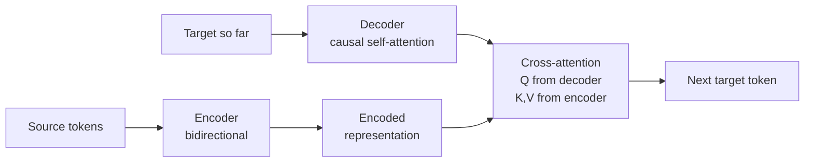

# M4-L11 — Encoder, Decoder and Encoder-Decoder Architectures

| | |
|---|---|
| **Lesson ID** | M4-L11 |
| **Difficulty** | 2 (Intermediate) |
| **Estimated study time** | 1.5 hours |
| **Prerequisites** | [M4-L10](M4-L10-transformer-block.md), [M4-L05](M4-L05-next-token-prediction.md) |

---

## 1. Learning objectives

1. **Distinguish** the three architectures by the single property that separates them.
2. **Explain** why encoder-only models cannot generate and decoder-only models make weaker embeddings.
3. **Describe** how cross-attention connects an encoder to a decoder.
4. **Explain** why decoder-only became dominant, in terms other than "it works better".
5. **Choose** the right architecture for a task, and know when the choice is already made for you.

---

## 2. Vocabulary

| Term | Definition |
|---|---|
| **Encoder-only** | Bidirectional attention, no causal mask. BERT-style. |
| **Decoder-only** | Causal attention. GPT-style, and nearly every current LLM. |
| **Encoder-decoder** | An encoder plus a decoder joined by cross-attention. T5-style. |
| **Bidirectional** | Each position attends to all positions, before and after. |
| **Causal / autoregressive** | Each position attends only to itself and earlier positions. |
| **Cross-attention** | Queries from the decoder, keys and values from the encoder. |
| **MLM** | Masked Language Modelling — predict hidden tokens from both sides. |
| **CLM** | Causal Language Modelling — predict the next token. |
| **Seq2seq** | Mapping an input sequence to an output sequence. |
| **`[CLS]` token** | A special position whose output is used as a sentence representation. |

---

## 3. Plain-language explanation

### 3.1 One property separates them

**Everything in M4-L07 through M4-L10 is shared.** Same attention, same FFN, same residuals, same
norms. The three architectures differ in **who may attend to whom**:

| Architecture | Attention pattern | Consequence |
|---|---|---|
| **Encoder-only** | Everyone sees everyone | Rich representations; **cannot generate** |
| **Decoder-only** | Each position sees only the past | Can generate; each token sees less context |
| **Encoder-decoder** | Encoder bidirectional, decoder causal + cross-attention | Best of both, at twice the machinery |

**That is the whole taxonomy.** One mask, three architectures.

### 3.2 Why an encoder cannot generate

If every position attends to every other, then predicting position `i` from a sequence containing
position `i` is trivial — the answer is in the input (M4-L05 §7.3 measured the loss collapsing to
**0.0006**).

So encoders are trained differently: **hide 15% of the tokens and predict them** from both sides
(masked language modelling). That produces excellent representations and no generation ability, because
there is no procedure for extending a sequence.

**Encoders answer "what does this text mean?" Decoders answer "what comes next?"**

### 3.3 Why decoder-only won

The honest reasons, in order of importance:

1. **Training efficiency.** Every position is a training example. MLM only trains on the ~15% of
   masked positions, so a decoder extracts roughly **6× more learning signal** from the same text.
2. **One objective, one model.** Any task expressible as text-in-text-out works, so classification,
   extraction and generation all use one model.
3. **Scaling.** The simpler recipe scaled further with less engineering.
4. **In-context learning.** Few-shot prompting emerged from generative pretraining and has no natural
   encoder analogue.

**Not because bidirectional attention is worse.** For a fixed budget on a pure understanding task,
encoders remain competitive and are usually smaller and faster. **Decoder-only won on economics and
generality, not on representation quality** — which is why embedding models (M6) are still frequently
encoder-based.

---

## 4. Analogy

**Reading a document versus writing one.** An encoder is a reader who may look ahead and back freely.
A decoder is a writer producing one word at a time who cannot see what they have not yet written. An
encoder-decoder is a translator: read the whole source, then write the target one word at a time,
consulting the source throughout.

### Where the analogy breaks

1. **A reader can also write.** An encoder genuinely cannot — there is no mechanism, not merely no
   training.
2. **A writer can revise. An autoregressive decoder cannot un-emit a token** (M4-L05 §5.3).
3. **A translator holds the source in memory. Cross-attention re-consults the encoder's output at
   every step** — it is a lookup, not a memory.
4. **People switch modes freely.** The mask is fixed at architecture time, not chosen per task.

---

## 5. Detailed technical explanation

### 5.1 Encoder-only

```python
scores = Q @ K.T / sqrt(d_k)        # NO mask
weights = softmax(scores, axis=-1)
```

**Training (MLM):** replace 15% of tokens with `[MASK]` and predict them from both sides.

**Uses:** classification, named-entity recognition, extractive question answering, and **embeddings**.

**Getting a sentence vector:** take the `[CLS]` position's output, or mean-pool (M4-L04 §5.5).

**Sizes are modest** — often 100M–350M parameters — because understanding tasks do not need the scale
that generation does. A small encoder frequently beats a large decoder on classification, per unit of
cost.

### 5.2 Decoder-only

```python
scores = Q @ K.T / sqrt(d_k)
scores = scores + causal_mask        # -inf above the diagonal
weights = softmax(scores, axis=-1)
```

**Training (CLM):** predict the next token at every position (M4-L05).

**Uses:** everything generative, and via prompting, most understanding tasks too.

**The cost of causality:** the first token sees nothing but itself, and token `i` sees only `0…i`. A
decoder's representation of position 3 is strictly less informed than an encoder's, which is why
decoder-derived embeddings are typically weaker at equal size.

### 5.3 Encoder-decoder



Each decoder block has **three** sublayers rather than two: causal self-attention, then
cross-attention to the encoder, then the FFN.

**Cross-attention is the same equation** (M4-L07 §5.4) with `K` and `V` taken from the encoder's
output. It is **not masked** — the decoder may consult the entire source, which is correct, since the
source is fully known.

**Best suited to:** translation, summarisation, and any task with a clean, fixed input-to-output
mapping. **Costs:** roughly twice the machinery, and a harder training and serving story.

### 5.4 Comparison

| | Encoder-only | Decoder-only | Encoder-decoder |
|---|---|---|---|
| Attention | Bidirectional | Causal | Both |
| Objective | MLM | CLM | Seq2seq |
| Can generate | **No** | Yes | Yes |
| Training signal | ~15% of positions | **100%** | 100% of target |
| Typical size | 100M–350M | 1B–500B+ | 200M–11B |
| Best at | Classification, embeddings | Generation, general purpose | Translation, summarisation |
| Examples | BERT, RoBERTa, DeBERTa | GPT, Llama, Claude, Mistral | T5, BART, mT5 |

### 5.5 What this means for your work

**Most of the time the choice is already made.** You will call a decoder-only model through an API and
an encoder-only embedding model for retrieval, and both decisions were taken by whoever built them.

**Where it does become your decision:**

- **Classification with plenty of labels.** A fine-tuned encoder is often cheaper, faster and more
  accurate than prompting a large decoder. Benchmark both — M1-L11's point about capability versus
  reliability applies directly.
- **Embeddings.** Use a purpose-built embedding model, not a chat model's hidden states (M4-L04 §5.5).
  Most are encoder-based, though strong decoder-based embedding models now exist.
  `[UNVERIFIED — changing quickly]`
- **Latency-sensitive extraction.** A 100M-parameter encoder can be **100×** cheaper per request than
  a large decoder for a fixed, narrow task.

**The instinct to reach for the largest general model is often wrong on cost, and sometimes wrong on
accuracy too.**

### 5.6 Assumptions and limitations

- The boundaries blur: prefix-LM and UL2 mix objectives, and encoder-decoder models can be adapted
  for generation-only use.
- Specific model families and their sizes change; treat named examples as illustrative.
- Encoder-based embeddings being "better" is a general tendency, not a universal fact. Benchmark on
  your data.

---

## 6. Worked example — one sentence, three architectures

**Input:** `the cat sat on the mat`. **Question at position 3 (`on`):** what may this position see?

### 6.1 The attention patterns

**Encoder-only** — every position sees all six:

```
        the  cat  sat  on   the  mat
the      ✓    ✓    ✓    ✓    ✓    ✓
cat      ✓    ✓    ✓    ✓    ✓    ✓
sat      ✓    ✓    ✓    ✓    ✓    ✓
on       ✓    ✓    ✓    ✓    ✓    ✓      ← sees "the mat" ahead
the      ✓    ✓    ✓    ✓    ✓    ✓
mat      ✓    ✓    ✓    ✓    ✓    ✓
```

**Decoder-only** — each position sees only itself and earlier:

```
        the  cat  sat  on   the  mat
the      ✓    ✗    ✗    ✗    ✗    ✗
cat      ✓    ✓    ✗    ✗    ✗    ✗
sat      ✓    ✓    ✓    ✗    ✗    ✗
on       ✓    ✓    ✓    ✓    ✗    ✗      ← cannot see "the mat"
the      ✓    ✓    ✓    ✓    ✓    ✗
mat      ✓    ✓    ✓    ✓    ✓    ✓
```

**Count the visible cells: 36 for the encoder, 21 for the decoder.** The decoder sees **58%** of what
the encoder does. That difference is exactly what it pays for the ability to generate.

### 6.2 Why the difference matters — a concrete case

**Task: is `bank` a financial institution or a riverside?**

```
"I walked along the bank of the river"
```

The disambiguating word `river` is **four positions after** `bank`.

- **Encoder:** position 4 (`bank`) attends directly to position 8 (`river`). Resolved in one layer.
- **Decoder:** position 4 cannot see position 8 at all. It must guess from the prefix alone.

**Does the decoder therefore fail?** No — and understanding *why not* matters more than the
limitation itself. Later positions *can* see `bank`, and the residual stream carries the resolution
forward, so by the time the model generates anything the ambiguity is settled. **The decoder resolves
it later rather than never.**

**But position 4's own representation is permanently less informed**, and that is precisely why
decoder-derived embeddings tend to be weaker: **an embedding is taken from a position's
representation**, and half of those positions never saw the second half of the sentence.

§7.3 measures this with a linear probe on held-out data. On positions that cannot see the
disambiguating token, the encoder scores **0.6212** and the decoder **0.5125** against a majority
baseline of **0.5200** — the decoder is at chance, exactly as the mask requires.

### 6.3 The training-signal calculation

For a 1,000-token document:

| Architecture | Positions supervised | Signal per document |
|---|---|---|
| Encoder (MLM, 15% masked) | 150 | 150 predictions |
| Decoder (CLM) | 999 | **999 predictions** |

**6.7× more learning signal from the same text**, at essentially the same compute per forward pass.
Over a trillion-token corpus, that is the difference between one training run and nearly seven.

**This, more than any argument about representation quality, is why decoder-only models scaled first.**

---

## 7. Practical activity

**File:** [`labs/m4/l11_architectures.py`](../../labs/m4/l11_architectures.py)

**No API key, no network.**

```bash
source .venv/bin/activate
python labs/m4/l11_architectures.py
```

Builds all three architectures over the same block code, counts visible attention cells, trains an
encoder and a decoder on the same corpus and compares their representations, measures the
training-signal difference, and demonstrates cross-attention.

### 7.2 Expected output

`[EXECUTED]` on Python 3.12.3, NumPy 2.5.3, 2026-09-08.

```text

============================================================================
1. ONE PROPERTY SEPARATES THEM: WHO MAY ATTEND TO WHOM
============================================================================

  ENCODER-ONLY (bidirectional)   -- 36 of 36 cells visible (100%)
            the   cat   sat    on   the   mat
      the     v     v     v     v     v     v
      cat     v     v     v     v     v     v
      sat     v     v     v     v     v     v
       on     v     v     v     v     v     v   <- position 3
      the     v     v     v     v     v     v
      mat     v     v     v     v     v     v

  DECODER-ONLY (causal)   -- 21 of 36 cells visible (58%)
            the   cat   sat    on   the   mat
      the     v     X     X     X     X     X
      cat     v     v     X     X     X     X
      sat     v     v     v     X     X     X
       on     v     v     v     v     X     X   <- position 3
      the     v     v     v     v     v     X
      mat     v     v     v     v     v     v

  encoder sees 36 cells; decoder sees 21.
  the decoder sees 58% of the encoder's view.
  That difference is exactly what it pays for the ability to generate.

============================================================================
2. THE CONSEQUENCE, MEASURED: DOES A LATER TOKEN AFFECT AN EARLIER ONE?
============================================================================
  Changing only token 5 ('mat'), then checking every other position:

  position        encoder changed?    decoder changed?
  0 (the)                     True               False
  1 (cat)                     True               False
  2 (sat)                     True               False
  3 (on)                     True               False
  4 (the)                     True               False
  5 (mat)                     True                True

  In the encoder EVERY position changed -- all six can see token 5.
  In the decoder only position 5 changed; positions 0-4 are bit-
  identical, because the causal mask makes them structurally unable to
  see it. Same block code, same weights, one mask.

============================================================================
3. WHY DECODER-ONLY SCALED FIRST: THE TRAINING SIGNAL
============================================================================
     document length    MLM (15% masked)    CLM (next token)     ratio
                 128                  19                 127      6.7x
               1,000                 150                 999      6.7x
               8,192               1,228               8,191      6.7x
             100,000              15,000              99,999      6.7x

  Roughly 6.7x more supervised positions from the SAME text, at
  essentially the same compute per forward pass. Over a trillion-token
  corpus that is the difference between one training run and nearly
  seven. This, more than any argument about representation quality, is
  why decoder-only models scaled first.

  on a 1T-token corpus:
    MLM supervises   0.15T positions
    CLM supervises   1.00T positions

============================================================================
4. REPRESENTATION QUALITY BY POSITION
============================================================================
  A 8-token sequence whose meaning is determined by the LAST token.
  How well can each position's representation predict that meaning?

  probe: fitted on 600 rows, scored on 200 HELD OUT (M3-L13)
  majority-class baseline 0.5200; standard error 0.0354 (M3-L14)

    position     encoder probe     decoder probe   can it see token 7?
           0            0.6550            0.5450                    NO
           2            0.5850            0.4800                    NO
           4            0.6450            0.5100                    NO
           6            0.6000            0.5150                    NO
           7            1.0000            1.0000                   yes

  mean over the positions that CANNOT see token 7:
    encoder 0.6212   decoder 0.5125   baseline 0.5200

  Read this carefully. Both models are UNTRAINED (random weights), so
  neither propagates the signal cleanly -- the encoder's early positions
  are well short of 1.0. What matters is the GAP: the encoder's early
  positions carry a detectable signal from token 7, and the decoder's
  carry none, because they are structurally unable to see it.
  Only position 7 reaches 1.00 in the decoder,
  and that is the only position that saw the evidence.

  THIS is why decoder-derived embeddings are weaker at equal size: an
  embedding is taken from a POSITION's representation, and most of a
  decoder's positions never saw the second half of the text. It is also
  why last-token pooling is the sensible choice for a decoder (M4-L04).

============================================================================
5. ENCODER-DECODER: CROSS-ATTENTION
============================================================================
  encoder: 4 source tokens, bidirectional -> (4, 24) representation
  decoder: 4 target tokens, causal self-attention
           + cross-attention (Q from decoder, K/V from encoder)
           -> (4, 24)

  cross-attention weights (rows = target, columns = source):
                   le     chat      est    assis     sum
         the   0.4548   0.1926   0.2048   0.1478  1.0000
         cat   0.2730   0.1940   0.3384   0.1946  1.0000
          is   0.2049   0.2730   0.2627   0.2594  1.0000
     sitting   0.2976   0.2398   0.2931   0.1695  1.0000

  Note it is NOT masked -- every target position may consult every
  source position, which is correct: the source is fully known.
  Rows still sum to 1; it is the same attention equation with K and V
  taken from somewhere else. That is the ONLY change.

  proving the decoder actually uses the source:
    changed source token 1; decoder output changed: True
    max change: 0.7262
    with cross-attention removed entirely, the source has NO effect:
      output identical for both sources: True

============================================================================
6. THE COST ARGUMENT FOR SMALL ENCODERS
============================================================================
  a narrow, labelled classification task, 50,000 requests per day

  model                           params   relative cost   runs locally?
  encoder (BERT-base)              110M              1x   yes, on a CPU
  encoder (DeBERTa-large)          400M              4x   yes, on a GPU
  decoder (7B)                    7000M             64x    GPU required
  decoder (70B, hosted)          70000M            636x              no

  A 110M encoder against a 70B decoder is a 636x
  parameter difference for a task with a fixed label set and plenty of
  labels. The small model also runs locally, so sensitive data need
  never leave your infrastructure -- frequently the deciding factor,
  ahead of accuracy.

  And a security point that is easy to miss: an encoder classifier has
  NO instruction-following surface. Text in its input cannot redirect
  it, because it was never trained to follow instructions. A prompted
  decoder is exposed to injection by design (M10-L06).

  None of this says 'always use an encoder'. It says BENCHMARK BOTH
  before defaulting to the largest model available (M1-L11).

Done.
```

### 7.3 Reading the result

**Section 1 confirms §6.1's arithmetic**: 36 visible cells for the encoder, **21 for the decoder —
58%**.

**Section 2 turns that count into a measurement.** Changing only token 5 and checking every position:
in the encoder **all six positions changed**; in the decoder **positions 0–4 are bit-identical** and
only position 5 moved.

**Same block code, same weights, one mask.** That is the lesson's central claim, demonstrated rather
than asserted — the three architectures genuinely differ in nothing but who may attend to whom.

**Section 3 gives the economic argument**, and the ratio is **6.7×** at every document length, because
it is simply `(L−1) / 0.15L`. On a 1-trillion-token corpus that is **0.15T supervised positions for
MLM against 1.00T for CLM** — the difference between one training run's worth of signal and nearly
seven, at the same compute per forward pass.

**Section 4 required a fix, and the fix is one this course teaches.** The first version fitted the
linear probe and scored it on the same rows, reporting the decoder's frozen positions at ~0.57 — pure
overfitting (M3-L13 §5.4), on representations that provably contain no information about the label.

With a proper held-out split:

| | Positions that cannot see token 7 | Position 7 |
|---|---|---|
| **Encoder** | **0.6212** | 1.0000 |
| **Decoder** | **0.5125** | 1.0000 |
| Majority baseline | 0.5200 | — |

Standard error is **0.0354** on 200 held-out rows (M3-L14 §5.4), so read these against it: the
decoder's 0.5125 is **below the baseline and well inside one standard error of chance** — those
positions carry no signal at all. The encoder's 0.6212 is about **3 SE above** the baseline.

Note also what the encoder's number is *not*: it is 0.62, not 1.00. **Both models are untrained**, so
neither propagates the signal cleanly through random weights. **The gap is the result, not the
absolute level** — and reporting it that way, with the baseline and the standard error alongside, is
the discipline M3-L14 exists to instil.

**This is the mechanical reason decoder-derived embeddings are weaker at equal size.** An embedding is
taken from *a position's representation*, and in a decoder most positions never saw the second half of
the text. It is also why **last-token pooling** is the sensible choice for a decoder while `[CLS]` or
mean pooling suits an encoder (M4-L04 §5.5).

**Section 5 builds cross-attention from the same `attention()` function**, passing a different source
for K and V. That is the only change. The weight matrix has rows summing to 1.0000 and **is not
masked** — every target position may consult every source position, which is correct because the
source is fully known.

The lab then proves the wiring works: changing one source token changes the decoder's output (max
change **0.7262**), and with cross-attention removed the source has **no effect whatsoever**. A
cross-attention bug that silently disconnects the encoder is easy to write and hard to spot, which is
why the assertion is worth having.

**Section 6 gives the cost argument.** A 110M encoder against a 70B hosted decoder is a **636×**
parameter difference for a task with a fixed label set and abundant labels — and the encoder runs on a
CPU, so sensitive data need never leave your infrastructure.

**And the security point is the one most easily missed:** an encoder classifier has **no
instruction-following surface**. Text in its input cannot redirect it, because it was never trained to
follow instructions. A prompted decoder is exposed to injection *by design* (M10-L06). For a narrow
classification task that is a real architectural advantage, not a footnote.

None of which says "always use an encoder". It says **benchmark both before defaulting to the largest
model available** (M1-L11).

---

## 8. Common mistakes and troubleshooting

1. **Expecting an encoder to generate.** There is no mechanism.
2. **Using a chat model's hidden states as embeddings** instead of an embedding model.
3. **Prompting a large decoder for classification** when you have thousands of labels and a latency
   budget.
4. **Masking cross-attention.** The source is fully known; do not mask it.
5. **Assuming bigger is better** for narrow understanding tasks.
6. **Forgetting `[CLS]` only works if the model was trained for it.**
7. **Comparing an encoder and a decoder without matching the parameter budget.**

| Symptom | Likely cause | Fix |
|---|---|---|
| Encoder produces gibberish when asked to generate | It cannot generate | Use a decoder |
| Embeddings from a chat model underperform | Not trained for embedding | Use an embedding model |
| Classification costs far too much | Prompting a large decoder | Fine-tune a small encoder |
| Encoder-decoder ignores the source | Cross-attention wired wrongly | K, V from encoder; Q from decoder |
| Decoder embeddings weaker than expected | Causal masking limits early positions | Expected; use last-token pooling or an encoder |
| `[CLS]` output is meaningless | Model was not trained with it | Mean-pool instead |

---

## 9. Security, privacy, reliability, cost

- **Cost.** A 110M-parameter encoder against a 70B decoder is roughly a **600×** parameter difference
  for a fixed classification task. Where the task is narrow and labelled, the small model is very
  often the right engineering answer.
- **Privacy.** Encoders can run locally on modest hardware, so sensitive classification need not leave
  your infrastructure. This is frequently the deciding factor, not accuracy.
- **Reliability.** Encoders give a fixed label set with calibratable confidence; a prompted decoder may
  return a label outside your set (M2-L08). Validate either way.
- **Security.** Decoder-only models follow instructions embedded in their input — that is what they
  are for, and it is why prompt injection exists (M10-L06). An encoder classifier has no instruction-
  following surface at all, which is a genuine security advantage for narrow tasks.

---

## 10. Exercises

### Exercise 1 — Beginner (~20 min)

1. What single property distinguishes the three architectures?
2. Why can an encoder not generate text?
3. Count the visible attention cells for a 5-token sequence under each pattern.
4. Give two tasks where an encoder is the better choice, with reasons.
5. Where do cross-attention's queries, keys and values come from?

### Exercise 2 — Intermediate (~35 min)

1. Run the lab. Confirm the visible-cell counts and the training-signal ratio.
2. Implement both masks over the same attention code and assert the encoder's output at position 3
   changes when position 5 changes, while the decoder's does not.
3. Train an encoder and a decoder on the same corpus. Compare the quality of position-3 embeddings on
   a task requiring later context.
4. Implement cross-attention and verify that masking it degrades performance.
5. Compute cost per request for a 110M encoder against a 7B decoder at the same throughput.

### Exercise 3 — Challenge (~45 min)

1. Implement all three architectures sharing one block implementation. The only difference should be
   the mask and the wiring.
2. Measure representation quality at each position for encoder and decoder, and plot it against
   position. Explain the shape.
3. Implement MLM training and compare its convergence with CLM on the same corpus, controlling for
   compute rather than epochs.
4. Build a prefix-LM (bidirectional over the prompt, causal over the completion) and describe where it
   sits between the two.
5. Compare `[CLS]`, mean and last-token pooling for both encoder and decoder on a retrieval task, and
   state which pooling suits which architecture.

---

## 11. Quiz

*(Answers: [`answer-keys/module-04-answers.md`](../../answer-keys/module-04-answers.md#m4-l11).)*

**Q1.** What single property distinguishes the three architectures?

- A. The number of transformer blocks stacked in each one.
- B. Which positions each position is permitted to attend to.
- C. The activation function used inside the feed-forward network.
- D. Whether positional encodings are learned or computed.

**Q2.** Why can an encoder-only model not generate text?

- A. Its vocabulary is smaller than a decoder's by design.
- B. It lacks the feed-forward sublayer needed for output.
- C. Bidirectional attention makes next-token prediction trivial.
- D. Its parameter count is too small to produce fluent text.

**Q3.** For a 1,000-token document, MLM at 15% supervises how many positions?

- A. 150  B. 999  C. 1,000  D. 15

**Q4.** The main reason decoder-only models scaled first was:

- A. Bidirectional attention is computationally more expensive.
- B. Causal masking reduces the memory needed during training.
- C. Encoders cannot be trained on unlabelled text at all.
- D. Every position is a training example, roughly 6× the signal.

**Q5.** In cross-attention, keys and values come from:

- A. The decoder's own previous layer, as in self-attention.
- B. A separate learned table indexed by target position.
- C. The encoder's output representation of the source.
- D. The embedding layer, before any block has run.

**Q6.** Should cross-attention be causally masked?

- A. Yes, to prevent the decoder seeing future target tokens.
- B. Yes, for consistency with the decoder's self-attention.
- C. No, because the source sequence is entirely known.
- D. Only during training, not during inference.

**Q7.** For a 6-token sequence, the decoder sees what fraction of the encoder's cells?

- A. 100%  B. 50%  C. 17%  D. 58%

**Q8.** Decoder-derived embeddings are typically weaker because:

- A. Decoders are trained on smaller and noisier corpora.
- B. Decoders lack the `[CLS]` token needed for pooling.
- C. Generation objectives discard positional information.
- D. Causal masking means early positions never see later context.

**Q9.** You must classify 50,000 support tickets daily into 8 categories, with labels available. You
should:

- A. Prompt the largest available decoder for maximum accuracy.
- B. Use an encoder-decoder model, as this is a seq2seq task.
- C. Benchmark a fine-tuned encoder against a prompted decoder.
- D. Train a decoder from scratch on your own ticket corpus.

**Q10.** Which architecture has no instruction-following surface at all?

- A. Encoder-only, which maps input to a fixed label set.
- B. Decoder-only, since it is trained to complete text.
- C. Encoder-decoder, because the encoder is bidirectional.
- D. All three are equally exposed to prompt injection.

**Q11.** *(Written, rubric-graded.)* In under 100 words, explain to a manager why the team should
evaluate a 110M-parameter encoder before defaulting to a large hosted model for ticket classification.

---

## 12. Revision notes

- **One property separates them: who may attend to whom.** Everything else — attention, FFN,
  residuals, norms — is shared.
- **Encoder-only:** bidirectional, MLM-trained. Rich representations, **cannot generate**.
  Classification, NER, **embeddings**. 100M–350M typical.
- **Decoder-only:** causal, CLM-trained. Generation and, via prompting, most other tasks. **Nearly
  every current LLM.**
- **Encoder-decoder:** encoder bidirectional, decoder causal plus **cross-attention** (Q from decoder,
  K and V from encoder, **not masked**). Translation, summarisation.
- **Decoder-only won on economics, not representation quality.** MLM supervises ~15% of positions;
  CLM supervises **100%** — roughly **6.7× the signal** from the same text.
- **A 6-token decoder sees 21 of 36 cells — 58% of the encoder's view.** That is what it pays to be
  able to generate.
- **Decoder embeddings are weaker because early positions never saw later context.** An embedding is
  a position's representation. Measured with a held-out linear probe: encoder **0.6212**, decoder
  **0.5125**, baseline **0.5200** — the decoder is at chance on positions that cannot see the
  evidence.
- **A small encoder is often the right answer** for narrow, labelled, latency-sensitive tasks — and
  can run locally, which is frequently the deciding factor.
- **An encoder classifier has no instruction-following surface**, so no prompt-injection exposure.

---

## 13. Completion checklist

- [ ] I can state the one property that separates the three.
- [ ] I can explain why an encoder cannot generate.
- [ ] I can compute the training-signal ratio and explain its significance.
- [ ] I know where cross-attention's Q, K and V come from, and that it is unmasked.
- [ ] I can name two tasks where a small encoder beats a large decoder.
- [ ] I know why decoder embeddings are weaker at equal size, and can cite the measurement.
- [ ] I can explain why an encoder classifier has no prompt-injection surface.
- [ ] I scored 8/11 on the quiz.

---

## 14. References

- Devlin et al. (2018), *BERT*. <https://arxiv.org/abs/1810.04805> `[UNVERIFIED]`
- Raffel et al. (2019), *Exploring the Limits of Transfer Learning* (T5).
  <https://arxiv.org/abs/1910.10683> `[UNVERIFIED]`
- Radford et al. (2019), *Language Models are Unsupervised Multitask Learners* (GPT-2). `[UNVERIFIED]`
- Wang et al. (2022), *What Language Model Architecture and Pretraining Objective Work Best?*
  <https://arxiv.org/abs/2204.05832> `[UNVERIFIED]`

---

## 15. Next lesson

→ [M4-L12 — Pretraining, Instruction Tuning and the Post-Training Stack](M4-L12-pretraining-posttraining.md)

You know how models are shaped. Next: how they are made — the stages between raw text and something
that answers your question rather than continuing it.
